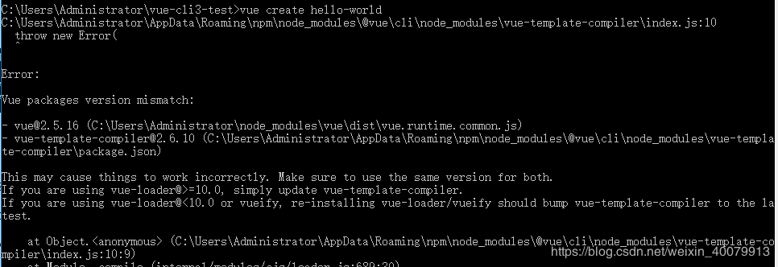
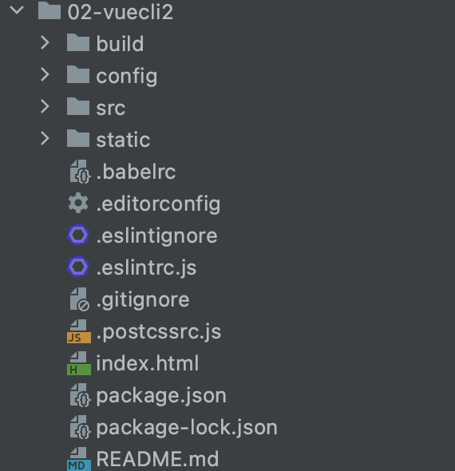
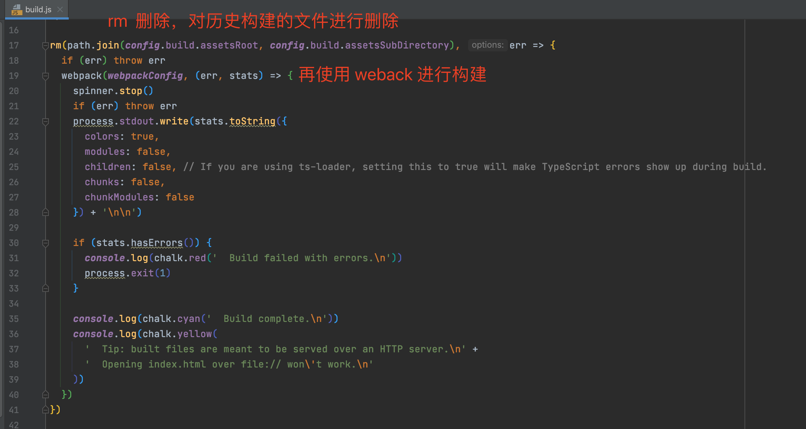
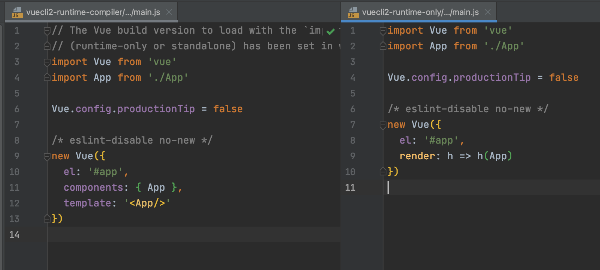
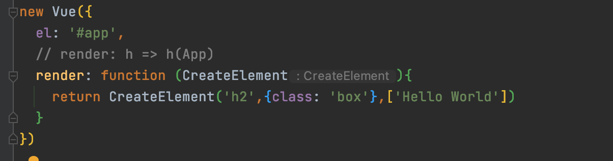
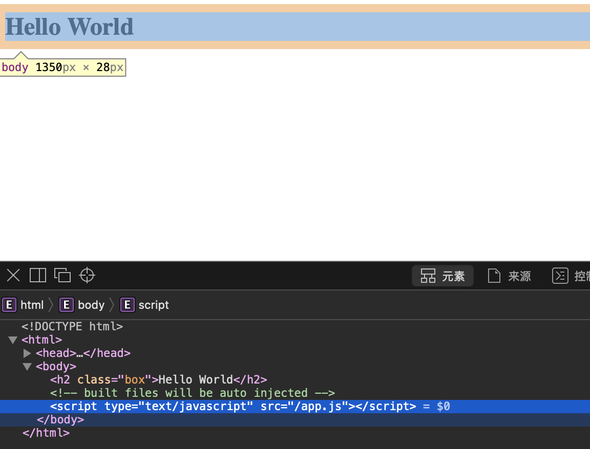
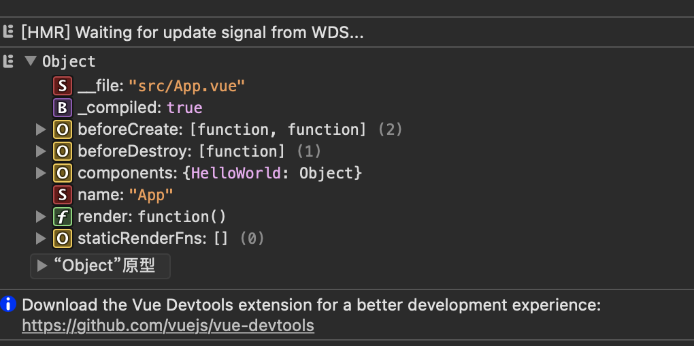
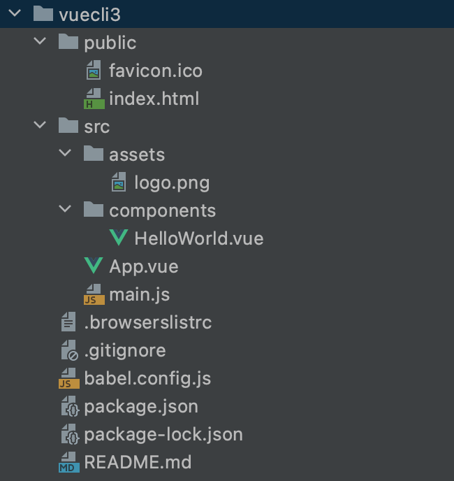
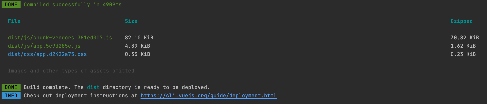

> 创建2021年6月23日
>
> 作者：想想

[toc]


# Vue CLI

## Vue 脚手架

### 1、cli 是什么

+ cli 是 Command-Line Interface 翻译为命令行界面，但是俗称脚手架
+ Vue CLI 是官方发布 vue.js 项目脚手架
+ 使用 vue-cli 可以快速搭建 Vue 开发环境以及对应的 webpack 配置

### 2、安装Vue脚手架

```sh
npm config set registry http://registry.npm.taobao.org/
npm get registry
```

​	安装命令

```sh
npm install -g @vue/cli
```

-g global(全局)

如果之前安装过低版本，需要卸载的话

#### 2.1、卸载旧版本

> vue-cli 是 1.x  和 2.x  的象征， @vue/cli 才是 3.x 的象征

```sh
npm uninstall vue-cli -g
```

执行  清除缓存

```sh
npm cache clean --force
```

安装Vue CLI 3

```sh
npm install -g @vue/cli
```

npm -V 查看是否安装成功

后续运行创建命令若报错



 

这两个版本不一样，需要做更新 执行

```sh
npm update
```

#### 2.2、2.x 与 3.x 的创建

​		如果我既想用 2.x 也想用 3.x ，拉去 2.x 的模块 [官方教程](https://cli.vuejs.org/zh/guide/creating-a-project.html#%E6%8B%89%E5%8F%96-2-x-%E6%A8%A1%E6%9D%BF-%E6%97%A7%E7%89%88%E6%9C%AC)

```sh
npm install -g @vue/cli-init
```

Vue cli2初始化项目

```sh
vue init webpack my-vue-project
```

Vue cli3初始化项目

```sh
vue create my-project
```

#### 2.3、2.x 初始化


```sh
F:\study\My-Project\vue-pro\vue-cli2>vue init webpack vuecli2

? Project name vuecli2		# 项目名称
? Project description test vue cli2		# 项目描述
? Author Array_Xiang <array_xiangxiang@163.com>		# 作者
? Vue build (Use arrow keys)			# 编译环境 Runtime-Compiler or Runtime-only ，only 更小一些！
> Runtime + Compiler: recommended for most users	# standalone
  Runtime-only: （这里推荐选这个）about 6KB lighter min+gzip, but templates (or any Vue-specific HTML) are ONLY allowed in .vue files - render functions are requi
red elsewhere
? Install vue-router? No				# 是否要路由
? Use ESLint to lint your code? Yes		# 是否约束代码 如果选择否，则没有下面的选择
? Pick an ESLint preset (Use arrow keys)			# Standard
> Standard (https://github.com/standard/standard)	# 标准
  Airbnb (https://github.com/airbnb/javascript)		# Airbnb 公司
  none (configure it yourself)						# 配置自己的
? Set up unit tests No					# 是否要单元测试
? Setup e2e tests with Nightwatch? No	# e2e 测试，end to end 安装 Nightwatch 利用 selenium或者webdriver等进行自动化测试
? Should we run `npm install` for you after the project has been created? (recommended) (Use arrow keys)	# npm
> Yes, use NPM
  Yes, use Yarn
  No, I will handle that myself


```


### 3、Vue-cli2目录结构



​	首先初始化一个 vue Cli2 项目，在读 cli2 目录结构的时候，==第一个要看 package.json 中 scripts 内容==，这是我们在使用 npm run start、dev、build 等命令时，webpack 帮我们干的事情

```js
"scripts": {
    "dev": "webpack-dev-server --inline --progress --config build/webpack.dev.conf.js",
    "start": "npm run dev",
    "lint": "eslint --ext .js,.vue src",
    "build": "node build/build.js"					// node 是可以直接运行JS的 去执行 build下面的 build.js 文件
  },
```

> Node 作为底层支撑 可以运行JS文件 是C++语言开发出来的

#### build 目录

##### nom run build

look 一下 build.js 文件，看一下是如何对项目进行构建的



​		其中 webpack 命令加载了  `webpackConfig` 配置文件，我们进入webpackConfig  跳转到了 webpack.prod.conf.js 文件

```js
const webpackConfig = merge(baseWebpackConfig, {...
```

​		除了引用 baseWebpackConfig 配置以外，下面还有我们熟悉的 plugins 插件，`OptimizeCSSPlugin` 打包CSS插件还有 `HtmlWebpackPlugin` 打包 Html 插件

##### npm run dev

```sh
webpack-dev-server --inline --progress --config build/webpack.dev.conf.js
```

+ webpack-dev-server 	搭建本地服务器
+ progress 监听当前打包的进度
+ --config build/webpack.dev.conf.js 指定配置

进入 webpack.dev.conf.js 文件，我们还能看到 

```js
const devWebpackConfig = merge(baseWebpackConfig, {...
```

这里同样抽取了 baseWebpackConfig 的配置信息

#### config 目录

Config 目录 定义的都是 系统中需要用到的变量

##### index.js

```js
module.exports = {
  dev: {
		...
    host: 'localhost', // can be overwritten by process.env.HOST
    port: 8080, // can be overwritten by process.env.PORT, if port is in use, a free one will be determined
    autoOpenBrowser: false,			// 是否自动打开浏览器，这里默认是不打开，我们可以更改为 打开
```

指定主机和端口

除了 index.js 之外，还有 dev.env.js、prod.env.js 针对 开发和生产环境不同的配置

```js
    useEslint: true,
```

是否开启 Eslint 代码约束，只有引用 eslint 之后才会有这个属性

#### static 目录

​		里面只有 .gitkeep 文件，

> 这里设计到 git 相关知识，如果文件夹内没有任何文件的话，git 扫描不到无法提交空文件夹，只有在里面存放一个文件，才可以提交。-- 黑知识

#### package.json

```js
  "dependencies": {
    "vue": "^2.5.2"  // vuecli2 默认指定版本
  },
```

#### .babelrc

​		我们知道 babel 将 ES6 或者 ES7、8 语法 转 ES5... 等其他版本 让浏览器适配

```js
      "targets": {
        "browsers": ["> 1%", "last 2 versions", "not ie <= 8"]
```

​		这里适配的浏览器 是 市场大于 1% 的浏览器，最后的两个版本，且不适配 ie 8以下

#### .editorconfig

```js
root = true		// 只有 root = true 时才会解析如下配置

[*]
charset = utf-8					
indent_style = space
indent_size = 2
end_of_line = lf		// 换行，在不同操作系统上的换行是不一样的
insert_final_newline = true		// 保存时，自动添加最后一个空行
trim_trailing_whitespace = true		// 去除没用的 空格
```

#### .eslintignore

​	约束文件时 忽略部分文件 和 .gitignore 文件夹大同小异

#### .eslintrc.js

​		检查代码

#### .postcssrs.js

​		转换 css 文件

#### index.html

​		这个是作为一个模版，在打包的时候，会根据这个模版生成到 dist 文件夹中

#### package.lock.json

​		在 package.json 中 可以看到 `"eslint": "^4.15.0",` 中 `^` 符号，表示会大于这个版本 但也只限制于 4.15.x 版本，, `~`  表示大于这个版本只限定于 4.x 版本 不会升级到 5版本，这样一来，在 node_modules 中的版本和我们 package.json 文件中配置的不一样，这样就需要一个映射关系， package.lock.json 指定具体的版本


### 4、compiler 与 only

区别只有这一个 在 src/man.js 中



> Vue  程序
>
> ​		template 经过 parse 解析成 ast（abstract syntax tree 抽象语法树） 转成 render 函数，然后到 virtual dom 虚拟DOM，最后转成 真实DOM

​	再返还到 runtime - compiler 、 only 中，我们可以知道，在 compiler 下，是 template -> ast - > render - > vdom -> ui， 反观 runtime-only 直接 rander -> vdom -> ui，即使在创建项目的时候，我们也能看到 runtime-only 比 compiler 少6kb  减少的部分就是 省下来的 代码

​		我们也可以将 runtime - compiler 的 main.js 文件 修改为 runtime - only 模式，其中 h 名字 代表的是 createElment 参数



```js
render:h => h(App)

render: function (createElement){
	// ('标签'，{标签属性}，['数组'])
  return createElement('h2',{class:box},["hello world"])
}
```



使用这种方式，避免了 解析 ast 的步骤，我们可以直接 在 createElement 中调用 App 从而达到组册组件的效果，但是我们就产生了另外一个疑问， App 本身就是组件，组件内的组件难道不需要 解析成 ast 吗？ 答案是 不需要的  

```js
import App from './App'

console.log(App)
```



​		其中没有 template 属性，多了一个 render 属性，这表示，已经渲染到 render 层了， 但是 .vue 文件中的 template 是由谁处理的呢？  答：  是通过 wenbapck 中的 vue-template-compiler，具体的讲 是vue-loader 进行加载，但不解析，真正解析的是 vue-template-compiler，当然，我们可以在开 `package.json` 文件中找到 `vue-template-compiler` ,改插件属于开发时的插件，所以在运行时，所有 template 组件都已经被渲染成 render 函数了，所以最终在运行的时候，只要使用 runtime-only 就可以了

​		runtime-only 优点：性能高、代码少！ 🐂


### 5、Vue-cli3 构建与目录结构

+ Vue -cli 3 与 2 版本有很大区别
  + vue-cli 3 是基于 webpack4 打造，vue-cli2 还是 webpack3
  + vue-cli 3 的设计原则是 “0配置”，移除的配置文件根目录下的，build 和 config 等目录
  + vue-cli 3 提供了 vue ui 命令，提供了可视化配置，更加人性化
  + 移除了 static 文件夹，新增了 public 文件夹，并且 index.html 移动到 public 中

#### 初始化

我这里用的是 vue-cli4

```sh
vue create my-project
Vue CLI v4.5.13
? Please pick a preset: 
  Default ([Vue 2] babel, eslint) 		# 默认配置 Vue2 babel 和 eslint
  Default (Vue 3) ([Vue 3] babel, eslint) 
❯ Manually select features 						# 手动配置
? Check the features needed for your project: (Press <space> to select, <a> to toggle all, <i> to invert selection)					# 空格 选择和取消
❯◉ Choose Vue version
 ◉ Babel
 ◯ TypeScript
 ◯ Progressive Web App (PWA) Support		# 先进的 webapp     
 ◯ Router										# 路由
 ◯ Vuex
 ◯ CSS Pre-processors				# css 与预处理器
 ◉ Linter / Formatter				# Eslint
 ◯ Unit Testing							# 单元测试
 ◯ E2E Testing							# 端到端 测试
? Choose a version of Vue.js that you want to start the project with 
  2.x 
❯ 3.x  		# vue-cli 3 没有这个，这是 vue-cli4 有的，我们选择 vue 3把
? Where do you prefer placing config for Babel, ESLint, etc.? (Use arrow keys)	# 打算 把config 配置单独出来呢？
❯ In dedicated config files 	# 单独配置
  In package.json 
? Save this as a preset for future projects? (y/N)  Yes		# 是否需要保存这个配置 ，
? save name: xiang

# 开始构建了
Vue CLI v4.5.13
✨  Creating project in /Users/xiang/xiang/study/Project/front-end/Vue-H/Vue-B/LearnVue-03/vuecli3.
🗃  Initializing git repository...
⚙️  Installing CLI plugins. This might take a while...

⸨      ░░░░░░░░░░░░⸩ ⠹ idealTree:json-parse-better-errors: sill fetch manifest is-arrayish@^0.2.1
```

我们在下一次创建的时候，就会之前保存的配置

```sh
Vue CLI v4.5.13
? Please pick a preset: (Use arrow keys)
❯ xiang ([Vue 3] babel) 
  Default ([Vue 2] babel, eslint) 
  Default (Vue 3) ([Vue 3] babel, eslint) 
  Manually select features 

```

> 如果我们保存了很多次配置，想删除的话，进入到 ~.vuerc 文件中 删除 presetsr  部分代码
>
> ```vuerc
> xiang@xiaocencen ~ % cat .vuerc
> {
>   "useTaobaoRegistry": false,
>   "packageManager": "npm",
>   "presets": {
>     "xiang": {
>       "useConfigFiles": true,
>       "plugins": {
>         "@vue/cli-plugin-babel": {}
>       },
>       "vueVersion": "3"
>     }
>   }
> }%
> ```
>
> ​		终端中的配置，一般都叫 .xxxrc. rc  `rc` -> run command（运行终端） 	-- 黑知识

#### 结构



#### src 目录

main.js

```js
import { createApp } from 'vue'
import App from './App.vue'

createApp(App).productionTip = true

// createApp(App).mount('#app')

createApp({
    render :h => h(App)
}).$mount('#app')
```

​		这是 vue cli4 构建出来的，我不认识了...   `createApp(App).productionTip = true` 在 build 项目时，展示详细信息



