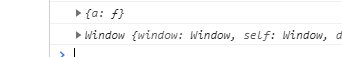

> 创建于 2021年6月 28日
>
> 作者：想想

[toc]


## 箭头函数的使用

​		一般创建方法：

```js
    // 1.定义函数的方式 function
    const a = function (){

    }

    // 2.对象字面量中意义函数
    const b = {
        bbb(){

        }
    }
```

​		使用 ES6 函数创建 方法

```js
    // 3.ES6 中箭头函数
    const c = () =>{

    }
```


### 参数问题

多个参数用括号括起来

```js
    const sum = (num1,num2) => {
        return num1 + num2
    }
```

如果只有一个参数，可以省略括号

```js
    const power2 = num => {
        const result = num * num;
        console.log(result);
        return result;
    }
```

如果方法里只有一行代码，可以省略大括号

```js
    const power1 = num => num*num
```

### this 问题

```js
   const obj ={
       a(){
             setTimeout(() => {
                console.log(this)
            })
           
            setTimeout(function (){
                console.log(this)
            },500)
       }
   }
```

箭头函数中的 this查找方式是，向外层作用域中，一层层查找this 直到 this 的定义



