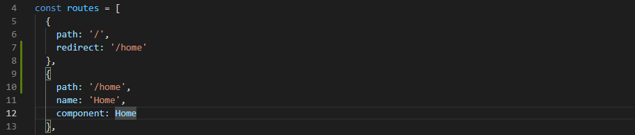

> 创建于 2021年6月28日
>
> 作者：想想

[toc]

# 路由

1. 路由器提供了两种机制：路由和传送
   1. 路由是决定数据包从来源到目的地的路径
   2. 转送将输入端的数据转移到合适的输出端
2. 路由中有一个非常重要的概念叫 `路由表`
   1. 路由表本质上就是一个映射表，决定了数据包的指向

## 一、监听

### 1.1、hash 模式与history 模式

修改 hash，页面不会跳转，不会刷新。这就是Vue Route 的请求机制，会监听 hash，Vue 修改页面的组件

```sh
location.hash = 'a'
```


修改 history 对象，也可以修改 url，不会跳转刷新

```sh
history.pushState({},'','a')
```


以栈的数据结构 push 入 history，既然有push就有back

```sh
history.back()
```

将栈顶删除，可以返回上一个路由路径，与 pushState 方法不同的是。replaceState ，==无法进行返回 直接替换==

```sh
history.replaceState({},'','a')
```

多次 push 路径后，如果要想跳到之前push 的位置

```sh
history.go(-2)
# 一次性弹出 2 个  负数往前，正数往后
```

## 二、Vue-route

### 2.1、安装路由

```sh
npm install vue-router --save
```

### 2.2、挂载使用

+ 导入路由对象 调用 Vue.use(VueRouter)
+ 创建路由实例，并且传入路由映射配置
+ 在Vue实例中挂载创建的路由实例

### 2.3、书写代码

​		在 src 下创建 router 文件夹，并向下创建 index.js 文件

```js
import Vue from 'vue'
import VueRouter from "vue-router";

// 1.通过 Vue.use(插件) 安装插件
Vue.use(VueRouter)

// 2.创建 VueRouter 对象
const routes = [

]

const router = new VueRouter({
    // 配置路由和组件之间的应用关系
    routes
})

// 3.将router 传入到 vue 实例中
export default router
```

​		在 main.js 中添加路由

```js
import Vue from 'vue'
import App from './App.vue'
import router from './router'

Vue.config.productionTip = false

new Vue({
    el: '#app',
    router,
    render: h=> h(App)
})
```

默认显示页面，用`redirect` 重定向，访问根路径时，自动跳到 /home 路径下



## 三、使用路由

### 3.1、使用路由

​		在 vuecli4 中 vue-router 会生成 view 文件 ，页面都写在这个文件夹下，配置在 router 下的 index.js 文件中 ，最终使用需要在 main.js 中使用 `<router-view/>`  展示路由

默认使用 hash 模式，在路径中会有 # 号，如果想改成 history 模式，在 router 中的index.js 文件中即可 去除 #

```js
new router = new VueRouter({
  ..
  mode: 'history'
})
```

> hisotry 模式会出很多奇奇怪怪的问题....  我自己也没有测试成功，可能是版本的问题

​		在点击 <router-link> 标签时，vue 会帮我们在 这个标签里添加一个 `router-link-exact-active` class 属性，如果我们要对点击后的元素进行修改样式，就可以用这个class ，如果我们不想用 `router-link-exact-active` 这个class 可以在  <router-link>  标签里，添加  `active-class` 属性，这样，vue 就会改成 这个属性对应的 值。

```
<router-link to="/" active-class="active">Home</router-link> 
```

如果有很多个。<router-link>  时，进入路由的配置， 这样所有<router-link> 都会渲染成 `linkActiveClass` 参数


```js
new router = new VueRouter({
  ..
  linkActiveClass: 'actives'
})
```

### 3.2、通过代码方式使用路由

​		用 @click 监听一个元素，使用代码的方式 进行路由跳转

不能绕过`$router` vue 的route 

```js
this.$router.push('/home')
this.$router.replace('/home')
```

## 四、动态路由

### 4.1、多层路由

在 router > index.js 中

```vue
 const routes = [{
    path: '/demo/:userName',
    name: 'Demo',
    component: () => import(/* webpackChunkName: "about" */ '../views/Demo.vue')
  }]
```

/demo/`:userId`  这样拼接后，根据原先 /demo 的路径是无法访问的，这个时候需要在后面跟上任意字符串才能访问到该路由

```vue
<router-link :to="'/demo/'+userId" >Demo</router-link> 
vue:
  data() {
    return {
      userId: 'lisi'
    }
  }
```

使用 v:bind ，前面的 /demo/ 需要另加单引号

如果要获取这个值，需要使用到 `$route`  ,他是路由中当前处于活动的路由值

```vue
  computed: {
    userId() {
      return this.$route.params.userName
    }
  }
```

这个 userName 就是路由中的参数， router-link 中传什么参数，这里就获取到什么参数

### 4.2、路由懒加载

回顾之前学到的webpack，当我们打包时候，会将我们代码中的业务代码、插件代码等打包到一个文件中


​	随着我们的代码量越来越大，打包生成的文件也会越来越大，当用户请求一个非常大的文件的时候，是非常危险的，页面可能会有短暂的白屏情况，为了避免这种情况，我们需要合理的分化代码。

​	路由懒加载的主要作用就是将路由对应的组件打包成一个个的js代码块，只有被访问的时候，才加载

懒加载之前路由：

```js
import Home from '../components/Home'
import About from '../components/About'

Vue.use(VueRouter)
const routes = [
    {
        path: '/home',
        component: Home
    }
]
```

懒加载之后

```js
const route = [
    {
        path: '/home',
        component: ()=> import('../components/About')
    }
]
```

懒加载之后打包，就会生成很多个js文件


## 五、嵌套路由

在  `router`/`index.js` 中

```js
..
 {
    path: '/news',
    name: 'News',
    component: () => import('../views/News.vue'),
    children: [
      {
        path: '',
        redirect: '/news/my' // 默认展示，这里一定要写完整路径
      },
      {
        path: 'my',
        component: NewsMy
      },
      {
        path: 'he',
        component: NewsHe
      }
    ]
  },
    ..
```


### 5.1、带参传递

参数传递主要分为两种 `params`、`query`

#### 5.1.1、params 路由参数传递

+ 配置路由格式：/router/:id
+ 传递方式：在path后面跟上对应的值
+ 参数后形成的路径 /router/123 ，/router/abc

```vue
# router 配置路由
  {
    path: '/user/:id',
    component: () => import('../views/User.vue')
  }
# home 传入
   <router-link :to="'/user/'+userId">User</router-link>
# user 输出
   <p>{{$route.params.id}}</p>
```

#### 5.1.2、query 路由参数传递

+ 配置路由格式：/router,也就是普通模式
+ 传递的方式：对象中使用 query 的 key 作为传递方式
+ 传递后形成的路径：/router?id=123 , /router?id=abc

```vue
# router 配置
  {
    path: '/profile',
    component: Profile
  }
# home 传入
<router-link :to="{path:'/profile',query:{name:'why',age:18,height:188}}">Profile</router-link>
# profile接收
    <p>{{$route.query}}</p>
    <p>{{$route.query.name}}</p>
    <p>{{$route.query.age}}</p>
    <p>{{$route.query.height}}</p>
```

### 5.1.3、不使用 router-link

使用button按钮跳转

```vue
<button @click="userCli">User copy</button>
<button @click="profileCli">Profile copy</button>

# js
 	userCli(){
      this.$router.push('/user/'+this.userId);
    },
    profileCli(){
      this.$router.push({
        path: '/profile',
        query:{name:'why',age:18,height:188}
      })
    }
```


## 六 、route 和 router 的区别

​		我们既可以在 上述 ## 5.1.3 中打印 `$router`  也可以在 main.js 中打印，两次输出都一样的，任何地方使用 `$router` 获取的都是一样的

没有 R 的`$route` 是获取当前活跃的路由，每个路由页面都是不一样的。

为什么会有区分，look 源码

​		我们知道，我们使用任何插件的时候，都需要使用 `use` 方法

```vue
Vue.use(VueRouter)
```

​		其实在使用 use 方法时，内部是拿到这个对象 执行 `VueRouter install` 方法


这样，我们才能在 router 中使用 `router-view` 和 `router-link` 驼峰转换法

> 所有的组件都继承自Vue 的原型   （看源码才能懂） `prototype`

