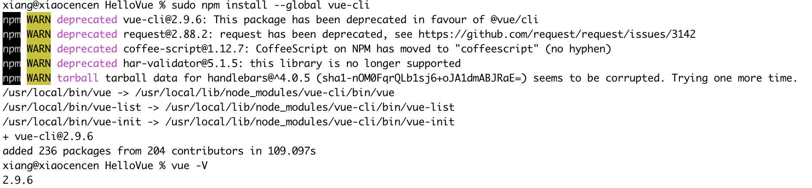
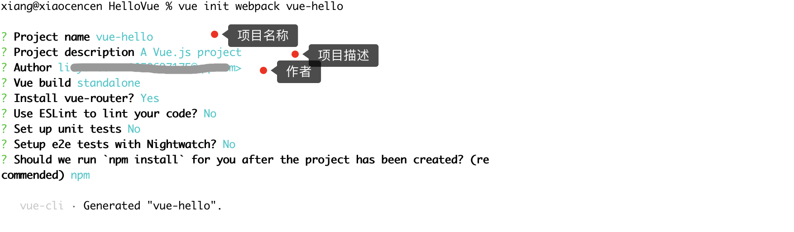
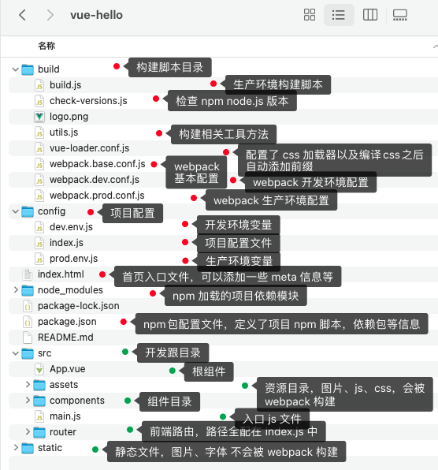
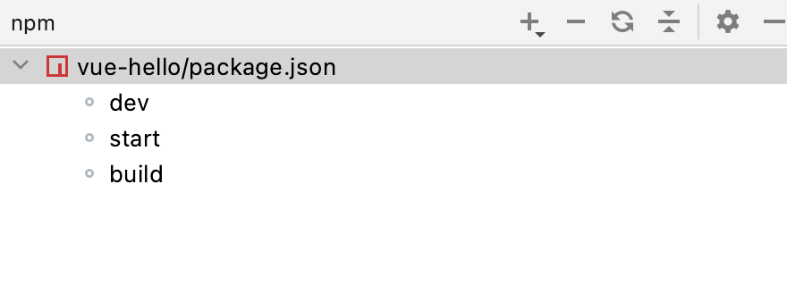
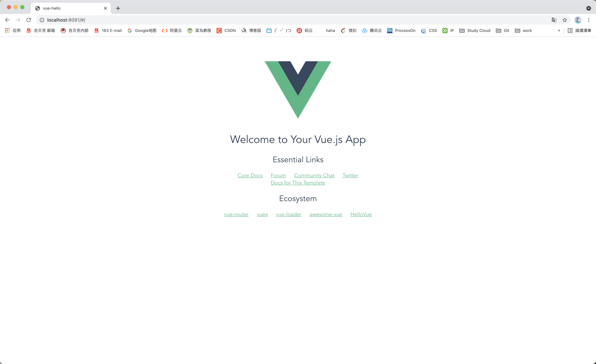

> 
>
> 创建于2021年6月3日
>
> 作者：想想

[toc]


## 搭建Vue

​		工作快大半年了，前端还只是会写一些 HTML ，用到比较多的还仅仅是 Freemarke 更为前沿的技术 Vue、React 甚至是 AVue都只是只有一面之缘，换句话讲 它认识我，我不认识他。所以下定决心，自己通过官网、B站等其他方法学会这门语言，为自己将来架构之路奠定夯实的基础


### 1、安装Node环境

官网：[Node.js](https://nodejs.org/zh-cn/)


因为本地有一款应用必须要 10.x 版本才能运行，所以我在我本地安装的是 10.24.0 的版本，初学者为了学习 Vue 安装任何版本都OK啊

安装完成后，测试Node 版本

```sh
xiang@xiaocencen vue-hello % node -v
v10.24.0
xiang@xiaocencen vue-hello % npm -v
6.14.11
```

### 2、安装 Vue-cli

```sh
npm install --global vue-cli
```



 

### 3、使用 Vue-cli 初始化 Vue 工程

进入到要创建工程的目录下，执行命令

```sh
vue init webpack vue-hello
```



​				Vue build ==> 打包方式，回车即可；

　　　　Install vue-router ==> 是否要安装 vue-router，项目中肯定要使用到 所以Y 回车；

　　　　Use ESLint to lint your code ==> 是否需要 js 语法检测 目前我们不需要 所以 n 回车；

　　　　Set up unit tests ==> 是否安装 单元测试工具 目前我们不需要 所以 n 回车；

　　　　Setup e2e tests with Nightwatch ==> 是否需要 端到端测试工具 目前我们不需要 所以 n 回车；

​				Should we run ’npm install‘ for you after the project has been created? > 创建完成后是否要启动项目 ==应该选择 n 的==


文件夹内会生成出这些文件

 

用 IDEA 打开工程

> 双击 shift 键，打开 everything 搜索，输入 show npm Scripts 能启动 npm 面板
>
>  双击 dev 启动项目


==注意：如果出现：==

```sh
> vue-hello@1.0.0 dev
> webpack-dev-server --inline --progress --config build/webpack.dev.conf.js

'webpack-dev-server' 不是内部或外部命令，也不是可运行的程序
或批处理文件。
```

这种情况，需要安装 webpack-cli 

```sh
npm install webpack webpack-dev-server webpack-cli --save-dev
```




