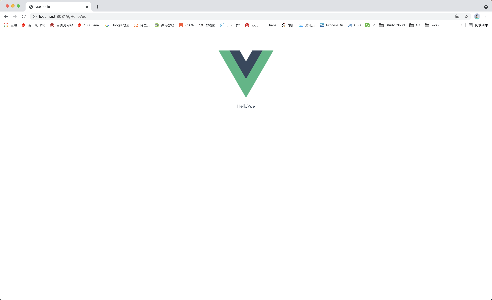

> 创建于2021年6月3日
>
> 作者：想想

[toc]

## 创建 Vue 页面

### 新建一个页面

​		使用 Vue-cli 创建 Vue 页面


进入 IDEA 页面后，在 src 目录下，创建新目录 `module` 在 module 下创建 `HelloVue.vue` 文件

1. 创建自己的 vue 文件页面

```vue
<template>
  <div>
    {{msg}}
  </div>
</template>

<script>
export default {
  data () {
    return {
      msg: 'HelloVue'
    }
  }
}
</script>

<style scoped>
</style>
```

2. 在 src/router/index.js 下配置路由


保存，即可重新编译

在原来的 路径后 加 /HelloVue

```http
http://localhost:8081/#/HelloVue
```




### 父组件中引入子组件

创建父页面

1. 按新建页面的方式，我们再创建一个 Vue 父 页面 命名为 /module/first.vue
2. 在 /router/index.js 中添加 路由，确保 http://localhost:8081/#/first 可以访问到

创建子页面. `second.vue` 不再复述


1. 在父页面引入 import Confirm from '../module/second'

2. 编辑 子页面

   ```vue
   <template>
     <div class="second-button">
       <button @click="getButtonClick">{{text||'确认'}}</button>
       <!-- @click 点击事件 -->
   		<p><router-link to="/first">回父组件</router-link></p>
     </div>
   </template>
   <script>
   export default {
     name: "second-button",
     // 父组件给子组件 传递的值
     props:["text"],
     data(){
       return{
         msg:true
       };
     },
     methods:{
       getButtonClick(){
         // 点击按钮的生活，向父组件传值
         this.$emit("message",this.msg);
       }
     }
   }
   /*
   *  父组件给子组件的值通过 props 接收
   *  子组件 通过 $emit 向父组件传值
   * */
   </script>
   ```

3. 编辑父组件

   1. 添加 getMessage() 方法

   ```vue
   <template>
     <div>
       {{msg}}
       <confirm text="组册" @message="getMessage"></confirm>
     </div>
   </template>
   <script>
   import Confirm from '../module/second'
   export default {
     name: "First",
     components:{
       Confirm
     },
     data(){
       return{
         msg: "这里是父页面!"
       }
     },
     methods:{
       // val 为子组件给父组件传递的值
       getMessage(val){
         alert(val);
       }
     }
   }
   </script>
   ```

   

```sh
D:\soft\nodejs\node.exe D:\soft\nodejs\node_modules\npm\bin\npm-cli.js install --scripts-prepend-node-path=auto
```

