[toc]


## 1、Docker 的基本组成

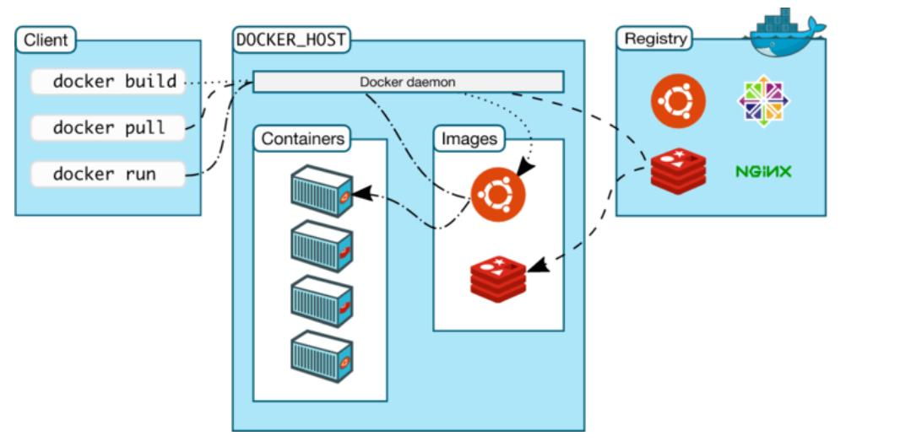

**镜像（image）：**

​	docker 镜像就好比一个模板，可以通过模板来创建容器服务，通过镜像可以创建多个容器

**容器（container）：**

​	Docker 利用容器技术，独立运行一个或一组应用，启动、停止、删除、基本命令！

**仓库（repository）：**

​	存放镜像的地方，分为 公有仓库、私有仓库


## 2、安装Docker

> 环境准备
>
> CentOS 7

```sh
# 系统内核
[root@Xiang ~]# uname -r
4.18.0-193.28.1.el8_2.x86_64
```

```sh
# 查看系统版本
[root@Xiang ~]# cat /etc/os-release
NAME="CentOS Linux"
VERSION="8 (Core)"
ID="centos"
ID_LIKE="rhel fedora"
VERSION_ID="8"
PLATFORM_ID="platform:el8"
PRETTY_NAME="CentOS Linux 8 (Core)"
ANSI_COLOR="0;31"
CPE_NAME="cpe:/o:centos:centos:8"
HOME_URL="https://www.centos.org/"
BUG_REPORT_URL="https://bugs.centos.org/"

CENTOS_MANTISBT_PROJECT="CentOS-8"
CENTOS_MANTISBT_PROJECT_VERSION="8"
REDHAT_SUPPORT_PRODUCT="centos"
REDHAT_SUPPORT_PRODUCT_VERSION="8"
```


### 2.1、卸载旧版本

```sh
 sudo yum remove docker \
                  docker-client \
                  docker-client-latest \
                  docker-common \
                  docker-latest \
                  docker-latest-logrotate \
                  docker-logrotate \
                  docker-engine
```

### 2.2、需要的安装包

```sh
yum install -y yum-utils
```

### 2.3、设置镜像仓库

```sh
yum-config-manager \
    --add-repo \
    https://download.docker.com/linux/centos/docker-ce.repo # 默认是国外的


yum-config-manager \
    --add-repo \
    http://mirrors.aliyun.com/docker-ce/linux/centos/docker-ce.repo  # 阿里云地址
```

### 2.4、下载docker引擎

安装引擎之前建议更新 yum 索引

```sh
# 用于 CentOS 7  我当时用的 CentOS 8 失效了
yum makecache fast
```

```sh
# docker-ce 社区版   ee 企业版
yum install docker-ce docker-ce-cli containerd.io
```

### 2.5、启动Docker

```sh
systemctl start docker
```

### 2.6、hello-world

```sh
docker run hello-world
```

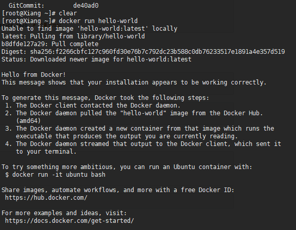

### 2.7、查看 hello-world 镜像

```sh
docker images
```

### 2.8、卸载docker

卸载依赖

```sh
yum remove docker-ce docker-ce-cli containerd.io
```

删除 docker 运行环境

```sh
rm -rf /var/lib/docker
rm -rf /var/lib/containerd
```

> /var/lib/docker    是 docker 的默认工作路径


## 3、HelloWorld 运行原理

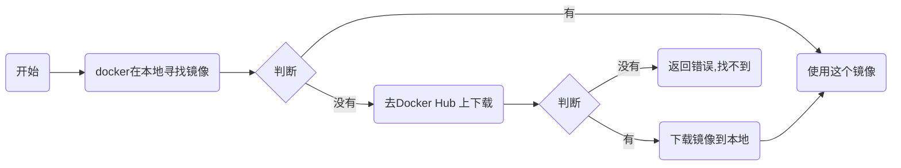

### 3.1、底层原理

**Docker是怎么工作的？**
Docker 是一个 client - server 结构的系统，Docker 的守护进程运行在主机上，通过 Socket 从客户端访问

DockerServer 接收到 Docker-Client 的指令，就会执行这个命令

**Docker 为什么比 VM快**

1、Docker 有比虚拟机更少的 抽象层

2、docker 利用的是宿主机的内核，vm 需要的是 Guest OS

创建一个新的容器的时候，docker不需要像虚拟机一样重新加载一个操作系统，避免引导，虚拟机加载 Guest OS，分钟级别，而docker 利用宿主机的操作系统，省略了这个复杂的过程，秒级


## 4、Docker 常用命令

### 4.1、帮助文档

```sh
docker version # 显示docker的版本信息
docker info # 显示docker的系统信息，包括镜像和容器数量
docker 命令 --help 
```

[官方命令文档 https://docs.docker.com/engine/reference/commandline/cli/](https://docs.docker.com/engine/reference/commandline/cli/)

### 4.2、镜像命令

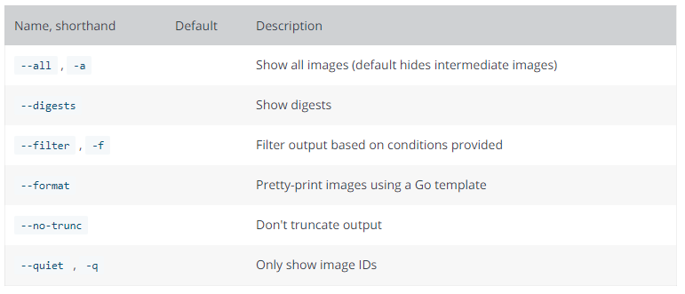

我们不仅可以看官方文档，也可以使用help命令

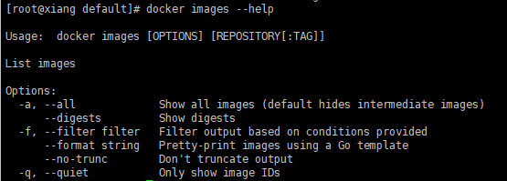


docker images 查看当前主机上的镜像

```sh
[root@xiang default]# docker images
REPOSITORY    TAG       IMAGE ID       CREATED       SIZE
hello-world   latest    d1165f221234   7 weeks ago   13.3kB
# 解析
REPOSITORY  	镜像的仓库源
TAG				镜像标签
IMAGE ID		镜像的id
CREATED			镜像的创建时间
SIZE			镜像的大小

# 可选项目
  -a, --all             # 列出所有镜像
  -q, --quiet           # 只显示镜像的 id
```

docker search 搜索

```sh
[root@Xiang ~]# docker search mysql
NAME                              DESCRIPTION                                     STARS     OFFICIAL   AUTOMATED
mysql                             MySQL is a widely used, open-source relation…   10777     [OK]       
mariadb                           MariaDB Server is a high performing open sou…   4058      [OK]       
# 可选项
--filyrt=START=3000  # 搜索出来的镜像就是 START 大于3000
```

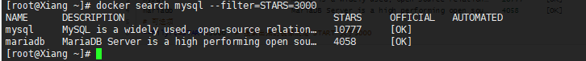

[docker Hub 中的Mysql](https://hub.docker.com/_/mysql)


docker pull 下载镜像

```sh
[root@xiang default]# docker pull mysql
Using default tag: latest  # 如果不写 tag 默认就是 latest
latest: Pulling from library/mysql
f7ec5a41d630: Pull complete  # 分层下载，docker image核心，联合文件系统
9444bb562699: Pull complete 
6a4207b96940: Pull complete 
181cefd361ce: Pull complete 
8a2090759d8a: Pull complete 
15f235e0d7ee: Pull complete 
d870539cd9db: Pull complete 
493aaa84617a: Pull complete
Digest: sha256:04ee7141256e83797ea4a84a4d31b1f1bc10111c8d1bc1879d52729ccd19e20a  # 签名
Status: Downloaded newer image for mysql:latest
docker.io/library/mysql:latest # 真实地址


# 等价于它
docker pull mysql
docker pull docker.io/library/mtsql:latest

# 指定版本
docker pull mysql:5.7
```


docker rei 删除镜像

```sh
# 删除
docker rmi -f 镜像id   # 删除指定的镜像
docker rmi -f 镜像id  镜像id  镜像di  # 删除多个镜像
docker rmi -f $(docker images -aq)   # 删除全部镜像
```

```sh
[root@xiang default]# docker rmi -f 0627ec6901db
Untagged: mysql:latest
Untagged: mysql@sha256:04ee7141256e83797ea4a84a4d31b1f1bc10111c8d1bc1879d52729ccd19e20a
Deleted: sha256:0627ec6901db4b2aed6ca7ab35e43e19838ba079fffe8fe1be66b6feaad694de
Deleted: sha256:94d5db550d62032ddc8ad8d4cfef8bac06fe7d35757deb2f8638d0fdc1e89217
Deleted: sha256:5fbbb0e9bfb8f2a4d665cc60aaf4876191c057898db276d2d030a0d6123afc8e
Deleted: sha256:124a9d262ebecea284b6438b0a04766b076bd3f89cb0f29a8a475f26bf93911f
Deleted: sha256:5aa37b6c8e31197ab2f357c09755bcb83228ff0fb69c2009a12b6eddb087e884
Deleted: sha256:d0b1d5665c308823bbc5b8986d405e5202ade6994dfa00d8ff576eff372dd045

# 删除全部
[root@xiang default]# docker rmi -f $(docker images -aq)
```

### 4.3、容器命令

我们有了镜像才可以去创建容器，下载一个 Centos 镜像来学习

```sh
docker pull centos
```

新建容器并启动

```sh
docker run [可选参数] image

# 参数说明
--name="Name"  容器名字  用来区分容器
-d				后台放弃运行
-it 			使用交互方式进入，进入容器查看端口
-p				指定容器端口 -p  8080:8080
	-p 	主机端口:容器端口
	-p	容器端口
	容器端口
-P				随机指定端口

# 测试
[root@xiang default]# docker run -it centos /bin/bash
[root@8e36b206b05d /]# 

# 退出
exit  # 退出停止
Ctrp + P + Q # 容器不停止退出
```

查看运行中的容器

```sh
# docker ps 命令
	# 列出当前正在运行的容器
-a 	# 列出当前正在运行的容器+带出历史运行的容器
-n=?	# 显示最近创建的容器
-q 	# 只显示编号


[root@xiang default]# docker ps
CONTAINER ID   IMAGE     COMMAND   CREATED   STATUS    PORTS     NAMES
# 当前没有在运行的容器

[root@xiang default]# docker ps -a
CONTAINER ID   IMAGE          COMMAND       CREATED             STATUS                         PORTS     NAMES
8e36b206b05d   centos         "/bin/bash"   2 minutes ago       Exited (0) 55 seconds ago                determined_jepsen
4fe12f691b48   d1165f221234   "/hello"      About an hour ago   Exited (0) About an hour ago             sleepy_hodgkin
# 查看曾经运行过的
```

删除容器

```sh
docker rm  容器id				# 删除指定镜像   不能删除正在运行的容器，如果要强制删除  rm -f
docker rm -f $(docker ps -aq)  # 删除所有容器
docker ps a -q|xargs rm			# 删除所有容器  （未尝试过）
```

启动和停止容器

```sh
docker start 容器id		# 启动容器
docker restart 容器id		# 重启容器
docker stop 容器id		# 停止当前正在运行的容器
docker kill 容器id		# 强制停止当前运行的容器
```

其他常用命令

后台启动命令

```sh
# 命令 docker run -d 镜像名字！
[root@xiang ~]# docker run -d centos
4284f6fc71749059eb8c4281549c6f500485c7170157f913cb17510bd5b67654

# 问题docker ps 发现 centos 停止了

# 常见的坑，docker 容器使用后台运行，就必须要有一个前台进程，docker发现没有应用，就会自动停止
# nginx 容器启动后，发现没有提供服务，就会立刻停止，自杀！
```

#### 4.3.1、查看日志

```SH
docker logs -tf --tail 10 容器

# 自己编写一段 shell 脚本
[root@xiang ~]# docker run -d centos sh -c "while true;do echo helloworld;sleep 1;done"
5d3272751a9bf59420b8b6a23e244f0db1bc1e67822a55970703337da457b9ad
[root@xiang ~]# docker ps
CONTAINER ID   IMAGE     COMMAND                  CREATED         STATUS        PORTS     NAMES
5d3272751a9b   centos    "sh -c 'while true;d…"   4 seconds ago   Up 1 second             compassionate_knuth


# 显示日志
 -tf			# 显示日志
 -tail number	# 显示日志条数
[root@xiang ~]# docker logs -tf --tail 10 5d3272751a9b

```

#### 4.3.2、查看容器中进程信息

> docker top 容器

```sh
[root@xiang ~]# docker top 5d3272751a9b
UID                 PID                 PPID                C                   STIME               TTY                 TIME              
root                4980                4960                0                   22:11               ?                   00:00:00          
root                5667                4980                0                   22:19               ?                   00:00:00          
```

#### 4.3.3、查看镜像的元数据

```sh
# 命令
docker inspect 容器id

# 测试
[root@xiang ~]# docker inspect 5d3272751a9b
[
    {
        "Id": "5d3272751a9bf59420b8b6a23e244f0db1bc1e67822a55970703337da457b9ad",
        "Created": "2021-04-26T14:11:10.974000419Z",
        "Path": "sh",
        "Args": [
            "-c",
            "while true;do echo helloworld;sleep 1;done"
        ],
        "State": {
            "Status": "running",
            "Running": true,
            "Paused": false,
            "Restarting": false,
            "OOMKilled": false,
            "Dead": false,
            "Pid": 4980,
            "ExitCode": 0,
            "Error": "",
            "StartedAt": "2021-04-26T14:11:12.593161076Z",
            "FinishedAt": "0001-01-01T00:00:00Z"
 ........
```

#### 4.3.4、进入当前正在运行的容器

> docker exec -it 容器id bashshell

```sh
[root@xiang ~]# docker exec -it 5d3272751a9b  bash
[root@5d3272751a9b /]# ls
bin  dev  etc  home  lib  lib64  lost+found  media  mnt  opt  proc  root  run  sbin  srv  sys  tmp  usr  var
```


> docker attach 容器id

```sh
[root@xiang ~]# docker attach 5d3272751a9b
helloworld
helloworld
helloworld

正在执行当前代码

# docker exec 			# 进入容器后开启一个新的终端，可以在里面操作（常用）
# docker attach			# 进入容器正在执行的终端，不会启动新进程
```

从容器内拷贝到主机上

```sh
docker cp 容器id:容器内路径 目的的主机路径

# 测试
[root@xiang data]# docker cp ac7c94ec3d98:/home/data/hello.txt /home/xiang/docker
[root@xiang data]# ls /home/xiang/docker
hello.txt
```

## 5、Docker 案例

### 5.1、 部署Nginx

```sh
# 搜索镜像
[root@xiang data]# docker search nginx
NAME                               DESCRIPTION                                     STARS     OFFICIAL   AUTOMATED
nginx                              Official build of Nginx.                        14752     [OK]       

# 下载镜像
[root@xiang data]# docker pull nginx
Using default tag: latest
latest: Pulling from library/nginx
f7ec5a41d630: Downloading [====================================>              ]  20.08MB/27.14MB
aa1efa14b3bf: Downloading [========================>                          ]  12.95MB/26.58MB

# 启动端口  使用公网的 3344 就可以访问到 80 nginx
-d  后台运行
--name 给容器命名
-p 暴露端口 宿主机
[root@xiang data]# docker run -d --name nginx01 -p 3344:80 nginx
```

> 我本地的虚拟机IP地址是  192.168.133.3

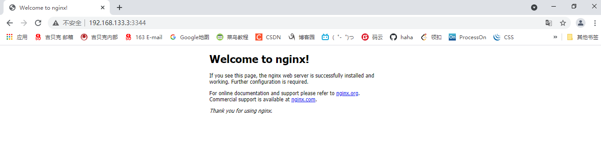

> 进入 nginx 进行配置

```sh
[root@xiang data]# docker exec -it nginx01 bash
root@1f21cdf9ce17:/# 
root@1f21cdf9ce17:/# ls
bin  boot  dev	docker-entrypoint.d  docker-entrypoint.sh  etc	home  lib  lib64  media  mnt  opt  proc  root  run  sbin  srv  sys  tmp  usr  var
root@1f21cdf9ce17:/# whereis nginx
nginx: /usr/sbin/nginx /usr/lib/nginx /etc/nginx /usr/share/nginx
root@1f21cdf9ce17:/# cd /etc/nginx/
root@1f21cdf9ce17:/etc/nginx# ls
conf.d	fastcgi_params	koi-utf  koi-win  mime.types  modules  nginx.conf  scgi_params	uwsgi_params  win-utf
root@1f21cdf9ce17:/etc/nginx# 
```

### 5.2、部署tomcat

```sh
# 官方使用
docker run -it --rm tomcat:9.0

# docker run --it -rm 一般用于测试，用完就即删
```

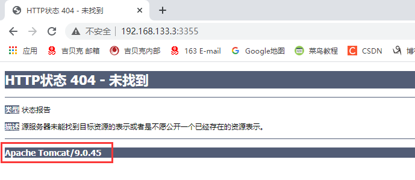

```sh
# 启动tomcat
[root@xiang data]# docker run -d -p 3355:8080 --name tomcat01 tomcat
Unable to find image 'tomcat:latest' locally
latest: Pulling from library/tomcat
Digest: sha256:0509684774ac53d8b152f4a50dd92889218a8633c0feddb4b35d092e55cd215d
Status: Downloaded newer image for tomcat:latest
400d68881e6ad1978d7ae1a86d1c905018587f129fe1848358b598c028dd29d0

# 测试没有问题
[root@xiang data]# docker exec -it tomcat01 bash
root@400d68881e6a:/usr/local/tomcat# ll
bash: ll: command not found
root@400d68881e6a:/usr/local/tomcat# ls -al
total 128
drwxr-xr-x. 1 root root    30 Apr 22 23:10 .
drwxr-xr-x. 1 root root    20 Apr 22 00:53 ..
-rw-r--r--. 1 root root 18984 Mar 30 10:29 BUILDING.txt
-rw-r--r--. 1 root root  5587 Mar 30 10:29 CONTRIBUTING.md
-rw-r--r--. 1 root root 57092 Mar 30 10:29 LICENSE
-rw-r--r--. 1 root root  2333 Mar 30 10:29 NOTICE
-rw-r--r--. 1 root root  3257 Mar 30 10:29 README.md
-rw-r--r--. 1 root root  6898 Mar 30 10:29 RELEASE-NOTES
-rw-r--r--. 1 root root 16507 Mar 30 10:29 RUNNING.txt
drwxr-xr-x. 2 root root  4096 Apr 22 23:10 bin
drwxr-xr-x. 1 root root    22 Apr 26 15:16 conf
drwxr-xr-x. 2 root root  4096 Apr 22 23:09 lib
drwxrwxrwx. 1 root root   177 Apr 26 15:16 logs
drwxr-xr-x. 2 root root   134 Apr 22 23:10 native-jni-lib
drwxrwxrwx. 2 root root    30 Apr 22 23:09 temp
drwxr-xr-x. 2 root root     6 Apr 22 23:09 webapps
drwxr-xr-x. 7 root root    81 Mar 30 10:29 webapps.dist
drwxrwxrwx. 2 root root     6 Mar 30 10:29 work

# ll 命令都没有  docker 只是保证了基础的运行环境 我们看到 webapp 中没有任何东西， 我们可以把 webapp.dist 中的文件复制到 webapp 中，再次打开就有页面了
```


### 5.3、部署ElasticSearch

> docker run -d --name elasticsearch  -p 9200:9200 -p 9300:9300 -e "discovery.type=single-node" elasticsearch:7.12.0

```sh
# es 暴露的端口非常多
# es 十分耗内存
# es 的数据一般要存放到 安全目录！ 挂载
# --net somenetwork 网络配置

# 启动 ElasticSearch
docker run -d --name elasticsearch  -p 9200:9200 -p 9300:9300 -e "discovery.type=single-node" elasticsearch:7.12.0

```

>docker stats

```sh
# 查看 docker cup状态   docker stats
[root@xiang data]# docker stats
CONTAINER ID   NAME            CPU %     MEM USAGE / LIMIT     MEM %     NET I/O           BLOCK I/O       PIDS
914e76d8b679   elasticsearch   1.21%     2.016GiB / 3.622GiB   55.64%    5.75kB / 4.76kB   775MB / 3.1MB   50
```

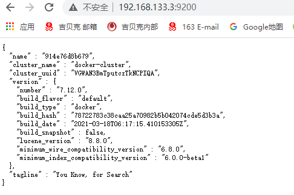

因为 es 占用太占内存了，停止后，配置环境，再重新启动

```sh
# 限制 最小64M 最大512M
docker run -d --name elasticsearch02  -p 9200:9200 -p 9300:9300 -e "discovery.type=single-node" -e ES_JAVA_OPTS="-Xms64m -Xmx512m" elasticsearch:7.12.0
```

### 5.4、部署Kbana

#### 5.4.1、可视化

+ portainer（先用这个）

  ```sh
  docker run -d -p 8088:9000 \--restart=always -v /var/run/docker.sock:/var/run/docker.sock --privileged=true portainer/portainer
  ```

+ Rancher (CI/CD再用)


什么是 portainer?

Docker 图像化界面管理工具！提供一个后台面板供我们操作!

```sh
[root@xiang data]# docker run -d -p 8088:9000 \--restart=always -v /var/run/docker.sock:/var/run/docker.sock --privileged=true portainer/portainer
Unable to find image 'portainer/portainer:latest' locally
latest: Pulling from portainer/portainer
94cfa856b2b1: Pull complete 
49d59ee0881a: Pull complete 
a2300fd28637: Pull complete 
Digest: sha256:fb45b43738646048a0a0cc74fcee2865b69efde857e710126084ee5de9be0f3f
Status: Downloaded newer image for portainer/portainer:latest
5f9b3924eff758909427f9e3d9d5af6e51fe71b6086d123afea7b13491eada5a
```

测试：外网 访问 8088

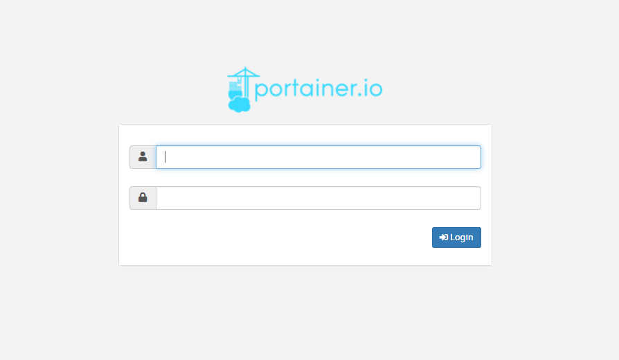

登录进去之后，选择本地连接

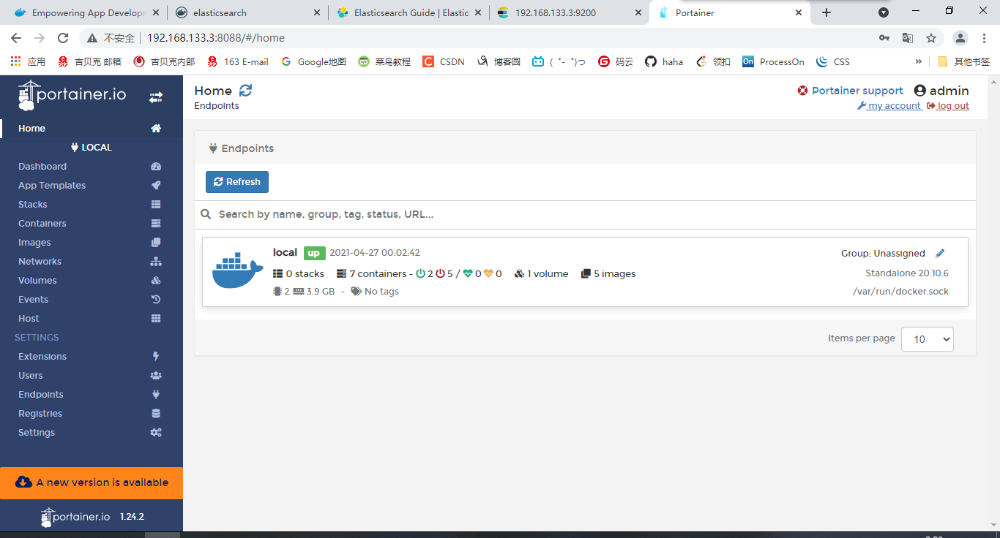


## 6、Commit镜像

```shell
docker commit 提交容器为一个新的副本

# 命令和git原理类型
docker commit -m="提交的信息" -a="作者" 容器id 目标镜像名:[TAG]
```

> 启动tomcat

```sh
[root@xiang data]# docker run -it -p 8080:8080 tomcat:9.0 
Using CATALINA_BASE:   /usr/local/tomcat
Using CATALINA_HOME:   /usr/local/tomcat
Using CATALINA_TMPDIR: /usr/local/tomcat/temp
Using JRE_HOME:        /usr/local/openjdk-11
Using CLASSPATH:       /usr/local/tomcat/bin/bootstrap.jar:/usr/local/tomcat/bin/tomcat-juli.jar
Using CATALINA_OPTS:   
```

> 默认的 webapp 没有东西，我们把 webapp.dist 中的文件拷贝到 webapp 中

我们要把改完的结果提交为新的镜像

```sh
[root@xiang data]# docker commit -a="xiang" -m="add webapps app" e00d764f49a1 tomcat:1.0
sha256:63b66b0f8a5ca1d59af16c805da0c5876392d6e0af80535132149b0546df38f1
```

> docker images # 查看

```sh
[root@xiang data]# docker images
REPOSITORY            TAG       IMAGE ID       CREATED          SIZE
tomcat                1.0       63b66b0f8a5c   38 seconds ago   672MB   # 我们刚刚提交的版本  以后就可以直接启动这个了
tomcat                9.0       c0e850d7b9bb   3 days ago       667MB
tomcat                latest    c0e850d7b9bb   3 days ago       667MB
nginx                 latest    62d49f9bab67   12 days ago      133MB
portainer/portainer   latest    580c0e4e98b0   5 weeks ago      79.1MB
elasticsearch         7.12.0    9337ed510a0c   5 weeks ago      830MB
centos                latest    300e315adb2f   4 months ago     209MB
```

然后想要保存当前容器的状态，就可以通过commit来提交，获得一个镜像


#