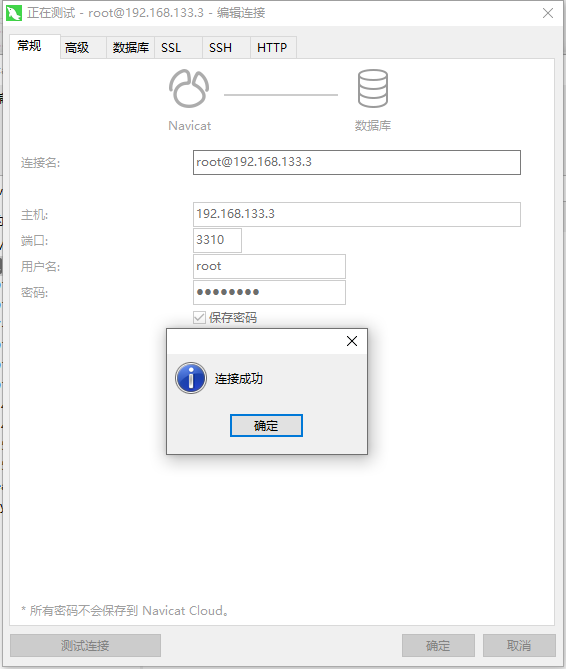
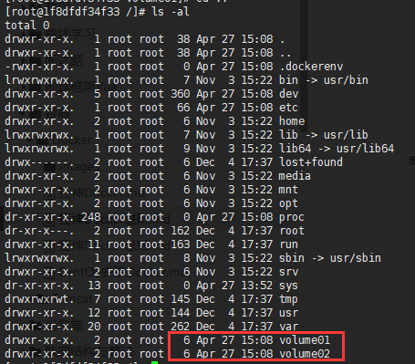
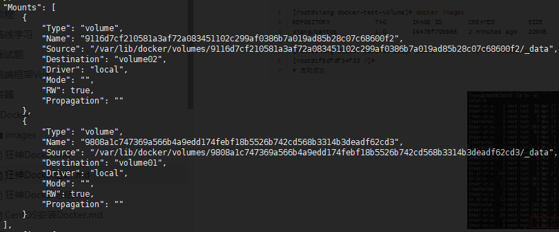
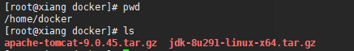
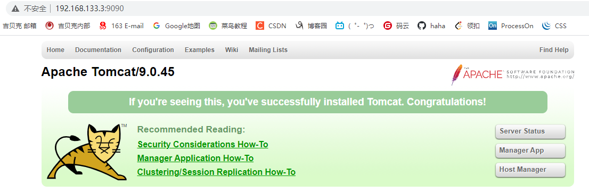
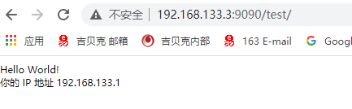
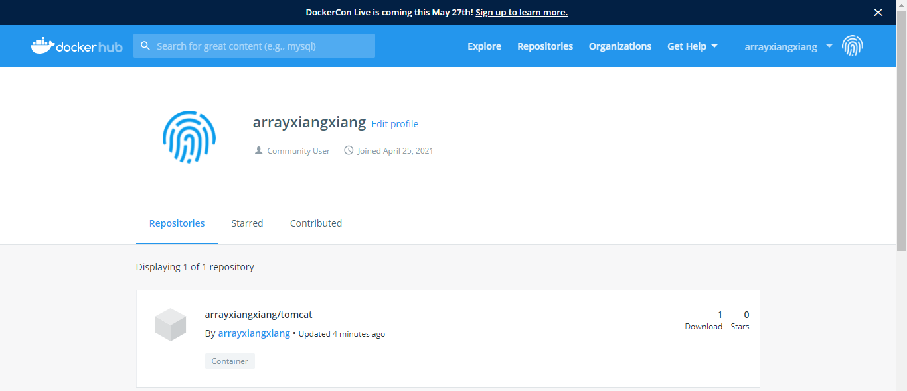
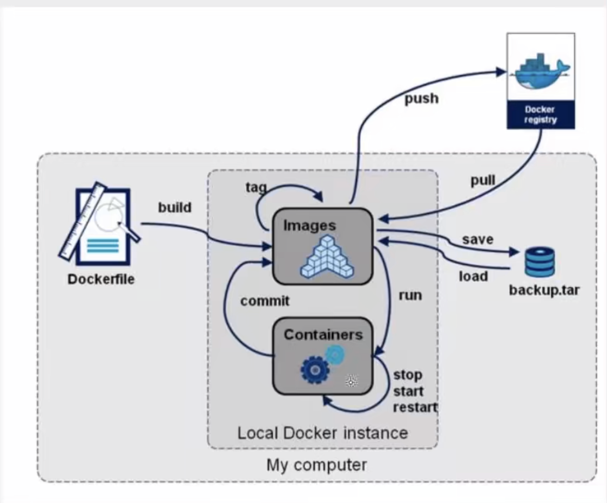
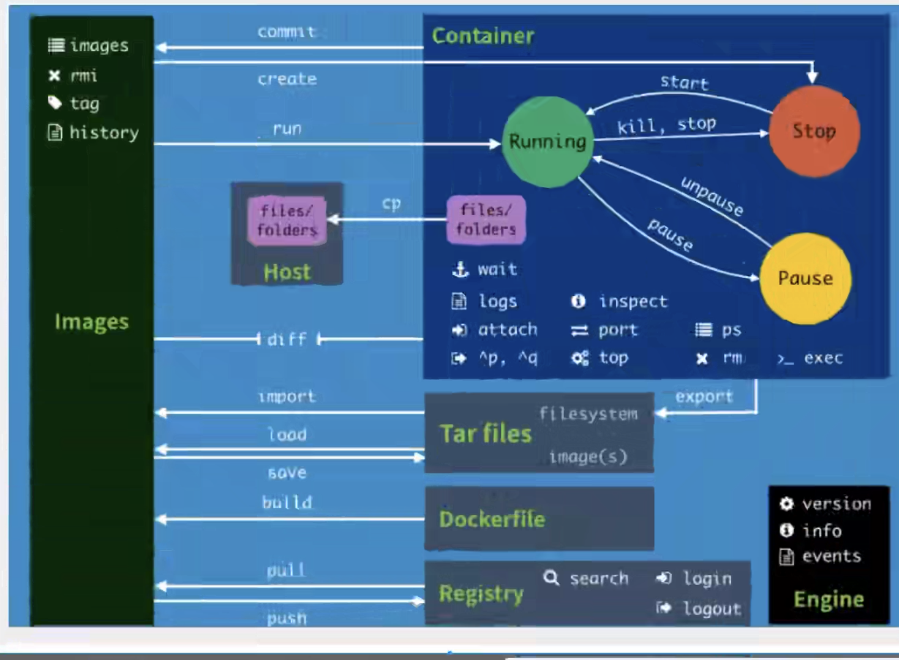

> 创建于2021年4月27日
>
> 来源于 bilibili 狂神的 Docker  视频编码  BV1og4y1q7M4

[TOC]

# 1、容器数据卷

将我们容器内的目录，挂载到Linux上面。

为什么要用卷：

容器的持久化和同步操作，容器间也是快要数据共享的！

> 方式一：直接使用命令来挂载   **-v**
>
> ​		本地目录：`/home/xiang/docker/test`

```sh
docker run -it -v 主机目录:容器目录 

# 测试
[root@xiang test]# docker run -it -v /home/xiang/docker/test:/home centos bash
```

 查看挂载状态  在容器外执行

> ```sh
> [root@xiang test]# docker ps
> CONTAINER ID   IMAGE                 COMMAND        CREATED              STATUS              PORTS                                   
> 854e7489ef5a   centos                "bash"         About a minute ago   Up About a minute                                           
> c574b66dd7ae   portainer/portainer   "/portainer"   21 hours ago         Up 10 minutes       0.0.0.0:8088->9000/tcp, :::8088-
> [root@xiang test]# docker inspect 854e7489ef5a
> ```

执行完 docker inspect 【centos】 命令后，我们可以找到以下数据

```sh
"Mounts": [
            {
                "Type": "bind",
                "Source": "/home/xiang/docker/test",			# 主机内的地址
                "Destination": "/home",							# docker 容器内的地址
                "Mode": "",
                "RW": true,
                "Propagation": "rprivate"
            }
        ],
```

此时  /home/xiang/docker/test 和  /home 是双向绑定的   


## 1.1、安装MySQL

下载Mysql

```sh
[root@xiang test]# docker pull mysql:5.7
```

运行容器，需要做数据挂载，安装启动 mysql 需要配置密码

```sh
# 官方测试：
docker run --name some-mysql -e MYSQL_ROOT_PASSWORD=my-secret-pw d mysql:tag
```

```sh
# 运行案例
-d 		后台运行
-p 		端口映射
-v		卷挂载
-e 		环境配置
--name	容器名字
docker run -d -p 3310:3306 -v /home/xiang/docker/mysql/conf:/etc/mysql/conf.d -v /home/mysql/data:/var/lib/mysql -e MYSQL_ROOT_PASSWORD=123456 --name mysql01 mysql:5.7
```



启动成功后，使用mysql工具连接 3310端口 映射到容器中的 3306 连接成功

```sh
# 挂载下的 mysql/data 没有任何文件，我们再去创建一个数据库
[root@xiang data]# pwd
/home/mysql/data/
[root@xiang data]# ls
[root@xiang data]# 

# 新建一个test 数据库后
[root@xiang data]# ls
auto.cnf    ca.pem           client-key.pem  ibdata1      ib_logfile1  mysql               private_key.pem  server-cert.pem  sys
ca-key.pem  client-cert.pem  ib_buffer_pool  ib_logfile0  ibtmp1       performance_schema  public_key.pem   server-key.pem   test
```

即使，我们把Mysql容器删除，我们挂载到数据卷的文件依然没有丢失。


### 1.1.1、具名挂载、匿名挂载

```sh
# 匿名挂载
-v 容器内挂载
-P 随机端口
docker run -d -p --name nginx01 -v /etc/nginx nginx
# 启动完成
```

匿名挂载

```sh
# 挂载相关命令
[root@xiang conf]# docker volume --help

Usage:  docker volume COMMAND

Manage volumes

Commands:
  create      Create a volume
  inspect     Display detailed information on one or more volumes
  ls          List volumes
  prune       Remove all unused local volumes
  rm          Remove one or more volumes

Run 'docker volume COMMAND --help' for more information on a command.

# 查看所有卷的情况
[root@xiang conf]# docker volume ls
DRIVER    VOLUME NAME
local     06a8d93d007d36bb1bb435a6394efe114100a8ccabc89d90d4cfde9055bd68f1			#  这里都是匿名的
local     7a447812d5b4ac186ed605e8409a8c1c1f9f8fcc2473ea44f8e4b3c233624a10
local     58eddc7ac7a8eb9e38851f1fb5d33abc908d31d63287dc3f2ab871a45a410ff5
local     91b009bdad4e2352c356732e329f3d8d22d7ccfaf0a1b1adb2746621df3ea7af
# 发现这种，就是匿名挂载，我们只用 -v 写了容器内的路径，没有写容器外的路径
```

具名挂载

```sh
[root@xiang home]# docker run -d -P --name nginx02 -v juming-nginx:/etc/nginx nginx
c73fc0368ce6a8410e0dbceb6e6876c136c7bdf613b911dd589de13b3abb5804

[root@xiang home]# docker volume ls
DRIVER    VOLUME NAME
local     juming-nginx
# 通过 -v 卷名：容器内路径
# 我们可以看到 juming-nginx

[root@xiang home]# docker volume inspect juming-nginx
[
    {
        "CreatedAt": "2021-04-27T22:48:11+08:00",
        "Driver": "local",
        "Labels": null,
        "Mountpoint": "/var/lib/docker/volumes/juming-nginx/_data",			# 挂载具体的地址
        "Name": "juming-nginx",
        "Options": null,
        "Scope": "local"
    }
]
```

所有 docker 容器内的卷，没有指定目录的情况下都是在  `/var/lib/docker/volumes/***/_data` 下的

我们通过具名挂载，可以方便的找到我们的一个卷，大多数情况都是使用==具名挂载==

```sh
# 然后确定是具名挂载还是匿名挂载，还是指定路径挂载！
-v	容器内路径		# 匿名挂载
-v  卷名：容器内路径	# 具名挂载
-v  /宿主机路径:容器内路径	# 指定路径挂载！
```


扩展：

```sh
# 通过 -v 容器内路径 ：ro  rw 改变读写权限
rw  # 可读可写
ro	# 只读

# 一旦设定了容器权限，容器对我们挂载出来的内容就限定了   外面没有权限，容器里面有权限判定
[root@xiang home]# docker run -d -P --name nginx02 -v juming-nginx:/etc/nginx:ro nginx
[root@xiang home]# docker run -d -P --name nginx02 -v juming-nginx:/etc/nginx:rw nginx
```


## 1.2、初识Dockerfile

Dockerfile 就是用来构建 docker 镜像的构建文件

通过脚本可以生产镜像

```sh
# 创建一个 dockerfile 文件
[root@xiang docker-test-volume]# vim dockerfile1

# 文件中的内容 （大写） 
FORM centos

VOLUME ["volume01","volume02"]

CMD echo "---end---"
CMD /bin/bash
```


```sh
[root@xiang docker-test-volume]# docker build -f dockerfile1 -t xiang/centos:1.0 .
Sending build context to Docker daemon  2.048kB
Step 1/4 : FROM centos
 ---> 300e315adb2f										# 进入镜像
Step 2/4 : VOLUME ["volume01","volume02"]
 ---> Running in 9a12d0b79999
Removing intermediate container 9a12d0b79999
 ---> 54a2b45c85c6										
Step 3/4 : CMD echo "---end---"
 ---> Running in ad76c789786d
Removing intermediate container ad76c789786d
 ---> 1bd77d6bea01
Step 4/4 : CMD /bin/bash
 ---> Running in 3a6189569067
Removing intermediate container 3a6189569067
 ---> 59478f75b966
Successfully built 59478f75b966
Successfully tagged xiang/centos:1.0

```

启动一下自己生成的镜像

```sh
[root@xiang docker-test-volume]# docker images
REPOSITORY            TAG       IMAGE ID       CREATED         SIZE
xiang/centos          1.0       59478f75b966   2 minutes ago   209MB

[root@xiang docker-test-volume]# docker run -it 59478f75b966 bash
[root@1f8dfdf34f33 /]# 
# 启动成功
```



这个卷肯定和外部有挂载

```sh
[root@xiang ~]# docker ps -a
CONTAINER ID   IMAGE                  COMMAND                  CREATED             STATUS                      PORTS                       
1f8dfdf34f33   59478f75b966           "bash"                   2 minutes ago       Up 2 minute
[root@xiang ~]# docker inspect 1f8dfdf34f33

```




说明是匿名挂载

进入 Source 目录，就可以看到我们之前创建的文件


## 1.3 、数据卷容器

两个mysql 同步数据

```sh
[root@xiang _data]# docker images
REPOSITORY            TAG       IMAGE ID       CREATED             SIZE
xiang/centos          1.0       59478f75b966   About an hour ago   209MB
。。。
[root@xiang _data]# docker run -it --name docker01 59478f75b966# 启动三个容器

[root@xiang _data]# docker run -it --name docker02 --volumes-from docker01 59478f75b966
[root@xiang _data]# docker run -it --name docker03 --volumes-from docker02 59478f75b966

```

> 通过 --volumes-from 进行挂载

多个 Mysql实现数据共享

```sh
docker run -d -p 3310:3306 -v /etc/mysql/conf.d -v /var/lib/mysql -e MYSQL_ROOT_PASSWORD=123456 --name mysql01 mysql:5.7

docker run -d -p 3311:3306 -e MYSQL_ROOT_PASSWORD=123456 --volumes-from mysql01 mysql:5.7
```

这个是，就可以实现两个数据库同步！

结论：

容器之间配置信息的传递，数据卷容器的生命周期，一直持续到没有容器的使用为止


# 2、DockerFile

dockerfile 是用来构建docker 镜像文件 ！ 命令参数脚本

构建步骤：

1. 编写一个dockerfile文件
2. docker build 构建成为一个镜像
3. docker run 运行镜像
4. docker push 发布镜像（DockerHub、阿里云镜像仓库）

```sh
FROM scratch
ADD centos-8-x86_64.tar.xz /
LABEL org.label-schema.schema-version="1.0"     org.label-schema.name="CentOS Base Image"     org.label-schema.vendor="CentOS"     org.label-schema.license="GPLv2"     org.label-schema.build-date="20201204"
CMD ["/bin/bash"]
```

很多官方镜像都是继承包，狠毒功能没有，我们通常会自己搭建自己的镜像。


## 2.1、DockerFile构建

基础知识：

1. 每个保留关键字（指令）都是必须是大写字母
2. 执行从上到下顺序
3.  .# 表示注释
4. 每一个指令都会创建提交一个新的镜像层，并提交

dockerfile 是面向开发的，我们以后要发布项目，做镜像，就要编写dockerfile文件，这个文件十分简单

DockerFile：构建文件，定义了一切的步骤，源代码

DockerImages：通过DockerFile 构建生成的镜像，最终发布和运行的产品

Docker容器：容器就是镜像运行起来提供服务的。


## 2.2、DockerFile 的指令

```sh
FROM			# 基础镜像，一切的开始来自这里
MAINTAINER		# 镜像是谁写的 姓名+邮箱
RUN				# 镜像构建的时候需要运行的命令
ADD				# 步骤，添加内容
WORKDIR			# 镜像工作目录
VOLUME			# 挂载的目录端口
EXPOSE			# 暴露端口配置
CMD				# 指定容器启动的时候要执行的命令   只有最后一个会生效，可悲替代
ENTRYPOINT		# 指定容器启动的时候要执行的命令   可以最佳命令
ONBUILD			# 当构建一个被继承， DockerFile 这个时候就会运行 ONBUILD
COPY			# 类似于 ADD 将我们文件拷贝到精修中
ENV				# 构建的时候设置环境变量
```

## 2.3、测试

DockerHub 中 99% 镜像都是从这个基础镜像过来的  FROM scratch，然后配置需要的软件来进行构建

> 创建一个自己的CentOS

```sh
[root@xiang dockerfile]# cat mydockerfile 
FROM centos
MAINTAINER array<array_xiangxiang@163.com>

ENV MYPATH /usr/local
WORKDIR $MYPATH

RUN yum -y install vim
RUN yum -y install net-tools

EXPOSE 80

CMD echo $MYPATH
CMD echo "----end-----"
CMD /bin/bash
```

> 通过文件构建镜像

```sh
# 命令 docker build -f dockerfile文件路径 -t 镜像名:[tag] .
[root@xiang dockerfile]# docker build -f mydockerfile -t mycentos:0.1 .
...
# 构建成功后 打印
Successfully built 885afd094dae
Successfully tagged mycentos:0.1

# 测试运行
vim 、 ifconfig 都可以使用了
```

查看我们搭建的镜像,可以看到我们的镜像是怎么一步一步做起来的

```sh
[root@xiang dockerfile]# docker history 885afd094dae
IMAGE          CREATED         CREATED BY                                      SIZE      COMMENT
885afd094dae   5 minutes ago   /bin/sh -c #(nop)  CMD ["/bin/sh" "-c" "/bin…   0B        
25cc160147c1   5 minutes ago   /bin/sh -c #(nop)  CMD ["/bin/sh" "-c" "echo…   0B        
12ce71c96470   5 minutes ago   /bin/sh -c #(nop)  CMD ["/bin/sh" "-c" "echo…   0B        
c7b63be8c2b2   5 minutes ago   /bin/sh -c #(nop)  EXPOSE 80                    0B        
c9dfa2fd0843   5 minutes ago   /bin/sh -c yum -y install net-tools             23.3MB    
c8bc9afec3a8   5 minutes ago   /bin/sh -c yum -y install vim                   58MB      
14a19d6708a1   6 minutes ago   /bin/sh -c #(nop) WORKDIR /$ MAPATH             0B        
c16af0a31c45   6 minutes ago   /bin/sh -c #(nop)  ENV MYPATH=/usr/local        0B        
68e42993e1d6   6 minutes ago   /bin/sh -c #(nop)  MAINTAINER array<array_xi…   0B        
300e315adb2f   4 months ago    /bin/sh -c #(nop)  CMD ["/bin/bash"]            0B        
<missing>      4 months ago    /bin/sh -c #(nop)  LABEL org.label-schema.sc…   0B        
<missing>      4 months ago    /bin/sh -c #(nop) ADD file:bd7a2aed6ede423b7…   209MB 
```

我们可以查到所有官方的镜像是怎么做的

## 2.4、CMD和ENTPYPOINT

+ CMD
  +  指定容器启动的时候要执行的命令   只有最后一个会生效，可悲替代
+ ENTRYPOINT
  + 指定容器启动的时候要执行的命令   可以最佳命令

> cmd 测试

```sh
[root@xiang dockerfile]# cat dockerfile-cmd-test 
FROM centos
CMD ["ls","-a"]


# 构建镜像
[root@xiang dockerfile]# docker build -f dockerfile-cmd-test -t centoscmdtest .
Sending build context to Docker daemon  3.072kB
Step 1/2 : FROM centos
 ---> 300e315adb2f
Step 2/2 : CMD ["ls","-a"]
 ---> Running in f981fc7c1ceb
Removing intermediate container f981fc7c1ceb
 ---> 9ede182025d8
Successfully built 9ede182025d8
Successfully tagged centoscmdtest:latest

[root@xiang dockerfile]# docker images
REPOSITORY            TAG       IMAGE ID       CREATED         SIZE
centoscmdtest         latest    9ede182025d8   4 seconds ago   209MB

# 命令生效
[root@xiang dockerfile]# docker run -it centoscmdtest
.   .dockerenv	dev  home  lib64       media  opt   root  sbin	sys  usr
..  bin		etc  lib   lost+found  mnt    proc  run   srv	tmp  var
[root@xiang dockerfile]# 
```

我们想追加一个命令  -l  ls -l

```sh
[root@xiang dockerfile]# docker run 9ede182025d8 -l
docker: Error response from daemon: OCI runtime create failed: container_linux.go:367: starting container process caused: exec: "-l": executable file not found in $PATH: unknown.
ERRO[0001] error waiting for container: context canceled

# 这样才能执行，我们需要写完整的路径
[root@xiang dockerfile]# docker run 9ede182025d8 ls -al
```


> 测试 ENTRYPOINT

```sh
[root@xiang dockerfile]# cat dockerfile-entrypoint-test 
FROM centos
ENTRYPOINT ["ls","-a"]


[root@xiang dockerfile]# docker build -f dockerfile-entrypoint-test -t entrypoint-test .
Sending build context to Docker daemon  4.096kB
Step 1/2 : FROM centos
 ---> 300e315adb2f
Step 2/2 : ENTRYPOINT ["ls","-a"]
 ---> Running in bc06226166a5
Removing intermediate container bc06226166a5
 ---> 830d5548fe39
Successfully built 830d5548fe39
Successfully tagged entrypoint-test:latest
[root@xiang dockerfile]# docker run entrypoint-test

```

直接追加

```sh
[root@xiang dockerfile]# docker run entrypoint-test -l
total 0
drwxr-xr-x.   1 root root   6 Apr 28 12:27 .
drwxr-xr-x.   1 root root   6 Apr 28 12:27 ..
```

## 2.5、Tomcat 镜像

1、准备镜像文件，tomcat 压缩包，jdk 的压缩包



2、编写dockerfile 文件，官方命名`Dockerfile`，build 会自动去寻找这个文件，就不需要加 -f 指定了

```sh
FROM centos

MAINTAINET xiang<array_xiangxiang@163.com>

COPY readme.txt /home/docker/readme.txt

ADD jdk-8u291-linux-x64.tar.gz /usr/local/
ADD apache-tomcat-9.0.45.tar.gz /usr/local/

RUN yum -y install vim

ENV MYPATH /usr/local
WORKDIR $MYPATH

ENV JAVA_HOME /usr/local/jdk1.8.0_291
ENV CLASSPATH $JAVA_HOME/lib/dt.jar:$JAVA_HOME/lib/tools.jar
ENV CATALINA_HOME /usr/local/apache-tomcat-9.0.45
ENV CATALINA_BASE /usr/local/apache-tomcat-9.0.45
ENV PATH $PATH:$JAVA_HOME/bin:$CATALINA_HOME/lib:$CATALINA_HOME/bin

EXPOSE 8080

CMD /usr/local/apache-tomcat-9.0.45/bin/startup.sh && tail -f /usr/local/apache-tomcat-9.0.45/logs/catalina.out
```

构建镜像

```sh
[root@xiang docker]# docker build -t diytomcat .
```

镜像构建完成，启动镜像

```sh
-- name  # 别名
-v /home/xiang/build/tomcat/test:/usr/local/apache-tomcat-9.0.45/webapps/test    # 将本地test 文件挂载到tomcat webapps 下的test文件
-v /home/xiang/build/tomcat/tomcatlogs/:/usr/local/apache-tomcat-9.0.45/logs	 # 挂载 日志
[root@xiang docker]# docker run -d -p9090:8080 --name xiangtomcat -v /home/xiang/build/tomcat/test:/usr/local/apache-tomcat-9.0.45/webapps/test -v /home/xiang/build/tomcat/tomcatlogs/:/usr/local/apache-tomcat-9.0.45/logs diytomcat
abf115c57464bb222fa7cc820a70c406c0af9a0cf4422841e5efef4ba572e5c9				 # 启动成功
```

访问成功



实现一个网页，百度一段 web.xml

```xml
<?xml version="1.0" encoding="UTF-8"?>
<web-app version="2.4" 
    xmlns="http://java.sun.com/xml/ns/j2ee" 
    xmlns:xsi="http://www.w3.org/2001/XMLSchema-instance"
    xsi:schemaLocation="http://java.sun.com/xml/ns/j2ee 
        http://java.sun.com/xml/ns/j2ee/web-app_2_4.xsd">
</web-app>
```

再找一个 jsp

```jsp
<%@ page language="java" contentType="text/html; charset=UTF-8"
    pageEncoding="UTF-8"%>
<!DOCTYPE html>
<html>
<head>
<meta charset="utf-8">
<title>菜鸟教程(runoob.com)</title>
</head>
<body>
Hello World!<br/>
<%
out.println("你的 IP 地址 " + request.getRemoteAddr());
%>
</body>
</html>
```

文件结构

```sh
[root@xiang tomcat]# tree test/
test/
├── index.jsp
└── WEB-INF
    └── web.xml

```



==效果实现==

## 2.6、发布自己的镜像

> DockerHub

1、注册 [https://hub.docker.com/](https://hub.docker.com/) 注册自己的账号！

2、确定这个账号可以登录

3、在我们服务器上提交自己的镜像

> docker login

```sh
[root@xiang tomcat]# docker login
Login with your Docker ID to push and pull images from Docker Hub. If you don't have a Docker ID, head over to https://hub.docker.com to create one.
Username: arrayxiangxiang			#  用户名
Password: 【这里输密码】			   #  密码
WARNING! Your password will be stored unencrypted in /root/.docker/config.json.
Configure a credential helper to remove this warning. See
https://docs.docker.com/engine/reference/commandline/login/#credentials-store

Login Succeeded

```

4、登录完成后，就可以push了

```sh
[root@xiang tomcat]# docker push diytomcat
Using default tag: latest
The push refers to repository [docker.io/library/diytomcat]
bf3cbbbcaf04: Preparing 
caffcbb4502a: Preparing 
4868f4f54c5e: Preparing 
972f27f22fc3: Preparing 
2653d992f4ef: Preparing 
denied: requested access to the resource is denied  # 拒绝 

```

这里 up 主没有找到解决的办法，我百度后找到答案，原因是需要将镜像名字 以自己 dockerHub 名字前缀 +`/`+ 镜像名字 加版本

> 注意，原本 diytomcat 依旧保留，会多一个 tag 后的 镜像

```sh
# 原来的名字是   diytomcat   没有指定版本，所以为  latest
# 标记为 arrayxiangxiang/tomcat:v1
[root@xiang tomcat]# docker tag diytomcat:latest arrayxiangxiang/tomcat:v1
```

结果得到证实

```sh
[root@xiang tomcat]# docker push arrayxiangxiang/tomcat:v1
The push refers to repository [docker.io/arrayxiangxiang/tomcat]
bf3cbbbcaf04: Pushing [>                                                  ]  549.9kB/58.03MB
caffcbb4502a: Pushing [==>                                                ]  700.4kB/15.9MB
4868f4f54c5e: Pushing [>                                                  ]   1.08MB/359.6MB
972f27f22fc3: Pushing  3.072kB
2653d992f4ef: Pushing [=>                                                 ]  8.219MB/209.3MB
```

推送成功！

```sh
v1: digest: sha256:d04d95cddfbb10378665aae1dd6923c546b48c9af2fcbc9bdfdc52aaaa70d61e size: 1373
```






