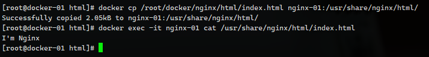
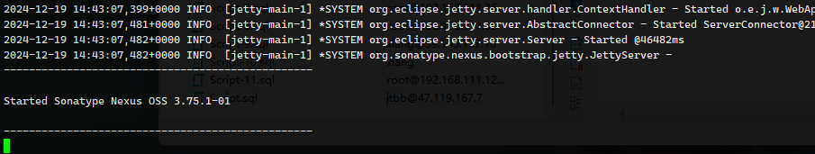

## Docker 数据卷

```sh
docker run -itd --name nginx-01 -p18080:80 nginx:1.19.3-alpine
```


```sh
docker run -itd --name nginx-02 -v /root/docker/nginx/html:/usr/share/nginx/html -p18080:80 nginx:1.19.3-alpine
```


Docker 容器数据卷可用看成我们生活中u盘，存在一个或多个容器中，由于 Docker 挂在到容器，但不属于联合文件系统，Docker 不回在容器删除时删除其挂在到数据卷

1. 数据卷可以在容器中共享重用数据
2. 数据卷中的更改可以立即生效
3. 数据卷中的更改不回包含在镜像的更新中
4. 数据卷默认会一直存在，即使容器被删除
5. 数据卷的生命周期一直支持到没有容器使用为止


容器中的管理数据主要由两种方式

1. 数据卷：直接映射到本地主机环境
2. 数据卷容器：使用特定容器维护数据卷


### docker cp 拷贝

宿主机文件复制到容器内

本地：/root/docker/nginx/html/index.html 文件，

容器：/usr/share/nginx/html/index.html 中。

```sh
docker cp /root/docker/nginx/html/index.html nginx-01:/usr/share/nginx/html/
```




容器拷贝出来，把容器中的 /usr/share/nginx/html/50x.html 拷贝出来

```sh
docker cp nginx-01:/usr/share/nginx/html/50x.html /root/docker/nginx/html/
```


### 数据卷

简化 docker cp 操作，挂载数据卷，最好是通过 run 而非 create/start 创建启动容器，create/start 命令创建的容器后，再挂载会比较麻烦，但并非不可以。

docker 也推荐目录挂载，不要文件挂载


1. 宿主机数据卷，直接再宿主机的文件系统中，容器可以访问 bind mount
2. 命名数据卷，磁盘上 Docker 管理的数据卷，卷有名字
3. 匿名数据卷，磁盘 Docker 管理的数据卷，因为没有名字找到比较难，Docker 来管理的

后两者都是 Docker 管理的目录，一般是在` /var/lib/docker/volumes/` 推荐大家使用第一种。


语法

```sh
docker run -v /主机目录:/容器目录 镜像名
```

案例

```sh
docker run -itd --name mysql5.7 -p 3306:3306 -e MYSQL_ROOT_PASSWORD=123456 -v /data/mysql:/var/lib/mysql registry.cn-beijing.aliyuncs.com/yuncenliu/mysql:5.7.44 --character-set-server=utf8mb4 --collation-server=utf8mb4_unicode_ci
```

查看启动日志

```sh
docker logs -f mysql5.7
```

> 一个目录下启多个mysql是无法启动的，mysql 回报错
>
> Unable to lock ./ibdata1 error: 11
> [Note] InnoDB: Check that you do not already have another mysqld process using the same InnoDB data or log files.


数据覆盖问题

+ 如果挂载一个空的数据卷到容器中的一个非空目录，那么这个目录下的文件会被复制到数据卷中
+ 如果挂载一个非空的数据卷到容器中第一个目录中，那么容器中的目录回显示数据卷中的数据，如果原来容器中的目录有数据，那么原始数据会被隐藏。


第二项表明，如果需要迁移容器，把挂载内容在新宿主机启动相当方便


#### 容器目录权限

通过 -v 容器内路径: ro  rw  改变读写权限

ro：readonly 只读

rw：readwrite 可读可写

例如

```sh
docker run -d -p --name nginx-02 -v /data:/etc/nginx:ro nginx
docker run -d -p --name nginx-03 -v /data:/etc/nginx:rw nginx
```

看到 `ro` 说明这个路径下只能通过宿主机操作，容器内部是无法操作的！


## Docker 挂载时，遇到的坑

### Docker 启动 Nexus3

启动 Nexus3，内存 > 4G

```sh
docker run -itd --name nexus3 -p 8081:8081  registry.cn-beijing.aliyuncs.com/yuncenliu/nexus3:3.75.1 
```



浏览器访问 xxxx:8081 

默认 admin 密码在容器 /nexus-data/admin.password 文件中

### 此时

如果想 -v /data/nexus3:/nexus-data 挂载到这个目录，此时如果盲目 -v 启动则会报错，官方文档提示需要授权。

```sh
mkdir -p /data/nexus3
chown -R 200 /data/nexus3/

docker run -itd --name nexus3 -p 8081:8081  -v /data/nexus3:/nexus-data registry.cn-beijing.aliyuncs.com/yuncenliu/nexus3:3.75.1 
```


## 具名挂载


不适用宿主机目录，用一个自定义的名字创建挂载

```sh
docker run -itd --name nginx -p 80:80 -v volumn-nginx:/etc/nginx nginx:1.19.3-alpine
```

查看挂载情况

```sh
docker volume ls
```

可以发现有一个 `volumn-nginx` , 查看挂载详细情况

```sh
docker volume inspect volumn-nginx
```

可以看到具体的宿主机目录，即使容器删掉，挂载的文件仍在。


## 匿名挂载


```sh
docker run -itd --name nginx -p 80:80 -v /etc/nginx nginx:1.19.3-alpine
```

只能根据创建时间去判断是哪个

```sh
docker volume ls
```


## 清理数据卷

慎用

```sh
docker volume prune
```

正在运行的 docker 容器不会被清理。


## 数据卷容器


创建好的数据卷容器处于停止运行状态，因为 -volumes-from 参数所挂载的容器自己并不需要保持运行状态

```sh
docker run -d --name data-volume -v /data/nginx:/usr/share/nginx/html -v /data/mysql:/var/lib/mysql registry.cn-beijing.aliyuncs.com/yuncenliu/centos:7.9.2009
```

会自动创建 /data/nginx 、/data/mysql 目录


##### Nginx-01

然后创建 Nginx

```sh
docker run -itd --name nginx-01 -p 80:80 --volumes-from data-volume nginx:1.19.3-alpine
```

```sh
echo "I'm nginx" > /data/nginx/index.html
```

此时，访问浏览器就可以访问 Nginx 应用


##### Nginx-02

```sh
docker run -itd --name nginx-02 -p 81:80 --volumes-from data-volume nginx:1.19.3-alpine
```

两个Nginx挂载同一个目录，实现挂载


但并不是所有容器都可以这样，比如前面说的 MySQL 