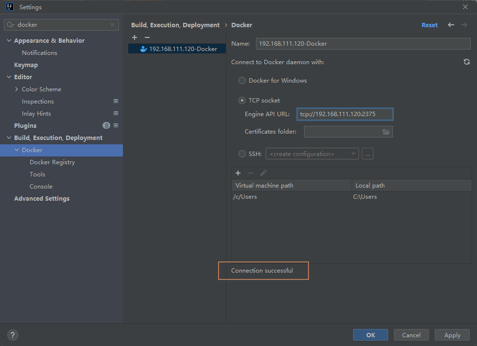
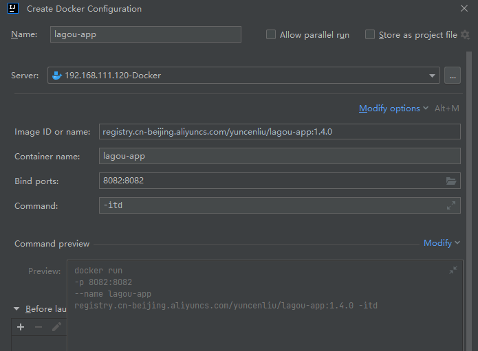

# IDEA 集成 Docker

修改 `192.168.111.120` 服务器的 docker.service 服务信息，运行其他主机远程访问docker服务

/usr/lib/systemd/system/docker.service

```
ExecStart=/usr/bin/dockerd -H fd:// --containerd=/run/containerd/containerd.sock -H tcp://0.0.0.0:2375
```

重启 docker

```sh
systemctl daemon-reload
systemctl restart docker
```

查看docker进程是否开启 2375 监听

```sh
ps -ef|grep docker
```


IDEA 设置 Docker



IDEA 启动 Docker




我们也可以修改内容，比如将 bind ports 修改成 8083:8082 这样浏览器访问端口就可以改变。