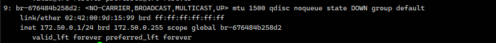
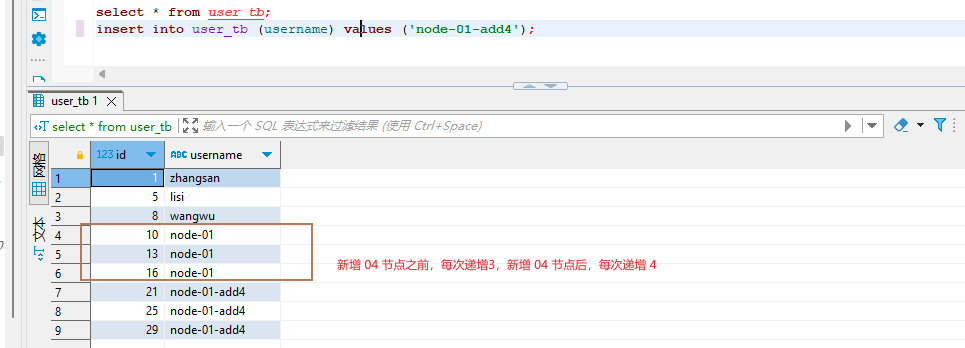

# MySQL主从复制搭建

## 官网自定义制作镜像


使用 mysql 官方提供镜像制作主从复制服务器集群配置

概念：将主数据库的增删改查操作记录到 二进制文件 保存，从库接收主数据库日志文件，根据最后一次更新的起始位置，同步复制到从数据库中，使得主从数据库保持一致。


作用：

1. 高可用扩展，主数据异常可切换到从数据库
2. 覆盖均衡：实现读写分离
3. 备份：进行日常备份


Binary log 主从数据库的二进制文件；Relay log：从数据库的中继日志

复制过程

1. 主数据库每次事务完成前，将操作日志记录到 binlog 日志文件中
2. 从数据库中有一个I/O进程，复制连接主数据库服务，并读取binglog日志，发现有变动就写入 relay-log，否则休眠
3. 从数据库中 SQL Thread 读取中继日志，并串行执行 SQL事件，使得从数据库始终保持一致

注意事项

1. 涉及时间函数，会出现不一致情况，原因是复制过程两次IO操作和网络、磁盘效率等问题导致时间戳不一致
2. 涉及系统函数，会出现不一致


节点信息

| 主机名                       | IP地址          |
| ---------------------------- | --------------- |
| mysql-server-192.168.111.120 | 192.168.111.120 |
| mysql-agent-192.168.111.175  | 192.168.111.175 |


#### server-192.168.111.120

my.cnf 配置文件

```my.conf
mkdir -p /data/cluster-mysql/master
vim /data/cluster-mysql/master/my.cnf

[mysqld]
# 必须开启二进制日志
log-bin=mysql-bin
# 服务器必须唯一ID，默认用ip后三位
server-id=120
```

Dockerfile 镜像文件

```dockerfile
docker build --rm -t registry.cn-beijing.aliyuncs.com/yuncenliu/mysql:cluster-master-mysql-5.7.44 .
```

运行容器

```sh
docker run -itd --name cluster-master-mysql -p 3306:3306 -e MYSQL_ROOT_PASSWORD=123456 registry.cn-beijing.aliyuncs.com/yuncenliu/mysql:cluster-master-mysql-5.7.44 --character-set-server=utf8mb4 --collation-server=utf8mb4_general_ci
```


#### agent-192.168.111.75

my.cnf

```cnf
FROM registry.cn-beijing.aliyuncs.com/yuncenliu/mysql:5.7.44
MAINTAINER cluster-master-mysql from data UTC by Asia/Shanghai "yuncenLiu@163.com"
ENV TZ Asia/Shanghai
COPY my.cnf /etc/mysql
```

dockerfile

```dockerfile
docker build --rm -t registry.cn-beijing.aliyuncs.com/yuncenliu/mysql:cluster-agent-mysql-5.7.44 .
```

运行容器

```sh
docker run -itd --name cluster-agent-mysq -p 3306:3306 -e MYSQL_ROOT_PASSWORD=123456 registry.cn-beijing.aliyuncs.com/yuncenliu/mysql:cluster-agent-mysql-5.7.44 --character-set-server=utf8mb4 --collation-server=utf8mb4_general_ci
```


### 数据库操作

##### mysql-master： root@192.168.111.120:3306

```mysql
create user 'yun'@'%' identified by '123456';
grant replication slave on *.* to 'yun'@'%';
flush privileges ;

# 出现 [Err] - 1055 解决方案在 my.cnf 配置
sql_mode='STRICT_TRANS_TABLES,NO_ZERO_IN_DATE,NO_ZERO_DATE,ERROR_FOR_DIVISION_BY_ZERO,NO_AUTO_CREATE_USER,NO_ENGINE_SUBSTITUTION'

# 查看 master 状态
show master status;
# mysql-bin.000003,836  这里 2个参数注意一下


# 查看二进制相关配置
show global variables like 'binlog%';

# 查看 server 相关配置
show global variables like 'server%';
```


##### mysql-agent： root@192.168.111.175:3306

```sql
CHANGE MASTER TO
    master_host = '192.168.111.120',
    master_user = 'yun',
    master_password = '123456',
    master_port = 3306,
    master_log_file = 'mysql-bin.000003',
    master_log_pos = 836;

-- 启动主从
start slave ;

-- Slave_IO_Running、Slave_SQL_Running 这两个 yes 就成功 80%了
show slave status ;
```


测试

在主库建库、建表

```sql
create database cloud;
create table cloud.cluster_test_tab(
    userid int primary key auto_increment,
    username varchar(50),
    password varchar(50)
);
```

从库查询，发现表已经建好了


## bitnami/mysql 主从MySQL

节点信息

| 主机名                       | IP地址               |
| ---------------------------- | -------------------- |
| mysql-server-192.168.111.120 | 192.168.111.120:3306 |
| mysql-agent-192.168.111.175  | 192.168.111.175:3306 |


授权 UID 进行挂载，否则无法进行挂载

##### master 运行

```sh
docker run -itd --name mysql-master \
 -p 3306:3306 \
 -e MYSQL_ROOT_PASSWORD=admin \
 -e MYSQL_REPLICATION_MODE=master \
 -e MYSQL_REPLICATION_USER=lagou \
 -e MYSQL_REPLICATION_PASSWORD=lagou \
 registry.cn-beijing.aliyuncs.com/yuncenliu/mysql:bitnami-5.7.30
```

连接数据库 mysql -h"192.168.111.120" -P3306 -uroot -padmin

如果需要初始化数据库加上参数

```sh
mkdir -p /data/bitnamimysql/docker-entrypoint-initdb.d
chmod -R 1001 /data/bitnamimysql
```

```sh
-v /data/bitnamimysql/docker-entrypoint-initdb.d:/docker-entrypoint-initdb.d \
```


##### agent 运行

```sh
docker run -itd --name mysql-slave \
 -p 3306:3306 \
 -e MYSQL_REPLICATION_MODE=slave \
 -e MYSQL_REPLICATION_USER=lagou \
 -e MYSQL_REPLICATION_PASSWORD=lagou \
 -e MYSQL_MASTER_HOST=192.168.111.120 \
 -e MYSQL_MASTER_ROOT_NUMBER=3306 \
 -e MYSQL_MASTER_ROOT_PASSWORD=admin \
 registry.cn-beijing.aliyuncs.com/yuncenliu/mysql:bitnami-5.7.30
```

连接数据库 mysql -h"192.168.111.175" -P3306 -uroot -padmin


## bitnami/mysql 主主MySQL

PXC模式，没有主从之分，每个数据库都可以读写，数据可以保证数据强一致性，执行时间较慢，由于一般是强一致性，所以用于存储重要数据，例如金融、电信、军工。

galera cluster 多主架构，关注数据一致性，对待事务行为，要么所有节点执行，要么都不执行，这种实现机制决定了它对待一致性行为非常严格，完美保证MYSQL集群的数据一致性。


搭建PXC架构，至少需要3个mysql实例来组成一个集群，这种架构不共享任何数据，是一种高冗余架构

PXC操作流程：

​	首先客户端发起事务，事务现在本地执行，执行完成后发起对事务的提交操作，在提交之前需要将产生的复制写集群广播出去，获得全局事务ID，一并传送到另外一个节点上，通过合并数据之后，发现没有冲突，执行 apply_cd 和 commit_cd 动作，否则取消此次事务。

  而当前 server 节点通过验证后，执行提交操作，并返回OK，如果验证没有通过，则执行回滚，当然在生产中至少要有3个节点的集群环境，如果其中一个节点没有验证通过，出现了数据冲突，那么此时采取的方式就是将不一致的节点踢出集群环境，而且他自己会执行 shutdown 命令，自己关机。


优点：

1. 实现 mysql 数据集群架构高可用的数据强一致性
2. 完成了真正多节点读写的集群方案
3. 改善传统意义上主从复制延迟问题，基本达到了实时同步
4. 新节点可以自动部署，无需提供手动备份，维护方便
5. 由于多节点写入，所以数据库故障切换容易


缺点：

1. 新加入节点开销大，需要复制完整的数据，采用STT传输开销大
2. 任何更新事务都需要全局验证，才会在每一个节点上执行，集群性能受限于最差节点。
3. 因为需要保证数据一致性，所以多节点并发，锁冲突比较验证
4. 存在写扩大问题，所有的节点上都会发送写操作
5. 只支持innodb存储引擎的表
6. 没有表级别的锁，执行DDL语句操作会把整个集群锁住，而且kill不了，建议使用 Osc 操作，即在线DDL
7. 所有的表必须含有主键，不然操作数据时会报错。


官方地址：https://hub.docker.com/r/percona/percona-xtradb-cluster


节点信息

| 主机名       | IP地址          |
| ------------ | --------------- |
| mysql-server | 192.168.111.120 |

镜像

```sh
docker pull percona/percona-xtradb-cluster:5.7.30
# 如果挂载数据卷，必须授权

# 个人镜像
registry.cn-beijing.aliyuncs.com/yuncenliu/mysql:percona-xtradb-cluster-5.7.30
```

使用端口：3301、3302、3303 端口


#### docker run 搭建操作

创建单独网络（可选），如果要创建，先 ip a 看一下已使用的网段

```sh
docker network create --subnet=172.50.0.0/24 pxc-net
```




准备三个数据卷，主要要给权限

```sh
docker volume create --name pxc-v1
docker volume create --name pxc-v2
docker volume create --name pxc-v3
```

创建完进入 /var/lib/docker/volumes 给这三个目录授 777 权限（开发图方便）

```sh
chmod 777 -R /var/lib/docker/volumes/pxc-v1/
chmod 777 -R /var/lib/docker/volumes/pxc-v2/
chmod 777 -R /var/lib/docker/volumes/pxc-v3/
```

创建节点 node-01

```sh
docker run -d -p 3301:3306 \
 -v pxc-v1:/var/lib/mysql \
 -e MYSQL_ROOT_PASSWORD=admin \
 -e CLUSTER_NAME=PXC \
 -e XTRABACKUP_PASSWORD=yuncenliu \
 --privileged \
 --name=pxc-node-01 \
 --net=pxc-net \
 --ip 172.50.0.2 \
 registry.cn-beijing.aliyuncs.com/yuncenliu/mysql:percona-xtradb-cluster-5.7.30
```

等待 node-01 创建完成再创建 node-02

```sh
docker run -d -p 3302:3306 \
 -v pxc-v2:/var/lib/mysql \
 -e MYSQL_ROOT_PASSWORD=admin \
 -e CLUSTER_NAME=PXC \
 -e XTRABACKUP_PASSWORD=yuncenliu \
 -e CLUSTER_JOIN=pxc-node-01 \
 --privileged \
 --name=pxc-node-02 \
 --net=pxc-net \
 --ip 172.50.0.3 \
 registry.cn-beijing.aliyuncs.com/yuncenliu/mysql:percona-xtradb-cluster-5.7.30
```

```sh
docker run -d -p 3303:3306 \
 -v pxc-v3:/var/lib/mysql \
 -e MYSQL_ROOT_PASSWORD=admin \
 -e CLUSTER_NAME=PXC \
 -e XTRABACKUP_PASSWORD=yuncenliu \
 -e CLUSTER_JOIN=pxc-node-01 \
 --privileged \
 --name=pxc-node-03 \
 --net=pxc-net \
 --ip 172.50.0.4 \
 registry.cn-beijing.aliyuncs.com/yuncenliu/mysql:percona-xtradb-cluster-5.7.30
```


创建完成后，测试sql

```sql
create table user_tb(
	id int primary key auto_increment comment '主键',
	username varchar(20) COMMENT  '用户名'
) COMMENT '用户表';

select * from user_tb;
insert into user_tb (username) values ('zhangsan');
```

这里会有主键按分片递增情况，假设再加一个分片进来




#### dockerfile 搭建操作

如果使用 docker run 创建过后，需要初始化一下

```sh
docker stop pxc-node-01 pxc-node-02 pxc-node-03 pxc-node-04
docker rm pxc-node-01 pxc-node-02 pxc-node-03 pxc-node-04
docker volume rm pxc-v1 pxc-v2 pxc-v3 pxc-v4
# rm -rf /var/lib/docker/volumes/pxc-v....
docker network rm pxc-net
```


##### 新环境如下操作

创建挂载目录

```sh
mkdir -p /data/pxc-volume
cd /data/pxc-volume
mkdir -p pxc-v1 pxc-v2 pxc-v3 pxc-master pxc-agent
# 授权
chmod 777 -R /data/pxc-volume
```

创建网络，master 和 agent 是两份 docker-compose.yml 文件，需要公用一个网络

```sh
docker network create pxc_network --driver bridge
```


Github => 查看 [docker-compose](https://github.com/YuncenLiu/code-example/blob/master/docker-module/src/main/resources/pxc/master/docker-compose.yml) 文件

```yaml
version: '3'
services:
  pxc-01:
    image: registry.cn-beijing.aliyuncs.com/yuncenliu/mysql:percona-xtradb-cluster-5.7.30
    container_name: pxc-node-01
    privileged: true
    ports:
      - 3301:3306
    environment:
      - MYSQL_ROOT_PASSWORD=admin
      - CLUSTER_NAME=pxc
    volumes:
      - /data/pxc-volume/pxc-v1:/var/lib/mysql
networks:
  default:
    external:
      name: pxc_network
```


注意事项

1. 一定要等到 master 节点起来，再启动 agent

2. pxc 节点不能太多，不然整体性能下降

3. pxc 节点之间服务器配置一致

4. pxc 集群只支持 innodb 引擎

5. docker-compose 网络

   1. 新建一个网络，网络名称为 front 的 bridge 类型网络

      ```yaml
      networks:
        front:
          driver: bridge
      ```

   2. 使用已经存在的网络

      ```sh
      docker network create pxc-network --driver bridge
      ```

      ```yaml
      networks:
        default:
          external:
            name: pxc-network
      ```

      

