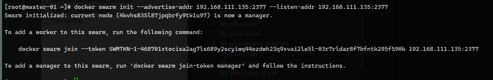
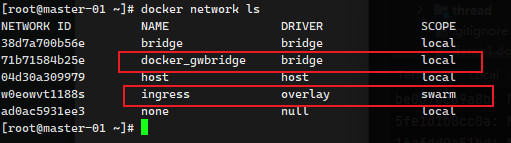
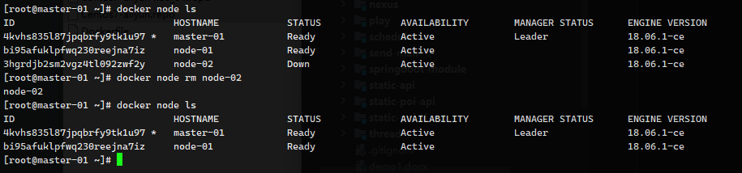

# Swarm 集群管理

compose、machine和 swarm 是 docker 原生提供的三大编排工具


swarm命令总结

| 命令                    | 描述                                         |
| ----------------------- | -------------------------------------------- |
| docker swarm init       | 初始化集群                                   |
| docker swarm join       | 加入集群作为work或manager                    |
| docker swarm join-token | 管理用于加入集群的令牌                       |
| docker swarm leave      | 离开集群                                     |
| docker swarm unlock     | 解锁集群                                     |
| docker swarm unlock-key | 管理解锁钥匙                                 |
| docker swarm update     | 更新 swarm 集群                              |
|                         |                                              |
| docker node demote      | 降级，从 manage 降为 work                    |
| docker node inspect     | 显示一个或多个节点详细信息                   |
| docker node ls          | 列出 swarm 集群节点                          |
| docker node promote     | 升级，从 work 升为 manage                    |
| docker node ps          | 列出一个或多个节点上运行的任务，默认当前节点 |
| docker node rm          | 从集群中删除                                 |
| docker node update      | 更新节点                                     |
|                         |                                              |
| docker service create   | 创建服务                                     |
| docker service insepct  | 显示一个或多个服务的详细信息                 |
| docker service logs     | 获取服务日志                                 |
| docker service ls       | 列出服务                                     |
| docker service rm       | 删除一个或多个服务                           |
| docker service scale    | 设置服务的实例数量                           |
| docker service update   | 更新服务                                     |
| docker service rollback | 恢复服务至update之前配置                     |


服务器节点信息 Home 

| 主机名        | IP地址          | 说明              |
| ------------- | --------------- | ----------------- |
| K8s-master-01 | 192.168.111.135 | swarm-master 节点 |
| K8s-node-01   | 192.168.111.136 | swarm-work 01节点 |
| K8s-node-02   | 192.168.111.137 | swarm-work 02节点 |

服务器节点信息 Mac 

| 主机名        | IP地址          | 说明              |
| ------------- | --------------- | ----------------- |
| K8s-master-01 | 192.168.186.186 | swarm-master 节点 |
| K8s-node-01   | 192.168.186.187 | swarm-work 01节点 |
| K8s-node-02   | 192.168.186.188 | swarm-work 02节点 |
| K8s-node-03   | 192.168.186.189 | swarm-work 02节点 |


官网：https://docs.docker.com/engine/swarm


创建 swarm 环境

```sh
docker swarm init --advertise-addr 192.168.111.135:2377 --listen-addr 192.168.111.135:2377

docker swarm init --advertise-addr 192.168.196.186:2377 --listen-addr 192.168.196.186:2377
```



创建完成后，会默认添加两个网络分别是




查看docker 集群状态

```sh
docker node ls
```


获取添加一个 work 的 token，使用 node-01 和 node-02 添加

```sh
docker swarm join-token worker
```

```sh
docker swarm join --token SWMTKN-1-468701xtocisa2ag7ls689y2scyiwq44ozdwh23q9xvai2le5l-03r7rldar8f7bfntk295f590k 192.168.111.135:2377
# 24小时失效，需要重新获取
```


获取添加一个 work 的 manager

```sh
docker swarm join-token manager
```


将一个 work 节点升级为 manager 节点，变成 Reachable 状态，如果 leader 挂掉，则 node-02 成为 leader

```sh
docker node promote node-02
```


将 manager 节点降级为 work 节点

```sh
docker node demote node-02
```


退出集群，需要在当前节点中执行，不久后，使用  docker node ls 查看到状态为 Down

```sh
docker swarm leave
```

如果要彻底删除，在 leader 节点中执行

```sh
docker node rm node-02
```




### 安装图形界面

Https://hub.docker.com/r/dockersamples/visualizer


Docker 创建容器

```sh
docker run -itd --name visualizer -p 8099:8080 \
 -e HOST=192.168.198.186 \
 -e PORT=8080 \
 -v /var/run/docker.sock:/var/run/docker.sock \
 registry.cn-beijing.aliyuncs.com/yuncenliu/visualizer:dockersamples-latest
```

Swarm 创建服务

```sh
docker service create \
 --name=viz \
 --publish=8080:8080/tcp \
 --constraint=node.role=manager \
 --mount=type=bind,src=/var/run/docker.sock,dst=/var/run/docker.sock \
 registry.cn-beijing.aliyuncs.com/yuncenliu/visualizer:dockersamples-latest
```


#### swarm 创建服务

镜像准备：

```sh
docker login --username=array_xiang -p 546820.0@lyc registry.cn-beijing.aliyuncs.com

docker pull registry.cn-beijing.aliyuncs.com/yuncenliu/nginx:1.17.10-alpine && \
docker pull registry.cn-beijing.aliyuncs.com/yuncenliu/nginx:1.19.3-alpine
```


创建网络

```sh
docker network create -d overlay nginx-net
```


> 以下所有操作必须在 manage 节点中运行

创建服务

```sh
docker service create --name nginx --network nginx-net -p 80:80 --replicas 5 registry.cn-beijing.aliyuncs.com/yuncenliu/nginx:1.17.10-alpine
```


不希望 leader 节点运行服务

将 k8s-master-01 节点驱离

```sh
docker node update --availability drain k8s-master-01
```

执行后， k8s-master-01 立即下线 Nginx 服务，并马上有一台其他节点上线 Nginx 服务


如果希望参加工作节点

```sh
docker node update --availability active k8s-master-01
```


修改副本数量，将5个副本修改为2个副本

```sh
docker service scale nginx=2
```


修改 Nginx 的镜像版本

```sh
docker service update --image registry.cn-beijing.aliyuncs.com/yuncenliu/nginx:1.19.3-alpine nginx
```

修改 Nginx 的端口号

```sh
docker service update --publish-add 8090:80 nginx
```

删除 Nginx 服务

```sh
docker service rm nginx
```


### 使用 docker-compose 方式创建

```sh
docker stack deploy nginx-stack -c docker-compose.yml
```

docker-compose.yml

```yaml
version: '3'
services:
  nginx-web:
    image: registry.cn-beijing.aliyuncs.com/yuncenliu/nginx:1.19.3-alpine
    container_name: nginx
    networks:
      - nginx-net
    ports:
      - 80:80
    deploy:
      replicas: 5

# 如果我们不创建网络，默认也是创建 overlay
networks:
  nginx-net:
    driver: overlay
```


### 总结

docker stack 和 docker compose 区别

1. Docker stack 会忽略构建指令，无法使用 stack 命令构建新镜像，他是需要镜像预先被构建好，所以 docker-compse 更适合开发场景
2. docker-compse 是 python 项目，内部使用了 docker api 规范容器，所以需要安装 docker-compse
3. docker stack功能包含在 docker 引擎中，不需要额外安装，docker stack 是 swarm mode中的一部分
4. stack 不支持第二版本 docker-compose.yml 也就是 version 版本至少为3 ，然后docker-compse 对2、3文件仍然可以处理
5. docker stack把docker compose 所有工作都做完了，因此 stack 占据主导地位，同时，对于大多数人来说 切换到使用 stack 机不困难，开销也不大，如果是 docker新手，推荐 docker stack


