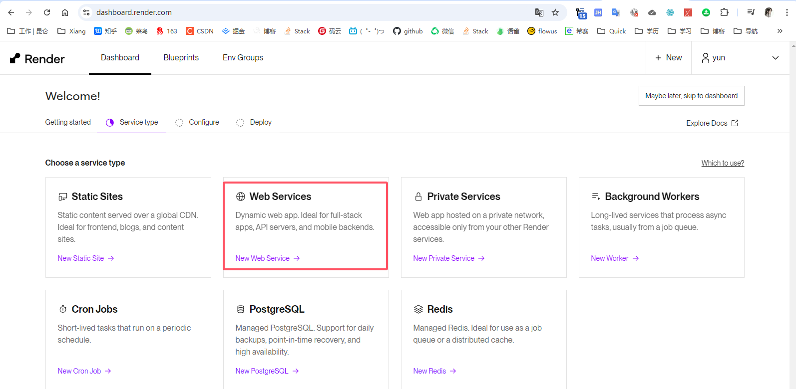

## 方案一：（无效）

### [Render](https://dashboard.render.com/)

Gihub 图文教程：[https://github.com/dqzboy/Docker-Proxy](https://github.com/dqzboy/Docker-Proxy)



[集成 Render 使用教程](https://github.com/dqzboy/Docker-Proxy/tree/main/Render#-%E9%83%A8%E7%BD%B2)

| 镜像                     | 平台       |
| ------------------------ | ---------- |
| mirhub/mirror-hub:latest | docker hub |


## 方案二：无效


老毛子的 [dockerhub.timeweb](https://dockerhub.timeweb.cloud/)

```sh
{ "registry-mirrors" : [ "https://dockerhub.timeweb.cloud" ] }
```


```sh
{
    "registry-mirrors": [
        "https://registry.docker-cn.com",
        "https://docker.mirrors.ustc.edu.cn",
        "https://hub-mirror.c.163.com",
        "https://mirror.baidubce.com",
    ]
}
```


重启docker执行命令

```sh
sudo mkdir -p /etc/docker
sudo tee /etc/docker/daemon.json <<-'EOF'
{
    "registry-mirrors": [
        "https://registry.docker-cn.com",
        "https://docker.mirrors.ustc.edu.cn",
        "https://hub-mirror.c.163.com",
        "https://mirror.baidubce.com",
    ]
}
EOF
sudo systemctl daemon-reload
sudo systemctl restart docker
```


### 方案三：搭建自己的镜像库（唯一有效）


[Aliyun](https://cr.console.aliyun.com/repository/cn-beijing/yuncenliu/opengauss/details)

查看镜像内容

```sh
docker scout quickview registry.cn-beijing.aliyuncs.com/yuncenliu/opengauss

docker scout cves registry.cn-beijing.aliyuncs.com/yuncenliu/opengauss

docker scout recommendations registry.cn-beijing.aliyuncs.com/yuncenliu/opengauss
```


> 2024-12-16

需要从能获取到镜像的地方，或者在已有镜像的地方上传镜像

适合在无法拉取镜像的虚拟机，或者快速搭建应用无法采用公共镜像服务的地方使用


```
docker login --username=array_xiang registry.cn-beijing.aliyuncs.com
546820.0@lyc

docker tag [ImageId] registry.cn-beijing.aliyuncs.com/yuncenliu/xxxx(镜像名)
docker push registry.cn-beijing.aliyuncs.com/yuncenliu/xxxx(镜像名)
```