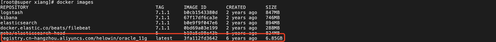

> 创建于 2022年4月6日
>
> 来源：https://blog.csdn.net/qq_38380025/article/details/80647620

前言：CentOS7.5

[toc]

### 拉取镜像

```sh
docker pull registry.cn-hangzhou.aliyuncs.com/helowin/oracle_11g
```

### 查看镜像

```sh
docker images
```



### 创建容器

```sh
docker run -d -p 1521:1521 --name oracle11g registry.cn-hangzhou.aliyuncs.com/helowin/oracle_11g:latest
```

我这里使用了 1522:1521，听评论说，用了此镜像容易被当矿机，最好的办法是不要使用默认端口。

如果空间不足可以清理

```sh
docker volume rm $(docker volume ls -qf dangling=true)
```

### 启动容器

```sh
docker start oracle11g
```

### 进入容器

```sh
docker exec -it oracle11g bash
```

切换 root 用户，修改`sqlplus`环境变量

```sh
su root
# 密码 helowin
vi /etc/profile
# 在最下面添加如下内容
export ORACLE_HOME=/home/oracle/app/oracle/product/11.2.0/dbhome_2
export ORACLE_SID=helowin
export PATH=$ORACLE_HOME/bin:$PATH
```

```sh
source /etc/profile
```

```sh
ln -s $ORACLE_HOME/bin/sqlplus /usr/bin
```

### 修改oracle密码及创建用户

切回oracle用户

```sh
su - oracle
```

登录Oracle

```sql
sqlplus /nolog
conn /as sysdba
```

创建用户

```sql
alter user system identified by system;
alter user sys identified by sys;
ALTER PROFILE DEFAULT LIMIT PASSWORD_LIFE_TIME UNLIMITED;
```

创建用户

```sql
create user xiang identified by xiang;
grant  connect,resource,dba to xiang;
```

退出容器（且不停止后台)

`ctrl+P+Q`

