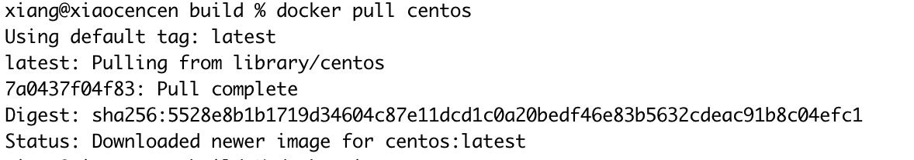

> 创建于2021年9月15日

[toc]

### 1、搭建服务器

搭建 三台Centos 容器

下载 centos 镜像

```sh
docker pull centos
```



查看 当前镜像情况


启动 centos 镜像，将 本地空间 `/Users/xiang/xiang/docker/centos` 与 容器的 `/home` 进行挂载

命令为：

```sh
docker run -d -i -t --name centos001 -v /Users/xiang/xiang/docker/centos:/home 300e315adb2f bash
docker run -d -i -t --name centos002 -v /Users/xiang/xiang/docker/centos:/home 300e315adb2f bash
docker run -d -i -t --name centos003 -v /Users/xiang/xiang/docker/centos:/home 300e315adb2f bash
```

查看当前容器情况


### 2、搭建JDK环境

安装 JDK

```sh
yum search java|grep jdk
```


```sh
yum install -y java-1.8.0-openjdk
```


### 3、下载Zookeeper 并安装

我这里下的是 zookeeper-3.4.5.tar.gz

[Zookeeper下载链接](https://archive.apache.org/dist/zookeeper/)

配置 Zookeeper

```sh
vi /etc/profile
```

在最后一行添加

```sh
export ZOOKEEPER_HOME=/usr/local/zookeeper
export PATH=.:$ZOOKEEPER_HOME/bin:$PATH
```

刷新

```sh
source /etc/profile
```

到 Zookeeper 下修改配置文件

```shell
cd /usr/local/zookeeper/conf
mv zoo_sample.cfg zoo.cfg
```

修改 conf

```sh
vi zoo.cfg 
# 修改两处
# (1) 
dataDir=/usr/local/zookeeper/data
# (2) 最后添加
server.0=172.17.0.3:2888:3888
server.1=172.17.0.4:2888:3888
server.2=172.17.0.5:2888:3888
```

> 这里的 ip 地址只能通过查看
>
> ```sh
> docker inspect [容器ID]
> ```
>
> 
>
> server.1 中的1 对应的是 data路径下的 myid 文件内容

服务器标识配置

```shell
# 创建文件夹
mkdir data
# 创建文件 myid 并且填写内容为 0

# 在 ip  服务器上，写的是 0
# 在 ip1 服务器上，写的是 1
# 在 ip2 服务器上，写的是 2   这里对应的是 上面的 server.编号  里面的编号

vi myid
# 内容为 0
```

### 4、启动

 在准备好相应的配置之后，可以直接通过zkServer.sh 这个脚本进行服务的相关操作

- 启动ZK服务:    			zkServer.sh start
- 查看ZK服务状态:       zkServer.sh status
- 停止ZK服务:              zkServer.sh stop
- 重启ZK服务:              zkServer.sh restart


### 问题

当我们启动其中一个 命令时候

```
zkServer.sh start
```

我们查询状态发现：


有以下几种情况

##### 1、没有启动其他的 zooker服务

把 zoo.cfg 中配置的 服务全启动再查看状态

##### 2、myid 里写错了


中间我以为是 jdk 错了，搞了一个新的 jdk 进去，发现根本不是这回事../2021-5. 以下是新配置的 JDK环境变量

```sh
export JAVA_HOME=/usr/local/jdk1.8.0_301
export ZOOKEEPER_HOME=/usr/local/zookeeper
export PATH=.:$JAVA_HOME/bin:$ZOOKEEPER_HOME/bin:$PATH
```


