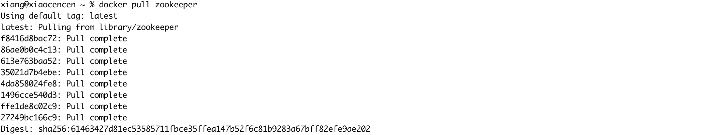

### 1、下啦 zookeeper

```sh
docker pull zookeeper
```



### 运行 zookeeper 容器

```sh
docker run --privileged=true -d --name zookeeper001 -p 2181:2181 -v /Users/xiang/xiang/docker/zookeeper:/home 2a33b1a1e11a
# ip:172.17.0.6

docker run --privileged=true -d --name zookeeper002 -p 2182:2181 -v /Users/xiang/xiang/docker/zookeeper:/home 2a33b1a1e11a
# ip:172.17.0.7

docker run --privileged=true -d --name zookeeper003 -p 2183:2181 -v /Users/xiang/xiang/docker/zookeeper:/home 2a33b1a1e11a
# ip:172.17.0.8
```

