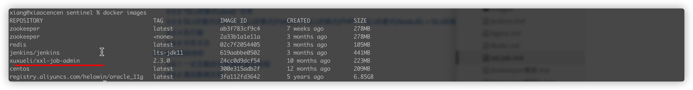

> 创建于2021年12月10日
> 作者：想想
> 来源：https://www.xuxueli.com/xxl-job/


[toc]

## 安装部署 xxl-job

官网地址：

本地执行

```sh
docker pull xuxueli/xxl-job-admin:2.3.0
```



运行

```sh
/**
* 如需自定义 mysql 等配置，可通过 "-e PARAMS" 指定，参数格式 PARAMS="--key=value  --key2=value2" ；
* 配置项参考文件：/xxl-job/xxl-job-admin/src/main/resources/application.properties
* 如需自定义 JVM内存参数 等配置，可通过 "-e JAVA_OPTS" 指定，参数格式 JAVA_OPTS="-Xmx512m" ；
*/
docker run -e PARAMS="--spring.datasource.url=jdbc:mysql://127.0.0.1:3306/xxl_job?useUnicode=true&characterEncoding=UTF-8&autoReconnect=true&serverTimezone=Asia/Shanghai" -p 8080:8080 -v /tmp:/data/applogs --name xxl-job-admin  -d xuxueli/xxl-job-admin:{指定版本}
```

==最终运行==

```sh
docker run -e PARAMS="--spring.datasource.url=jdbc:mysql://127.0.0.1:3306/xxl_job?useUnicode=true&characterEncoding=UTF-8&autoReconnect=true&serverTimezone=Asia/Shanghai" -p 7009:8080 -v /Users/xiang/xiang/docker/xxl_job/data/applogs:/data/applogs --name xxl-job-admin  -d xuxueli/xxl-job-admin:2.3.0
```

