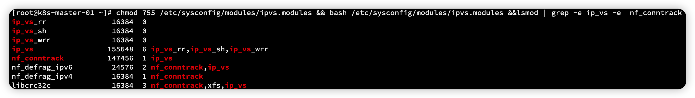

# Kubernetes 集群快速搭建

环境 Mac 13.1 虚拟机 VMware Fusion 12


## CentOS 系统搭建

CentOS 要求在 7.6 以上版本

```sh
http://mirrors.aliyun.com/centos/7/isos/x86_64/
```

查看 CentOS 系统版本

~~~
cat /etc/centos-release
~~~

配置阿里云 yum

```sh
# 1.下载安装 wget 
yum install -y wget 

# 2.备份默认的 yum 
mv /etc/yum.repos.d /etc/yum.repos.d.backup

# 3.设置新的yum目录 
mkdir -p /etc/yum.repos.d 

# 4.下载阿里yum配置到该目录中，选择对应版本 
wget -O /etc/yum.repos.d/CentOS-Base.repo http://mirrors.aliyun.com/repo/Centos-7.repo 

# 5.更新epel源为阿里云epel源 
# mv /etc/yum.repos.d/epel.repo /etc/yum.repos.d/epel.repo.backup 
# mv /etc/yum.repos.d/epel-testing.repo /etc/yum.repos.d/epel-testing.repo.backup

wget -O /etc/yum.repos.d/epel.repo http://mirrors.aliyun.com/repo/epel-7.repo

# 6.重建缓存 
yum clean all 
yum makecache

7.看一下yum仓库有多少包
yum repolist yum update
```

升级内核

```sh
rpm -Uvh http://www.elrepo.org/elrepo-release-7.0-3.el7.elrepo.noarch.rpm
yum --enablerepo=elrepo-kernel install -y kernel-lt
grep initrd16 /boot/grub2/grub.cfg
grub2-set-default 0
reboot
```

查看内核命令

```sh
uname -r
uname -a
```

查看 CPU 命令

~~~sh
lscpu
~~~

查看内存命令

```sh
free 
free -h
```

查看磁盘信息

```sh
fdisk -l
```


## CentOS 系统配置

关闭防火墙

```sh
systemctl stop firewalld
systemctl disable firewalld
```

关闭 selinux

```sh
sed -i 's/SELINUX=enforcing/SELINUX=disabled/g' /etc/sysconfig/selinux
setenforce 0
```

网络桥段

```sh
vi /etc/sysctl.conf

net.bridge.bridge-nf-call-ip6tables = 1
net.bridge.bridge-nf-call-iptables = 1
net.bridge.bridge-nf-call-arptables = 1
net.ipv4.ip_forward=1
net.ipv4.ip_forward_use_pmtu = 0

# 生效命令
sysctl --system 

# 查看效果
sysctl -a|grep "ip_forward"
```

开启 IPVS

~~~sh
# 安装IPVS
yum -y install ipset ipvsdm

# 编译ipvs.modules文件
vi /etc/sysconfig/modules/ipvs.modules

# 文件内容如下 
#!/bin/bash
modprobe -- ip_vs
modprobe -- ip_vs_rr
modprobe -- ip_vs_wrr
modprobe -- ip_vs_sh
# modprobe -- nf_conntrack_ipv4
modprobe -- nf_conntrack

# 赋予权限并执行
chmod 755 /etc/sysconfig/modules/ipvs.modules && bash /etc/sysconfig/modules/ipvs.modules &&lsmod | grep -e ip_vs -e  nf_conntrack_ipv4

# 重启电脑，检查是否生效
reboot
lsmod | grep ip_vs_rr
~~~

> 注意这里在执行赋权时候，会报   **modprobe: FATAL: Module nf_conntrack_ipv4 not found.**  错误
>
> 原因：https://blog.csdn.net/weixin_45387943/article/details/123225090
>
> 将 modprobe -- nf_conntrack_ipv4 修改为 modprobe -- nf_conntrack 后重新执行即可
>
> ```sh
> chmod 755 /etc/sysconfig/modules/ipvs.modules && bash /etc/sysconfig/modules/ipvs.modules &&lsmod | grep -e ip_vs -e  nf_conntrack
> ```
>
> 

同步时间

```sh
# 安装软件
yum -y install ntpdate

# 向阿里云服务器同步时间
ntpdate time1.aliyun.com

# 删除本地时间并设置时区为上海
rm -rf /etc/localtime && ln -s /usr/share/zoneinfo/Asia/Shanghai /etc/localtime

# 查看时间
date -R || date
```

命令补全

```sh
# 安装bash-completion
yum -y install bash-completion bash-completion-extras

# 使用bash-completion
source /etc/profile.d/bash_completion.sh
```

关闭 swap 分区

```sh
# 临时关闭： 
swapoff -a

# 永久关闭：
vi /etc/fstab

# 将文件中的/dev/mapper/centos-swap这行代码注释掉
#/dev/mapper/centos-swap swap swap defaults 0 0 

# 确认swap已经关闭：若swap行都显示 0 则表示关闭成功
free -m
```

配置 Host

```sh
vi /etc/hosts
# 文件内容如下: 
cat <<EOF >>/etc/hosts
192.168.196.186 k8s-master-01
192.168.196.187 k8s-node-01
192.168.196.188 k8s-node-02
192.168.196.189 k8s-node-03
EOF
```

```sh
cat <<EOF >>/etc/hosts
192.168.111.186 k8s-master-01
192.168.111.187 k8s-node-01
192.168.111.188 k8s-node-02
192.168.111.189 k8s-node-03
EOF
```


## 搭建 docker

> ~~~
> 阿里云镜像
> https://4do5t9av.mirror.aliyuncs.com
> ~~~

前置安装

```sh
# step 1: 安装必要的一些系统工具
sudo yum install -y yum-utils device-mapper-persistent-data lvm2
# Step 2: 添加软件源信息
sudo yum-config-manager --add-repo http://mirrors.aliyun.com/docker-ce/linux/centos/docker-ce.repo
# Step 3: 更新并安装 Docker-CE
sudo yum makecache fast
sudo yum -y install docker-ce
# Step 4: 开启Docker服务
sudo service docker start
```

> ```sh
> # 查看最新版本
> # yum list docker-ce --showduplicates | sort -r
> # 安装指定版本：
> # yum -y install docker-ce-18.09.8
> # yum -y install docker-ce-20.10.22
> ```

配置镜像加速

#docker镜像

```sh
sudo mkdir -p /etc/docker
sudo tee /etc/docker/daemon.json <<-'EOF'
{
  "registry-mirrors": ["https://4do5t9av.mirror.aliyuncs.com"],
  "exec-opts": ["native.cgroupdriver=systemd"]
}
EOF
sudo systemctl daemon-reload
sudo systemctl restart docker
```

> 修改**cgroupdriver**是为了消除安装**k8s**集群时的告警：
>
> [WARNING IsDockerSystemdCheck]:
>
> detected “cgroupfs” as the Docker cgroup driver. The recommended driver is “systemd”.
>
> Please follow the guide at https://kubernetes.io/docs/setup/cri/......

开机自启 docker

```sh
systemctl enable docker && systemctl start docker
```


## kubeadm快速搭建

更新 yum 源

```sh
vi /etc/yum.repos.d/kubernates.repo

[kubernetes]
name=Kubernetes
baseurl=https://mirrors.aliyun.com/kubernetes/yum/repos/kubernetes-el7-x86_64
enabled=1
gpgcheck=1
repo_gpgcheck=1
gpgkey=https://mirrors.aliyun.com/kubernetes/yum/doc/yum-key.gpg
       https://mirrors.aliyun.com/kubernetes/yum/doc/rpm-package-key.gpg
```

更新缓存

```sh
yum clean all
yum -y makecache
```

验证是否可用

```sh
[root@k8s-master-01 ~]# yum list | grep kubeadm
kubeadm.x86_64                           1.26.1-0                      kubernetes
```


查看 k8s 版本

```sh
yum list kubelet --showduplicates | sort -r

yum list kubeadm --showduplicates | sort -r
```

安装 k8s-1.17.5

```sh
yum install -y kubelet-1.17.5 kubeadm-1.17.5 kubectl-1.17.5
yum remove -y  kubelet-1.17.5 kubeadm-1.17.5 kubectl-1.17.5

yum install -y kubelet-1.23.6 kubeadm-1.23.6 kubectl-1.23.6
yum remove -y kubelet-1.24.0-0 kubeadm-1.24.0-0 kubectl-1.24.0-0

yum install -y kubelet-1.28.2-0 kubeadm-1.28.2-0 kubectl-1.28.2-0
yum remove -y  kubelet-1.28.2-0 kubeadm-1.28.2-0 kubectl-1.28.2-0
```

设置 kubelet，添加备注信息

```sh
# 如果不配置kubelet，可能会导致K8S集群无法启动。为实现docker使用的cgroupdriver与kubelet 使用的cgroup的一致性。

vi /etc/sysconfig/kubelet
KUBELET_EXTRA_ARGS="--cgroup-driver=systemd"
```

设置自动开启

```sh
systemctl enable kubelet

systemctl status kubelet
systemctl start kubelet
systemctl restart kubelet
```

## 初始化镜像

查看需要安装的镜像

```
kubeadm config images list
```


这些前缀带 K8s 的是无法进行下载的，使用阿里云加速镜像，编写脚本

```sh
mkdir -p /data
vi /data/images.sh
# !/bin/bash
# 下面的镜像应该去除"k8s.gcr.io"的前缀，版本换成kubeadm config images list命令获取 到的版本
images=(
	kube-apiserver:v1.17.17
	kube-controller-manager:v1.17.17
	kube-scheduler:v1.17.17
	kube-proxy:v1.17.17
	pause:3.1
	etcd:3.4.3-0
	coredns:1.6.5
)
for imageName in ${images[@]} ;
do
	docker pull registry.cn-hangzhou.aliyuncs.com/google_containers/$imageName
	docker tag registry.cn-hangzhou.aliyuncs.com/google_containers/$imageName k8s.gcr.io/$imageName
	docker rmi registry.cn-hangzhou.aliyuncs.com/google_containers/$imageName
done

```

确保docker在启动状态

```sh
systemctl start docker

# 给文件授权
chmod +x images.sh
# 执行文件
./images.sh
# 如果问题无法解决，请重新安装，或者直接使用别人的包导入
```

保存镜像

```sh
docker save -o k8s.1.17.17.tar \
k8s.gcr.io/kube-proxy:v1.17.17 \
k8s.gcr.io/kube-apiserver:v1.17.17 \
k8s.gcr.io/kube-controller-manager:v1.17.17 \
k8s.gcr.io/kube-scheduler:v1.17.17 \
k8s.gcr.io/coredns:1.6.5 \
k8s.gcr.io/etcd:3.4.3-0 \
k8s.gcr.io/pause:3.1 \
```

> 以后在真正搭建集群过程中，master 节点可以直接
>
> ```sh
> docker load -i k8s.1.17.17.tar
> ```
>
> node 节点只需要 `kube-proxy` 和 `pause`
>
> ```
> docker save -o k8s.1.17.17-node.tar \
> k8s.gcr.io/kube-proxy:v1.17.17 \
> k8s.gcr.io/pause:3.1 \
> ```
>
> ```sh
> docker load -i k8s.1.17.17-node.tar
> ```


## 初始化集群

下载官方地址

```sh
https://docs.projectcalico.org/v3.14/manifests/calico.yaml
```

镜像下载，一次下载不用次次都下载了

```sh
docker pull calico/kube-controllers:v3.14.2
docker pull calico/node:v3.14.2
docker pull calico/pod2daemon-flexvol:v3.14.2
docker pull calico/cni:v3.14.2
```


克隆三台主机，修改hostname 和ip 地址

```sh
hostnamectl set-hostname k8s-master-01
bash
```

| 主机          | IP              |
| ------------- | --------------- |
| K8s-master-01 | 192.168.196.186 |
| K8s-node-02   | 192.168.196.187 |
| K8s-node-02   | 192.168.196.188 |
| K8s-node-03   | 192.168.196.189 |


> 到这一步，一定要打快照

修改完成后！

初始化集群信息 calico 网络，再 master 节点执行，其中第一个ip地址是主节点（根据真实情况修改），后面两个ip地址是分配IP

```sh
kubeadm init --apiserver-advertise-address=192.168.196.186 --kubernetes-version v1.17.5 --service-cidr=10.1.0.0/16 --pod-network-cidr=10.81.0.0/16

kubeadm init --apiserver-advertise-address=192.168.111.186 --kubernetes-version v1.17.17 --service-cidr=10.1.0.0/16 --pod-network-cidr=10.81.0.0/16
```

`kubernetes-version ` 的版本根据 docker images 中的版本而定


```sh
Your Kubernetes control-plane has initialized successfully!

To start using your cluster, you need to run the following as a regular user:

  mkdir -p $HOME/.kube
  sudo cp -i /etc/kubernetes/admin.conf $HOME/.kube/config
  sudo chown $(id -u):$(id -g) $HOME/.kube/config

You should now deploy a pod network to the cluster.
Run "kubectl apply -f [podnetwork].yaml" with one of the options listed at:
  https://kubernetes.io/docs/concepts/cluster-administration/addons/

Then you can join any number of worker nodes by running the following on each as root:

kubeadm join 192.168.196.186:6443 --token 3yy7mj.tjm82uwj57iojic2 \
    --discovery-token-ca-cert-hash sha256:dfccb79ef9780609f10494935e30cf8603cca1d0555dfb50a840cc3112e63358 
    
    
-------------
Your Kubernetes control-plane has initialized successfully!

To start using your cluster, you need to run the following as a regular user:

  mkdir -p $HOME/.kube
  sudo cp -i /etc/kubernetes/admin.conf $HOME/.kube/config
  sudo chown $(id -u):$(id -g) $HOME/.kube/config

You should now deploy a pod network to the cluster.
Run "kubectl apply -f [podnetwork].yaml" with one of the options listed at:
  https://kubernetes.io/docs/concepts/cluster-administration/addons/

Then you can join any number of worker nodes by running the following on each as root:

kubeadm join 192.168.111.186:6443 --token fmzr5z.5z3m2zx2pucj8o38 \
    --discovery-token-ca-cert-hash sha256:edc4ff3fdfe3b73e18a3f3ad8ffd4f49bb7d40eb4f7238ea3116eaf5873a4409
```

在 master 节点执行

```sh
  mkdir -p $HOME/.kube
  sudo cp -i /etc/kubernetes/admin.conf $HOME/.kube/config
  sudo chown $(id -u):$(id -g) $HOME/.kube/config
```

在子节点执行

```sh
kubeadm join 192.168.196.186:6443 --token 3yy7mj.tjm82uwj57iojic2 \
    --discovery-token-ca-cert-hash sha256:dfccb79ef9780609f10494935e30cf8603cca1d0555dfb50a840cc3112e63358 
```


初始化 calicao.yml   来源于 https://docs.projectcalico.org/v3.14/manifests/calico.yaml

```sh
kubectl apply -f calico.yml
```

主节点执行 `kubectl get nodes`  


集群搭建完成

kubectl 命令自动补全

```sh
echo "source <(kubectl completion bash)" >> ~/.bash_profile
source ~/.bash_profile
```

发送邮件问题

```sh
# 在 bash 中设置 shell 的总布裙，要先安装 bash-completion 包
echo "unset MAILCHECK" >> /etc/profile
source /etc/profile
```

