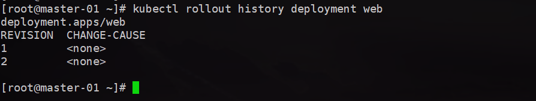

[toc]

## K8s-Controller

​		Controller  是在集群上管理和运行容器的对象

### 1、deployment 部署应用

生成 web.yaml 文件

~~~sh
kubectl create deployment web --image=nginx --dry-run -o yaml > web.yaml
~~~

使用 yaml 部署器 

~~~sh
kubectl apply -f web.yaml
~~~

对外发布 暴露对外端口号

~~~sh
kubectl expose deployment web --port=80 --type=NodePort --target-port=80 --name=web-export -o yaml > web-export.yaml
~~~

最后可以看到最后一行， PORTS 栏 的暴露端口是 32012，这也在我们任何一个node节点，都可以通过这个端口访问

+ http://192.168.111.135:32012/
+ http://192.168.111.136:32012/
+ http://192.168.111.137:32012/

### 2、应用升级回滚和弹性伸缩

修改上面创建的 web.yaml 文件，修改为

框住的为修改部分， 备份数修改为2，版本修改为 1.14

然后创建，

我们可以去 node-01 节点执行 `docker images` 能查看到有 nginx/1.14 版本的镜像

**1、升级**

~~~sh
kubectl set image deployment web nginx=nginx:1.15
~~~

我们依旧可以去 node-01 节点查看 nginx 的版本已经为 1.15了

这里为什么会有3个呢？ 原因很简单，就像 tomcat 升级一样，先把新版本放到服务器上，只有升级完会删掉旧版本，保证升级过程中服务不中断

**2、查看升级服务是否成功、 状态**

~~~sh
 kubectl rollout status deployment web
~~~

**3、查看历史版本**

~~~sh
kubectl rollout history deployment web
~~~

上面的是老版本，数字越高版本越新

**4、返回上一版本**

~~~sh
kubectl rollout undo deployment web
~~~

下面为什么是4个，这里之前就解释过了，保证服务升级过程不中断

**5、返回指定版本**

~~~sh
kubectl rollout undo deployment web --to-revision=2
~~~

**6、弹性伸缩**

创建好多好多个

目前有2个应用，如果要扩展到8个

~~~sh
kubectl scale deployment web --replicas=8
~~~

