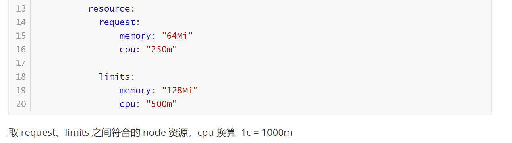
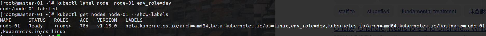
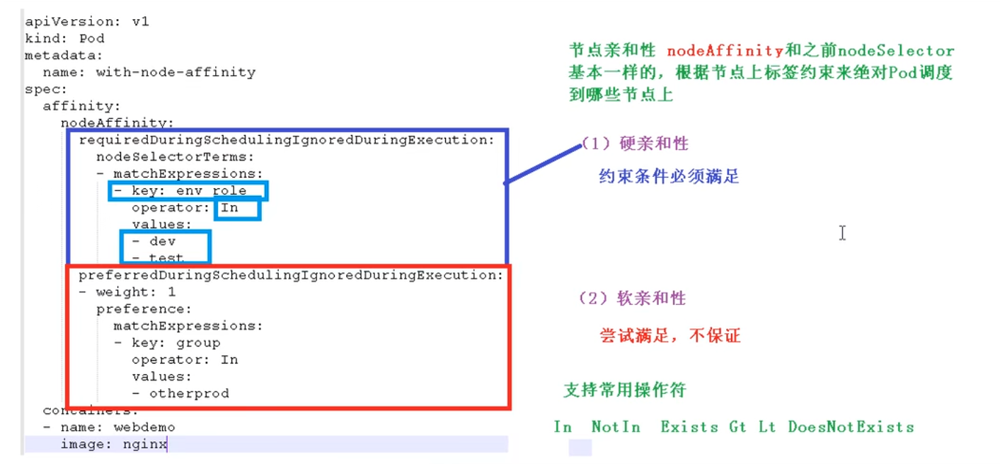
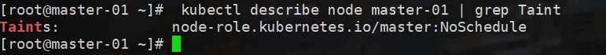
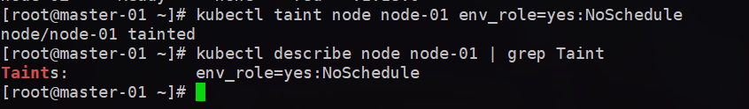
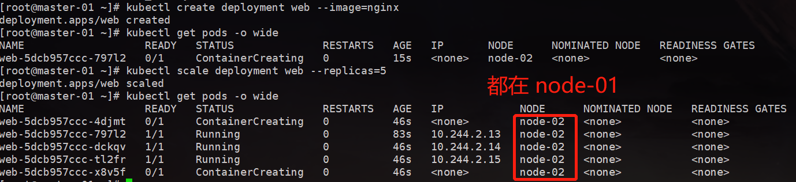
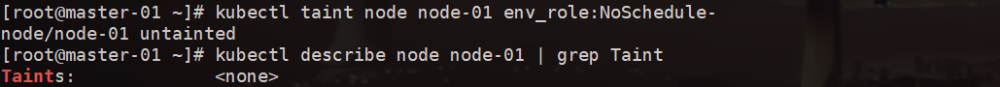

[toc]

### Pod概述

Pod 是 K8s 系统中可以创建和管理的最小单元，是资源对象模型中由用户创建或部署的最小资源对象模型，也是再 K8s 上运行容器化应用和资源对象，其他的资源对象都是用来支撑或者扩展 Pod 对象功能的，比如控制对象是用来管控 Pod 对象，Service 或者 Ingress 资源对象是用来暴露 Pod 引用对象的，PersistentVolume 资源对象是用来为 Pod 提供存储等等，K8s 不会直接处理容器，而是 Pod，Pod 是由一个或多个 container 组成的

Pod 是 Kubernetes 的最重要概念，每一个 Pod 都有一个特殊的被称为 “根容器” 的 Pause 容器，Pause 容器对应的镜像属于 Kubernetes 平台的一部分，除了 Pause 容器，每个 Pod 还包含一个或读个紧密相关的用户业务容器。


### 4、Pod 镜像拉取策略

```yml
apiVersion: v1
kind: Pod
metadata:
	name: mypod
spec:
	containers:
		- name: nginx
		  image: nginx:1.14
		  imagePullPolicy: Always

# IfNotPresent: 默认值，镜像在宿主机上不存在时才拉取
# Always: 每次创建 Pod 都会重写拉拉取一次镜像
# Never: Pod 永远都不会主动拉取这个镜像
```


### 5、Pod 资源限制

```yaml
apiVersion: v1
kind: Pod
metadata:
	name: mypod
spec:
	containers:
		- name: db
		  image: mysql
		  env:
		  - name: MYSQL_ROOT_PASSWORD
		    value: "password"
		  
		  resource:
		  	request:
		  		memory: "64Mi"
		  		cpu: "250m"
		  	
		  	limits:
		  		memory: "128Mi"
		  		cpu: "500m"
```

取 request、limits 之间符合的 node 资源，cpu 换算  1c = 1000m


### 6、Pod重启策略

```yaml
apiVersion: v1
kind: Pod
metadata:
	name: dns-test
spec:
	containers:
		- name: busybox
		  image: busybox:1.28.4
		  args:
		  - /bin/sh
		  - -c
		  - sleep 36000
		restartPolicy: Never
# Always: 当容器终止退出后，总是重启容器，默认策略
# OnFailure： 当容器异常退出（退出状态码非0）时，才重启容器
# Never: 当容器终止退出，从不重启容器
```


### 7、Pod健康检查

~~~yaml
apiVersion: v1
kind: Pod
metadata:
	labels:
		test: liveness
	name: liveness-exec
spec:
	containers:
		- name: busybox
		  image: busybox:1.28.4
		  args:
		  - /bin/sh
		  - -c
		  - touch /tmp/healthy;sleep 30;rm -rf /tmp/healthy
		  livenessProbe:
		  	exec:
		  		command:
		  			- cat
		  			- /tmp/healthy
		  	initialDelaySeconds: 5
		  	periodSeconds: 5

# livenessProbe(存活检查)
# readinessProbe(就绪检查)
	
# Probe 支持以下三种检查方式

	## httpGet  发送Http请求，返回 200-400 范围状态码为成功
	## exec 执行 shell 命令返回状态码 0 为成功
	## topSocket 发起 TCP Socket 建立成功
~~~


### 8、Pod调度

#### 8.1、影响调度的属性

根据 resource 找到足够 node 节点进行调度



#### 8.2、节点选择器

~~~yaml
spec:
	nodeSelector:
		env_role: dev
	containers:
		- name: nginx
		  image: nginx:1.15
~~~

对节点创建标签

~~~shell
[root@master-01 ~]# kubectl label node  node-01 env_role=dev
node/node-01 labeled

[root@master-01 ~]# kubectl get nodes node-01 --show-labels
NAME      STATUS   ROLES    AGE   VERSION   LABELS
node-01   Ready    <none>   76d   v1.18.0   beta.kubernetes.io/arch=amd64,beta.kubernetes.io/os=linux,env_role=dev,kubernetes.io/arch=amd64,kubernetes.io/hostname=node-01,kubernetes.io/os=linu
~~~



#### 8.3、节点亲和性



#### 8.4、污点和污点容忍

1、基本介绍

nodeSelector 和 nodeAffinity：Pod 调度到某个节点上，Pod 属性，调度时候实现

Taint 污点，节点不做普通分配调度，是节点属性

2、场景

+ 专用节点
+ 配置特点硬件节点
+ 基于Taint驱逐

3、演示

查看节点污点情况

~~~sh
kubectl describe node master-01 | grep Taint
kubectl describe node node-01 | grep Taint
~~~



污点值有三个

1. NoSchedule：一定不被调度
2. PreferNoSchdule：尽量不被调度
3. NoExecute：不会调度，并且会驱逐Node已有 Pod> 

**为节点添加污点**

kubectl taint node [node] key=value:（NoSchedule/PreferNoSchdule/NoExecute）

```sh
kubectl taint node node-01 env_role=yes:NoSchedule
```




 为 node-01 添加了`一定不会调度` 污点之后，我们再创建pods 分为5个



发现，都在 node-02 上（笔误）


**删除污点**

~~~sh
kubectl taint node node-01 env_role:NoSchedule-
~~~




**污点容忍**

```yaml
spec:
	tolerations:
	- key: "eno_role"
	  operator: "Equal"
	  value: "yes"
	  effect: "NoSchedule"
	containers:
	- name: webdemo
	  image: nginx
```

虽然设置了污点容忍，加了这个配置，还是有可能会使用该节点

