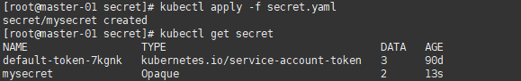

[toc]

### K8s-Secret 加密

作用：加密数据到 Pod 里，让 Pod 容器可以使用各种方式使用加密数据


#### 1、创建 secret 加密

```yaml
apiVersion: v1
kind: Secret
metadata:
  name: mysecret
type: Opaque
data:
  username: YWRtaW4=
  password: MTIzNDU2
```


创建

```sh
kubectl apply -f secret.yaml
```

查看

```sh
kubectl get secret
```




#### 2、以变量形式挂在到 Pod

```yaml
apiVersion: v1
kind: Pod
metadata:
  name: mypod
spec:
  containers:
  - name: nginx
    image: nginx
    env:
      - name: SECRET_USERNAME
        valueFrom:
          secretKeyRef:
            name: mysecret
            key: username
      - name: SECRET_PASSWORD
        valueFrom:
          secretKeyRef:
            name: mysecret
            key: password
```


#### 3、以文件形式挂在到 Pod

> 像一些配置文件，就可以以这也的方式写到 pod 里

```yaml
apiVersion: v1
kind: Pod
metadata:
  name: mypod
spec:
  containers:
  - name: nginx
    image: nginx
    volumeMounts:
    - name: foo
      mountPath: "/etc/foo"
      readOnly: true
  volumes:
  - name: foo
    secret:
      secretName: mysecret
```

创建完成后，进入服务内，到 /etc/foo 目录下，会有 username、passowrd 两个文件

