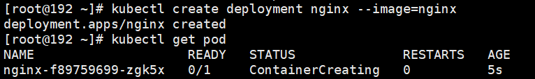
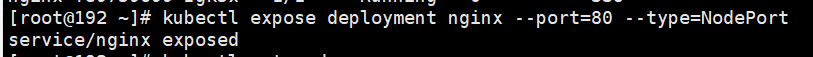
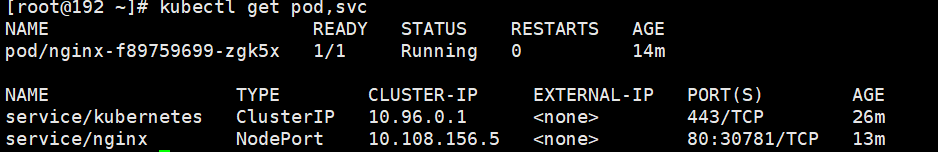
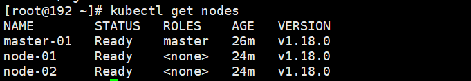
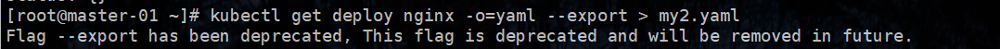

### 1、kubectl 概述

kubectl 是 Kubernetes 集群的命令行工具，通过 kubectl 能够对集群本身进行管理，并且能够再集群上进行容器化应用的安装部署

常用命令

```sh
kubectl create deployment nginx --image=nginx
kubectl get pod
```



```sh
kubectl expose deployment nginx --port=80 --type=NodePort
```



```sh
kubectl get pod,svc
```



删除 pod 和 svc

```sh
# 删除 pod/nginx-f89759699-zgk5x
kubectl delete deployment nginx
# 删除 service/nginx
kubectl delete svc nginx
```


```sh
kubectl get nodes
```



```sh
kubectl apply -f
```


### 2、yaml 文件

+ 通过缩进表示层级关系
+ 不能使用Tab进行缩进，只能使用空格
+ 一般缩进等于两个空格
+ 字符后缩进一个空格，比如冒号，逗号等后面
+ 使用 `---` 表示新的yaml文件开始
+ 使用 `#`  表示注释


| key        | means      |
| ---------- | ---------- |
| kind       | 资源类型   |
| metadata   | 资源元数据 |
| spec       | 资源规格   |
| replicas   | 副本数量   |
| selector   | 标签选择器 |
| template   | Pod模板    |
| metadata   | Pod元数据  |
| spec       | Pod规格    |
| containers | 容器配置   |

#### 2.1、生成 yaml 文件

使用 kubectl create 命令生成 yaml 文件

```sh
kubectl create deployment web --image=nginx -o yaml --dry-run
```

```yaml
apiVersion: apps/v1
kind: Deployment
metadata:
  creationTimestamp: null
  labels:
    app: web
  name: web
spec:
  replicas: 1
  selector:
    matchLabels:
      app: web
  strategy: {}
  template:
    metadata:
      creationTimestamp: null
      labels:
        app: web
    spec:
      containers:
      - image: nginx
        name: nginx
        resources: {}
status: {}
```


#### 2.2、导出 yaml 文件

根据已经部署好的进行导出

~~~sh
kubectl get deploy nginx -o=yaml --export > my2.yaml
~~~




#### 2.3、pod执行器部署

```sh
kubectl apply -f my2.yaml
```

