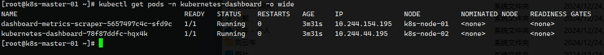
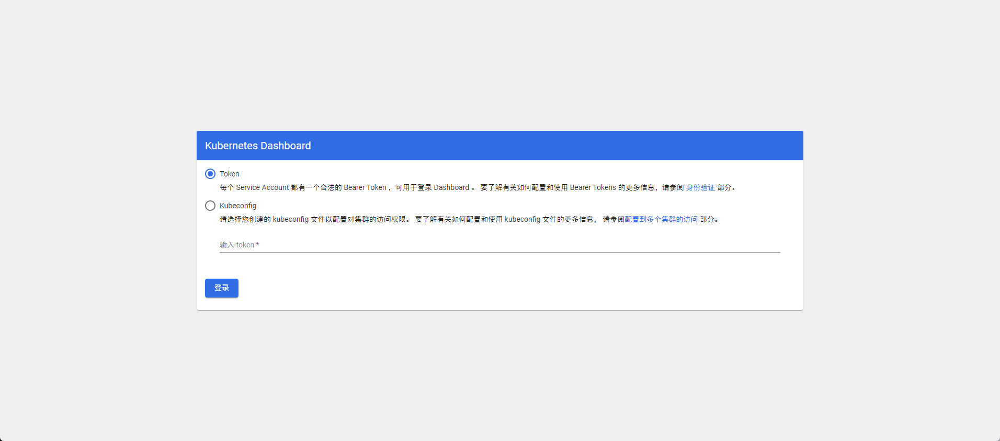
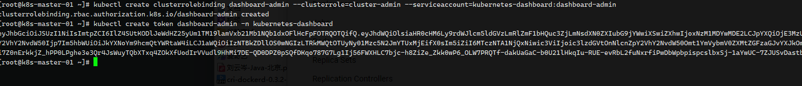
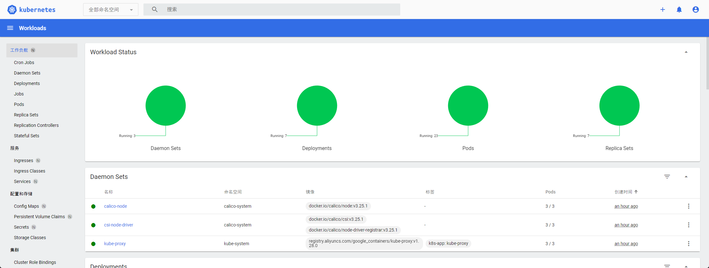

#  快速搭建 K8s 集群

[toc]


| 角色          | ip           |
| ------------- | ------------ |
| k8s-master-01 | 192.168.58.4 |
| k8s-node-01   | 192.168.58.5 |
| k8s-node-02   | 192.168.58.6 |

服务器需要连接互联网下载镜像

| 软件       | 版本         |
| ---------- | ------------ |
| Docker     | 24.0.0（CE） |
| Kubernetes | 1.28         |


### 初始化配置

关闭防火墙

```sh
systemctl stop firewalld && systemctl disable firewalld
```

关闭Selinux

```sh
sed -i 's/enforcing/disabled/' /etc/selinux/config

setenforce 0
```

关闭Swap

```sh
sed -ri 's/.*swap.*/#&/' /etc/fstab

swapoff -a
```

根据规划设置主机名

```sh
hostnamectl set-hostname k8s-master-01
hostnamectl set-hostname k8s-node-01
hostnamectl set-hostname k8s-node-02
```

网络桥段

```sh
vi /etc/sysctl.conf

net.bridge.bridge-nf-call-ip6tables = 1
net.bridge.bridge-nf-call-iptables = 1
net.bridge.bridge-nf-call-arptables = 1
net.ipv4.ip_forward=1
net.ipv4.ip_forward_use_pmtu = 0

# 生效命令
sysctl --system 

# 查看效果
sysctl -a|grep "ip_forward"
```


确保网络桥接的数据包经过Iptables处理，防止网络丢包

```sh
cat > /etc/sysctl.d/k8s.conf << EOF
net.bridge.bridge-nf-call-ip6tables = 1
net.bridge.bridge-nf-call-iptables = 1
EOF

sysctl --system  # 生效
```

同步时间

```sh
# 安装软件
yum -y install ntpdate

# 向阿里云服务器同步时间
ntpdate time1.aliyun.com

# 删除本地时间并设置时区为上海
rm -rf /etc/localtime && ln -s /usr/share/zoneinfo/Asia/Shanghai /etc/localtime

# 查看时间
date -R || date
```

开启 IPVS

```sh
yum -y install ipset ipvsdm

cat > /etc/sysconfig/modules/ipvs.modules << EOF
#!/bin/bash
modprobe -- ip_vs
modprobe -- ip_vs_rr
modprobe -- ip_vs_wrr
modprobe -- ip_vs_sh
modprobe -- nf_conntrack
EOF

# 赋予权限并执行
chmod 755 /etc/sysconfig/modules/ipvs.modules && bash /etc/sysconfig/modules/ipvs.modules &&lsmod | grep -e ip_vs -e  nf_conntrack_ipv4

# 重启电脑，检查是否生效
reboot
```

命令补全

```sh
yum -y install bash-completion bash-completion-extras

source /etc/profile.d/bash_completion.sh
```

配置 HOSTS

```sh
cat <<EOF >>/etc/hosts
192.168.58.4  k8s-master-01
192.168.58.5 	k8s-node-01
192.168.58.6 	k8s-node-02
EOF
```


### 安装docker

下载源

```sh
yum install -y wget

wget https://mirrors.aliyun.com/docker-ce/linux/centos/docker-ce.repo -O /etc/yum.repos.d/docker-ce.repo
```

安装 docker

```sh
# yum list docker-ce --showduplicates | sort -r

yum -y install docker-ce-24.0.0

systemctl enable docker
systemctl start docker
```

设置Cgroup驱动

```sh
cat > /etc/docker/daemon.json << EOF
{
  "exec-opts": ["native.cgroupdriver=systemd"]
}
EOF

systemctl daemon-reload && systemctl restart docker

# 查看设置状态
docker info
```

安装 cri-docker 驱动 （Docker与Kubernetes通信的中间程序）：

```sh
# wget https://github.com/Mirantis/cri-dockerd/releases/download/v0.3.2/cri-dockerd-0.3.2-3.el7.x86_64.rpm

rpm -ivh cri-dockerd-0.3.2-3.el7.x86_64.rpm
```

指定依赖镜像地址为国内镜像地址：

```sh
vim /usr/lib/systemd/system/cri-docker.service

ExecStart=/usr/bin/cri-dockerd --container-runtime-endpoint fd:// --pod-infra-container-image=registry.aliyuncs.com/google_containers/pause:3.9

systemctl daemon-reload 
systemctl enable cri-docker && systemctl start cri-docker
```

### 部署 K8s 集群

添加阿里云 yum 源

```sh
cat > /etc/yum.repos.d/kubernetes.repo << EOF
[kubernetes]
name=Kubernetes
baseurl=https://mirrors.aliyun.com/kubernetes/yum/repos/kubernetes-el7-x86_64
enabled=1
gpgcheck=0
repo_gpgcheck=0
gpgkey=https://mirrors.aliyun.com/kubernetes/yum/doc/yum-key.gpg https://mirrors.aliyun.com/kubernetes/yum/doc/rpm-package-key.gpg
EOF
```


安装kubeadm 官方提供的集群搭建工具，kubelet 守护进程 和kubectl 管理集群工具（实际在 master 安装即可）

```sh
yum install -y kubelet-1.28.0 kubeadm-1.28.0 kubectl-1.28.0

systemctl enable kubelet
# 这里只是设置开机启动，直接起也起不来
```

设置 kubelet，添加备注信息

```sh
# 如果不配置kubelet，可能会导致K8S集群无法启动。为实现docker使用的cgroupdriver与kubelet 使用的cgroup的一致性。

vi /etc/sysconfig/kubelet
KUBELET_EXTRA_ARGS="--cgroup-driver=systemd"
```


提前把所有镜像都拉下来

```sh
docker load -i calico.v3.25.0.tar
docker load -i calico.v3.25.1.tar
docker load -i calico.v3.25.2.tar
```


==只需要 k8s-master-01 节点执行== 初始化Master节点

```sh
kubeadm init \
  --apiserver-advertise-address=192.168.58.4 \
  --image-repository registry.aliyuncs.com/google_containers \
  --kubernetes-version v1.28.0 \
  --service-cidr=10.96.0.0/12 \
  --pod-network-cidr=10.244.0.0/16 \
  --cri-socket=unix:///var/run/cri-dockerd.sock
```

初始化信息

```sh
mkdir -p $HOME/.kube
cp -i /etc/kubernetes/admin.conf $HOME/.kube/config
chown $(id -u):$(id -g) $HOME/.kube/config
```

==只需要 k8s-node-01 、k8s-node-02 节点执行== 

`--cri-socket=unix:///var/run/cri-dockerd.sock` 这一句要补充在最后面

>```sh
>kubeadm join 192.168.58.4:6443 --token phmxd0.fzuqsa8fk00rykhq --discovery-token-ca-cert-hash sha256:1e282fd1f3c2dde90082cf889f546fde4410f65ef2502727a3fcd34b37a6a530 --cri-socket=unix:///var/run/cri-dockerd.sock
>```

使用kubectl工具查看节点状态： kubectl get nodes 由于网络插件还没有部署，节点会处于“NotReady”状态


2024年12月25日 MacVMware 虚拟机无法使用 calico-v3.25.1、calico-v3.25.2 版本，采用最早版本 calico-v3.25.0

```
uname -a
Linux k8s-master-01 3.10.0-1160.119.1.el7.x86_64 #1 SMP Tue Jun 4 14:43:51 UTC 2024 x86_64 x86_64 x86_64 GNU/Linux
```

```sh
kubectl create -f calico.yaml
```

> 如果无法执行，需要删除 pod 执行
>
> ```sh
> kubectl delete -f calico.yaml
> ```

检查运行情况

```sh
kubectl get pod -n kube-system  -o wide
```


#### 安装页面

所有节点先下拉镜像

```sh
docker load -i k8s-dashboard-v2.7.0.tar
```

创建 Dashboard ，在 master 节点执行

```
kubectl apply -f kubernetes-dashboard.yaml
kubectl get pods -n kubernetes-dashboard -o wide

```



执行完成后，任意 https://任意node:30001 访问，例如：https://192.168.58.4:30001/#/login



创建用户

```sh
kubectl create serviceaccount dashboard-admin -n kubernetes-dashboard
```

用户授权

```sh
kubectl create clusterrolebinding dashboard-admin --clusterrole=cluster-admin --serviceaccount=kubernetes-dashboard:dashboard-admin
```

获取用户 token

```sh
kubectl create token dashboard-admin -n kubernetes-dashboard
```



将 token 粘贴到浏览器的 token输入栏中（默认还是选第一项）点击登录即可


