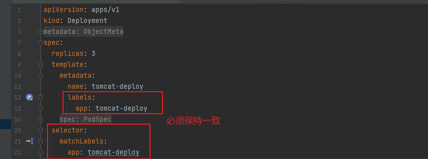

# Yaml

[toc]

### pod

```yaml
apiVersion: v1
kind: Pod
metadata:
  name: tomcat-pod
  labels:
    app: tomcat-pod
spec:
  containers:
    - name: tomcat-pod
      image: registry.cn-beijing.aliyuncs.com/yuncenliu/tomcat:9.0.20-jre8-alpine
      imagePullPolicy: IfNotPresent
  restartPolicy: Always
```


##### 镜像拉取策略 imagePullPolicy

+ Always：总是拉取
+ IfNotPresent：如果本地没有就拉取
+ Never：只用本地，从不拉取


##### 重启策略 restartPolicy

+ Always：只要退出就重启
+ OnFailure：失败退出时，exit code 不为 0 才重启
+ Never：永远都不会重启


### deployment


#####　deploy 必写 matchLables

在定义模板时，必须定义 labes，因为 Deployment 的 spec.selector 是必须字段 需要和 template.labels 对应上




### Service

```yaml
apiVersion: apps/v1
kind: Deployment
metadata:
  name: yun-tomcat-deploy
  namespace: yun
  labels:
    app: yun-tomcat-deploy
spec:
  # 3个
  replicas: 3
  template:
    metadata:
      name: yun-tomcat-deploy
      labels:
        app: yun-tomcat-pod
    spec:
      containers:
        - name: yun-tomcat-deploy
          image: registry.cn-beijing.aliyuncs.com/yuncenliu/tomcat:9.0.20-jre8-alpine
          # 一直从远程下载
          imagePullPolicy: IfNotPresent
          # 对外暴露端口，对其他应用暴露，这里还不是对用户暴露
          ports:
            - containerPort: 8080
      restartPolicy: Always
      # 拉取是私有镜像用到的 认证
      # 通过 kubectl create secret docker-registry aliyun-yuncen .... 创建
      imagePullSecrets:
        - name: aliyun-yuncen
  selector:
    matchLabels:
      app: yun-tomcat-pod

---
# service 对集群外的用户使用
apiVersion: v1
kind: Service
metadata:
  name: yun-tomcat-service
spec:
  selector:
    # 标签选择必须是 spec.template.labels.app
    app: yun-tomcat-pod
  ports:
    - port: 8080      # 对集群内其他访问暴露端口
      targetPort: 8080
      nodePort: 30088   # 默认是 30000 - 32767 ，如果修改需要改 k8s 配置文件，官方不建议修改
  type: NodePort
```

