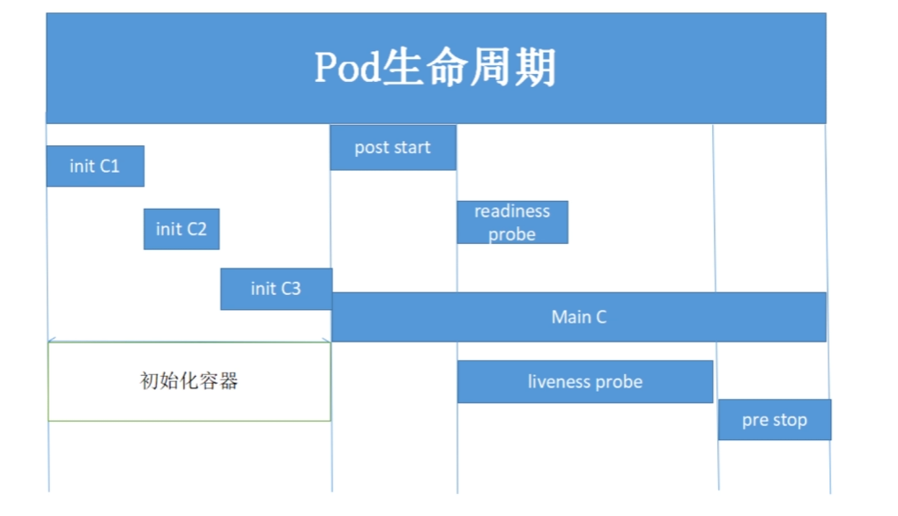

[toc]

### Pod生命周期




+ init C 初始化卷，数据共享，网络传输，这是有顺序的
+ Main C 全过程
  + start 回调初始化（钩子程序）
  + stop 回调结束
  + readiness 就绪探测，k8s 判断容器是否准备-
  + liveness 生产探测


#### initc 过程

参考 Github：完整 [initcpod.yaml](https://github.com/YuncenLiu/code-example/blob/master/docker-module/src/main/resources/k8s/initcpod.yaml) 文件 、[initcservice1.yaml](https://github.com/YuncenLiu/code-example/blob/master/docker-module/src/main/resources/k8s/initcservice1.yaml)、[initcservice2.yaml](https://github.com/YuncenLiu/code-example/blob/master/docker-module/src/main/resources/k8s/initcservice2.yaml)


init-yun：检查 yun-service 是否存在，存在则通过，不存在等待2秒，继续循环

yun-db：一样的

```yaml
initContainers:
  - name: init-yun
    image: registry.cn-beijing.aliyuncs.com/yuncenliu/busybox:1.32.0
    imagePullPolicy: Never
    command:
      - 'sh'
      - '-c'
      - 'until nslookup yun-service; do echo waitting for yunService; sleep 2; done ;'
  - name: init-db
    image:  registry.cn-beijing.aliyuncs.com/yuncenliu/busybox:1.32.0
    imagePullPolicy: Never
    # 两种写法都可以
    command: ['sh', '-c', 'until nslookup yun-db; do echo waitting for yun-db; sleep 2; done ;']
```


总结：实现 初始化过程的顺序执行，序列且阻塞的


#### readiness  过程

参考 [Github: YAML](https://github.com/YuncenLiu/code-example/blob/master/docker-module/src/main/resources/k8s/readinessprobe.yaml) 文件，启动之前检测是否存在 index1.html ，那肯定是不存在的，所以一直卡在启动状态

```yaml
readinessProbe:
    httpGet:
    port: 80
    path: /index1.html
    initialDelaySeconds: 2
    # 重新检测 3秒
    periodSeconds: 3
```

```sh
kubectl describe pod readinesspod-test
```


此时我们创建一个 index1.html 文件，为探测开路

```sh
kubectl exec -it readinesspod-test sh
```

进入容器之后，创建 index1.html 文件立刻 Running 状态


#### liveness  过程 （用的很多）

###### 案例1

```yaml
command: ['/bin/sh' , '-c', 'touch /tmp/liveness-pod; sleep 10; rm -rf /tmp/liveness-pod; sleep 3600']
    livenessProbe:
    exec:
        command: ['test', '-e', '/tmp/liveness-pod']
    initialDelaySeconds: 1
    periodSeconds: 3
```

描述过程：

当pod 创建完成后，立刻 touch 一个文件，并睡眠 10 秒后，删除这个文件

但设置了 livenessProbe，此时会检测 这个文件是否存在，如果不存在，则按照 restartPolicy 策略进行重启


从日志里发现，这里的 sleep 事件并不准确


###### 案例2

创建一个 service 里面有3个 nginx pod

```yaml
# 检测 index 文件是否存在，如果不存在，按 restartPolicy 策略重启
livenessProbe:
httpGet:
  port: 80
  path: /index.html
initialDelaySeconds: 3
timeoutSeconds: 10
```

完整 [YAML](https://github.com/YuncenLiu/code-example/blob/master/docker-module/src/main/resources/k8s/livernessprobeservice3.yaml) 参考 GitHub

执行完成后，访问 http://192.168.58.170:30080/ 、 http://192.168.58.171:30080/ 、http://192.168.58.172:30080/，都可以访问到 Nginx 开始页面，此时使用

```sh
kubectl exec -it podname sh
```

修改 /usr/shar/nginx/html/index.html 内容，此时随意访问三个地址，发现 k8s 没有默认做负载均衡，一个地址固定访问同一个 pod。不会负载均衡

此时删除其中一个 pod 中的 index.html 文件，node-01:30080 几秒之内访问不到 index.html 内容，之后立刻访问到 其他节点，另外某个节点也访问到重启后到 nginx pod


pod 名一致，且 restarts 数 +1


###### 案例3


```yaml
        image: registry.cn-beijing.aliyuncs.com/yuncenliu/nginx:1.17.10-alpine
        imagePullPolicy: IfNotPresent
        livenessProbe:
          tcpSocket:
            port: 8080
          # 初始化时间
          initialDelaySeconds: 10
          # 每次间隔扫描时间
          periodSeconds: 3
          # 超时时间
          timeoutSeconds: 5
```

Nginx 默认 80 端口，监听 8080，肯定监听不到，就会一直重启，重启到一定次数，就不再重启了。


```sh
kubectl describe po xxx-podname
```


#### post start 、pre stop 钩子

启动容器前，和关闭容器后做的事情

启动容器之前，创建一个文件夹 

```yaml
lifecycle:
  postStart:
    exec:
      command: ['mkdir', '-p', '/data/k8s/']
```

