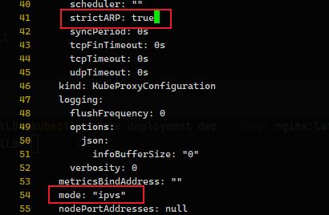
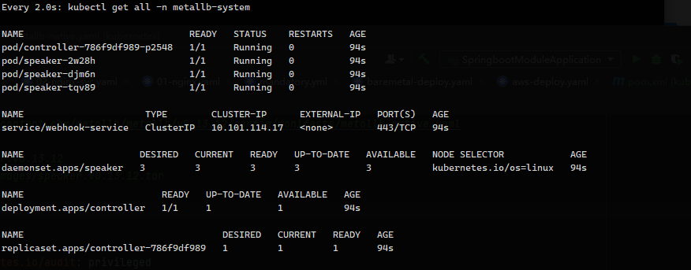
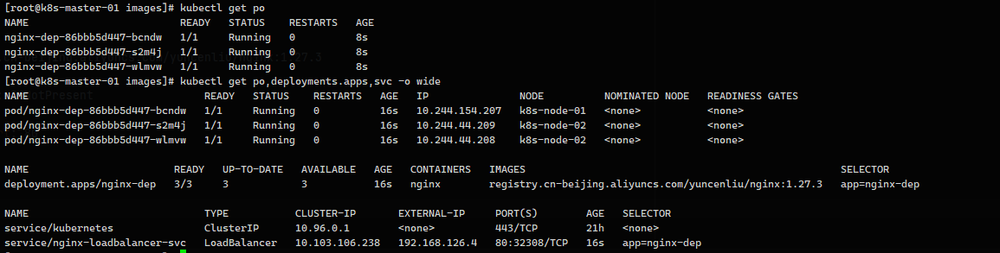

## Kuberntes LoadBalancer-MetalLBUntitled

[toc]

参考：[博客园](https://www.cnblogs.com/birkhoffxia/articles/17949510)


MetalLB 官网：https://metallb.io/installation/clouds/


### 部署 MetalLB

修改 kube-proxy 为 ipvs 模式

```sh
kubectl edit cm kube-proxy -n kube-system
```




```sh
kubectl apply -f https://raw.githubusercontent.com/metallb/metallb/v0.13.12/config/manifests/metallb-native.yaml
```




部署成功后，集群中在 metallb-system namespace 下会存在名为 Controller 的 deployment 和 Speaker 的 daemonSet

metallb-system/controller deployment，该 Controller 用于 watch 集群中使用 LoadBalancer 类型的 service 并为其分配 EXTERNAL-IP

metallb-system/speaker daemonset，该组件在每个节点都会运行，使用 hostNetwork 网络模式，可以保证上面分配的 IP 可访问。

通过命令查看地址

```sh
kubectl -n metallb-system get pod speaker-2w28h -o jsonpath={.status.hostIP}
# 192.168.126.4
```

通过执行 `kubectl api-versions` 查看发现多了三个 crd

```sh
metallb.io/v1alpha1
metallb.io/v1beta1
metallb.io/v1beta2
```


### 创建地址池

metallb-ipaddresspool.yaml

```yaml
apiVersion: metallb.io/v1beta1
kind: IPAddressPool
metadata:
  name: localip-pool
  namespace: metallb-system
spec:
  addresses:
    - 192.168.126.4-192.168.126.6
  autoAssign: true
  avoidBuggyIPs: true
```

查看IP组

```sh
kubectl get ipaddresspool -n metallb-system
```


### 创建二层公告机制

metallb-l2advertisement.yaml

```yaml
apiVersion: metallb.io/v1beta1
kind: L2Advertisement
metadata:
  name: localip-pool-l2a
  namespace: metallb-system
spec:
  ipAddressPools:
    - localip-pool
  interfaces:
    - ens33
```

查看网卡

```sh
kubectl get l2advertisement -n metallb-system
```


### 测试 LoadBalancer

```yaml
apiVersion: apps/v1
kind: Deployment
metadata:
  name: nginx-dep
spec:
  replicas: 3
  selector:
    matchLabels:
      app: nginx-dep
  template:
    metadata:
      labels:
        app: nginx-dep
    spec:
      containers:
        - image: registry.cn-beijing.aliyuncs.com/yuncenliu/nginx:1.27.3
          name: nginx
          imagePullPolicy: IfNotPresent
          ports:
            - containerPort: 80
---
apiVersion: v1
kind: Service
metadata:
  name: nginx-loadbalancer-svc
spec:
  type: LoadBalancer
  ports:
    - port: 80
      protocol: TCP
  selector:
    app: nginx-dep
```





分别修改每一个 Nginx

```sh
kubectl logs -f nginx-dep-86bbb5d447-bcndw
kubectl logs -f nginx-dep-86bbb5d447-s2m4j
kubectl logs -f nginx-dep-86bbb5d447-wlmvw
```

如果只用一个浏览器无法模拟出效果，需要用不同浏览器，才能看到日志打到不同 Pod 中。


### 原理

参考：https://mp.weixin.qq.com/s/x3FKy-ssA1157FJrQc8vvA

MetalLB 分为两部分组成，分别是 Controller 和 Speaker。两者的分工如下所示： 

+ Controller 负责监听 Service 变化，依据对应的 IP 池进行 IP 分配。
+ Speaker 负责监听 Service 的变化，并依据具体的协议发起相应的广播或应答、节点的 Leader 选举。


所以说 MetalLB 的 Controller 和 Speaker 并没有直接通讯，而是依赖于集群中的 LoadBalancer Service 间接协作

Controller Watch 到集群中新增了一个 LoadBalancer Service，从 IpPoolAddress 中获取一个 没有被使用的 IP，并至该 Service 的 status.loadBalancer

Kube-proxy Watch 到 Service 的更新操作，在集群每个节点上创建一条 IPVS 规则，该规则就是将上述 MetalLB 分配的 IP 负载到该 Service 的 Endpoint

Speaker 是 DaemonSet 类型的工作负载，所以每个 K8S 节点都有一个实例。上述 Controller 和 Kube-proxy 工作的同时，Speaker 也同时 Watch Service 的新增。首先根据 memberlist[3] 选举出一个 Leader (这里就回答了第三个问题)，  会不断监听该 VIP 的 ARP 请求，然后把当前 Spaeker 所在的 Node 主机网卡 MAC 地址回复给对端。

Speaker 会向 Service 发送一条 event 记录，表明该 Service 的 LoadBalancer 被该节点承载流量。

根据上面的描述，就是对于一个 LoadBalancer Service 最终只有一个节点承载流量，当前节点出现故障会立即进行选主， 新的 Leader Speaker 会承载 ARP 请求，显然这种高可用的方式不是很纯粹。

> 这里说的并不是所有的 Service 的流量都被某一个节点承载，只是当前 Service 的生命周期的流量都在一个节点上。 因为每个 Service 都会通过 memberlist[4] 选举一个 Leader。 这时候通过 192.168.40.51 去访问 nginx 服务时，整个数据流是什么样的？

1. 向 192.168.40.51 发起请求时，数据包到数据链路层发送 ARP 广播请求，询问该广播域谁有  192.168.40.51  的 MAC 地址
2. 这时候 Speaker Leader 会回复该 ARP 请求，将当前节点的网卡 MAC 地址回复给对端
3. 客户端拿到了 MAC 地址后数据包继续封装发送成功到达对端，也就是 Speaker Leader 节点
4. 根据上面介绍 Kube-proxy 会在 MetalLB 分配 IP 后在每个节点创建一条 IPVS 转发规则，将请求流量负载到后端每个实例。  所以流量到达 Speaker Leader 节点后会被负载到后端多个 nginx 实例上