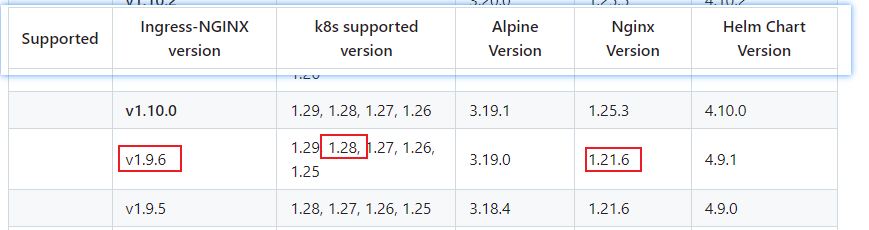
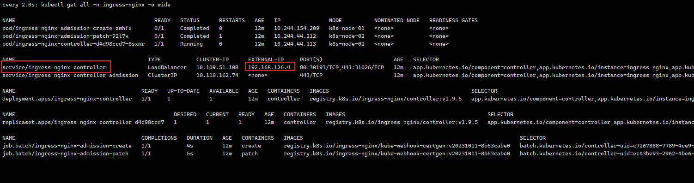
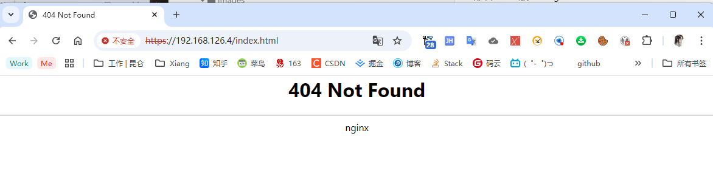

# Kubernetes MetalLB + Ingress

[toc]

参考：[博客园](https://www.cnblogs.com/birkhoffxia/articles/17998192)

官网：https://github.com/kubernetes/ingress-nginx

### 部署 MetalLB

参考 07、Kuberntes LoadBalancer-MetalLBUntitled.md


### 部署 Ingress Controller

因为多次部署导致 K8s集群宕机，这里和文章部署版本保持一致

部署1.9.5版本 Ingress-controller




准备镜像包

```sh
registry.k8s.io/ingress-nginx/kube-webhook-certgen:v20231011-8b53cabe0@sha256:a7943503b45d552785aa3b5e457f169a5661fb94d82b8a3373bcd9ebaf9aac80

registry.k8s.io/ingress-nginx/controller:v1.9.5@sha256:b3aba22b1da80e7acfc52b115cae1d4c687172cbf2b742d5b502419c25ff340e
```

```sh
docker load -i /data/images/ingress-controller.1.9.5.tar
```

执行后，并不会引起 宕机情况



查看 ingress-nginx-controller 虚拟节点位置

```sh
 kubectl get svc -n ingress-nginx  -o wide
```


nginx-ingress 创建了一个 EXTERNAL-IP：192.168.126.4 的 svc

浏览器直接访问

https://192.168.126.4/index.html

http://192.168.126.4/index.html




## 2、Ingress 类型

### 2.1、Simple fanout

在同一个 FQDN 下通过不同URI完成不同应用间流量分发

+ 基于虚拟主机接收多个应用流量
+ 常用于流量分发至同一个应用下的多个不同子应用
+ 不需要为每一个应用配置专用域名


命令：

```sh
kubectl create ingress NAME --rule=host/path=service:port[,tls[=secret]]
```

+ --annotation=[] 提供注解，格式：annotation=value
+ --rule=[]，代理规则，格式：host/path=service:port[,tls=secrename]
+ --class=''，该Ingress适配 Ingress Class


#### 2.1.1、simple fanout案例

第一组Nginx

simple-fanout-a-dep.yaml

```sh
kubectl create deployment simple-fanout-a-dep --image=ikubernetes/demoapp:v1.0 --replicas=3 -o yaml --dry-run=client > 02-simple-fanout/01-simple-fanout-a-dep.yaml
```

simple-fanout-a-svc.yaml

```sh
kubectl create service clusterip simple-fanout-a-dep --tcp=80:80 --dry-run=client -o yaml > 02-simple-fanout/02-simple-fanout-a-svc.yaml
```

第二组Nginx

```sh
kubectl create deployment simple-fanout-b-dep --image=ikubernetes/demoapp:v1.0 --replicas=2 -o yaml --dry-run=client > 02-simple-fanout/03-simple-fanout-b-dep.yaml
```

```sh
kubectl create service clusterip simple-fanout-b-dep --tcp=80:80 --dry-run=client -o yaml > 02-simple-fanout/04-simple-fanout-b-svc.yaml
```

运行当前节点


编写 loop 命令

```sh
#!/bin/bash

# 检查是否提供了命令
if [ $# -eq 0 ]; then
  echo "请提供要循环执行的命令"
  exit 1
fi

# 使用无限循环执行命令，每次循环之间间隔1秒
while true; do
  "$@"      # 执行传入的命令
  sleep 1   # 每次循环后暂停1秒
done
```


验证负载均衡

```sh
loop curl 10.97.17.245
```


#### 2.1.2、annotaion 案例（固定匹配）

Ingress-Nginx 支持 annotation nginx.ingress.kubernetes.io/rewrite-target 注解进行

```sh
kubectl create ingress yun \
--rule="yun.yuncen-k8s.com/a=simple-fanout-a-dep:80" \
--rule="yun.yuncen-k8s.com/b=simple-fanout-b-dep:80" \
--class=nginx \
--annotation nginx.ingress.kubernetes.io/rewrite-target="/" \
--dry-run=client -o yaml > 03-annotation/01-yun-ingress.yaml
```

运行后，查看域名是否生效

```sh
kubectl get ingress
```


```sh
kubectl describe ingress yun
```


发现 Address 是 192.168.58.101，此时虚拟IP，代理到了 这个地址，将域名配置到 `hosts` 配置文件中

```sh
192.168.58.101	yun.yuncen-k8s.com
```


#### 2.1.3、annotaion 案例（正则匹配）

```sh
kubectl create ingress yun \
--rule="yun.yuncen-k8s.com/a(/|$)(.*)=simple-fanout-a-dep:80" \
--rule="yun.yuncen-k8s.com/b(/|$)(.*)=simple-fanout-b-dep:80" \
--class=nginx \
--annotation nginx.ingress.kubernetes.io/rewrite-target="/$2" \
--dry-run=client -o yaml > 03-annotation/02-yun-ingress.yaml
```

此时需要将 02-yun-ingress.yaml 中的 pathType 更改为 `ImplementationSpecific`

运行后查看状态


此时就可以访问更多的路径

```
http://yun.yuncen-k8s.com/a/123123
http://yun.yuncen-k8s.com/b/a
http://yun.yuncen-k8s.com/a/a
```


查看负载均衡的配置文件

```sh
kubectl get po -n ingress-nginx  | grep controller
```

```sh
kubectl exec -it ingress-nginx-controller-d4d98ccd7-m5fvv -n ingress-nginx -- /bin/bash
```


### 2.2、Name based virtual hosting

为每一个应用使用专有的主机名，并基于这些名称完成不同应用间的流量转发

每一个 FQDN 对应一个 Ingress Controller 上的虚拟主机定义，同一组内的应用流量，由 Ingress Controller 根据调度算法完成请求调度

基于 FQDN 名称代理不同应用的请求时，需要事先准备好多个域名，且确保这些域名的解析能够达到 Ingress Controller

+ yun-a.yuncen-k8s.com -> simple-fanout-a-dep
+ yun-b.yuncen-k8s.com -> simple-fanout-b-dep

```sh
kubectl create ingress my-ingress \
--rule="yun-a.yuncen-k8s.com/*=simple-fanout-a-dep:80" \
--rule="yun-b.yuncen-k8s.com/*=simple-fanout-b-dep:80" \
--class=nginx \
--dry-run=client -o yaml > 03-annotation/03-yun-match-ingress.yaml
```

如果匹配路径是 `/` ，使用 `Exact`

如果匹配路径是 `/*` ，使用 `Prefix`

如果匹配路径是正则，使用 `ImplementationSpecific`

配置 hosts

```sh
192.168.58.101	yun-a.yuncen-k8s.com,yun-b.yuncen-k8s.com 
```


### 2.3、TLS

Ingress 也可以提供 TLS 支持，但仅限于 443/TCP 端口，前提是 Ingress 控制器支持 SNI 在同一端口上复用，TLS Secret 必须包含名为 tls.crt 和 tls.key ，他们分别含有 TLS 的证书和私钥

参考 14_Linux 服务/操作/创建证书和私钥.md

```
kubectl create secret tls xiang-tls \
--key=03-annotation/04-ssl/yuncen.key \
--cert=03-annotation/04-ssl/yuncen.crt -o yaml \
--dry-run=client > 03-annotation/05-ssl-secret.yaml
```

创建具有 tls 的 ingress

```sh
kubectl create ingress xiang-ssl \
--rule="ssl.yuncen-k8s.com/a=simple-fanout-a-dep:80,tls=xiang-tls" \
--rule="ssl.yuncen-k8s.com/b=simple-fanout-b-dep:80,tls=xiang-tls" \
--annotation nginx.ingress.kubernetes.io/rewrite-target="/" \
--class='nginx' \
-n default -o yaml --dry-run=client > 03-annotation/06-ssl-ingress.yaml
```


创建完成后，查看 ingress 配置

```sh
kubectl get ingress  
```


浏览器访问

```sh
https://ssl.yuncen-k8s.com/a
https://ssl.yuncen-k8s.com/b
```

