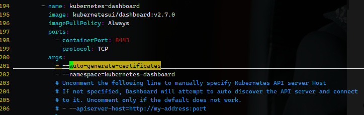

参考[CSDN](https://blog.csdn.net/Dream_Weave/article/details/135059439)


找到 

```yaml
- name: kubernetes-dashboard
    image: kubernetesui/dashboard:v2.7.0
    args:
      - '--auto-generate-certificates'
      - '--namespace=kubernetes-dashboard'
      # 添加下面这一行
      - '--token-ttl=0'
```




