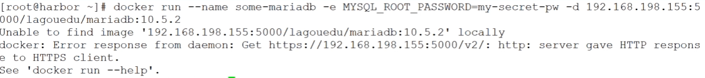
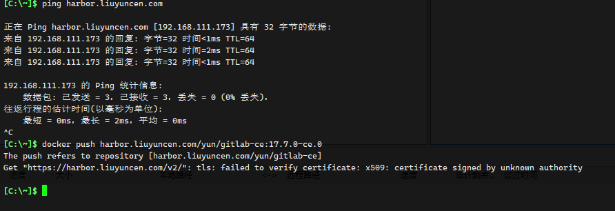

```sh
docker login --username=array_xiang -p 546820.0@lyc registry.cn-beijing.aliyuncs.com
```


```sh
kubectl create secret docker-registry aliyun-yuncen \
  --docker-server=registry.cn-beijing.aliyuncs.com \
  --docker-username=array_xiang \
  --docker-password=546820.0@lyc \
  --docker-email=array_xiangxiang@163.com
```


#### 指定其他命名空间

```sh
kubectl create namespace ingress-nginx
kubectl create secret docker-registry aliyun-yuncen \
  --docker-server=registry.cn-beijing.aliyuncs.com \
  --docker-username=array_xiang \
  --docker-password=546820.0@lyc \
  --docker-email=your-email@example.com \
  --namespace=kube-system
```


在 Depolyment YAML 文件中，添加 添加 `imagePullSecrets` 来指定 Secret。

```yaml
apiVersion: v1
kind: Pod
metadata:
  name: my-pod
spec:
  containers:
  - name: my-container
    image: registry.example.com/my-image:latest
  imagePullSecrets:
  - name: aliyun-yuncen
```


## 一些问题

#### http: server gave HTTP response to HTTPS client.

如果搭建是私有镜像 Harbor 是 HTTPS 形式，在拉取镜像报错信息如下



修改配置文件 /etc/docker/daemon.json

```sh
{
  "insecure-registries":[
    "192.168.58.175:5000"
  ]
}
```

重启后，重新拉取即可


#### Get "https://harbor.liuyuncen.com/v2/": tls: failed to verify certificate: x509: certificate signed by unknown authority




修改配置文件

```json
{
    "insecure-registries":[
    "harbor.liuyuncen.com:443"
  ],
  "registry-mirrors":[
    "https://harbor.liuyuncen.com"
  ]
}
```


参考 [51CTO](https://blog.51cto.com/u_11880730/11657295)