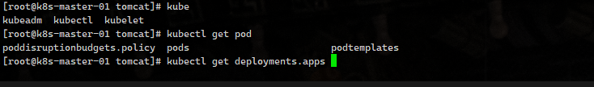

```sh
echo "source <(kubectl completion bash)" >> ~/.bashrc

source ~/.bashrc
```




#### Windows 环境

查看 powerShell 配置文件是否存在

```sh
$PROFILE

C:\Users\xiang\Documents\PowerShell\Microsoft.PowerShell_profile.ps1
```

不存在，则创建

```sh
New-Item -ItemType File -Path $PROFILE -Force
```

添加配置

```sh
Invoke-Expression ((kubectl.exe completion powershell) -join "`n")
```

保存配置

```sh
. $PROFILE
```


添加临时路径，直接在 powershell 中执行

```sh
$env:Path += ";C:\Program Files\Docker\Docker\resources\bin"
```

用户级别，永久添加到 PATH

```sh
[System.Environment]::SetEnvironmentVariable("Path", $env:Path + ";C:\Program Files\Docker\Docker\resources\bin", [System.EnvironmentVariableTarget]::User)
```

