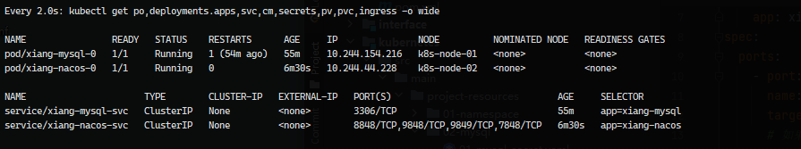
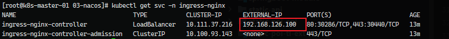
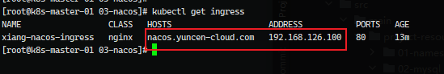
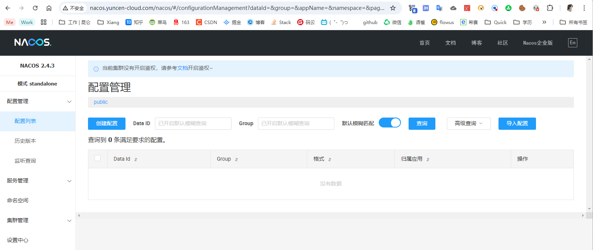

# Kubernetes 部署 Cloud 应用一些基础操作

参考：[CSDN](https://blog.csdn.net/m0_51510236/article/details/133926035)


## 1、服务器集群创建 NFS 共享存储目录

参考文档 [14_Linux 服务/操作/NFS挂载共享目录](https://github.com/YuncenLiu/Knowledge/blob/master/14_Linux%20%E6%9C%8D%E5%8A%A1/%E6%93%8D%E4%BD%9C/NFS%E6%8C%82%E8%BD%BD%E5%85%B1%E4%BA%AB%E7%9B%AE%E5%BD%95.md)

查看某服务器是否有对应服务器挂载权限

```sh
showmount -e 192.168.126.4

showmount -e 192.168.111.170
```


## 2、编排服务

```sh
https://github.com/YuncenLiu/code-example/blob/master/docker-module/src/main/resources/k8s-xiang-cloud
```

创建一个 `xiang-cloud`  命名空间

```sh
kubectl create namespace xiang-cloud --dry-run=client --output=yaml > 01-namespace/01-namespace.yaml
```

创建 `configmap` 指定运行时环境，指定为 `dev` 环境

```sh
kubectl create configmap spring-profile-cm --namespace=xiang-cloud --from-literal=spring-profiles-active=dev --dry-run=client --output=yaml > spring-profile-en.yaml
```

创建持久化 `pv` 和 `pvc`，使用 NFS 共享目录 /data

```#sh
mkdir -p /data/xiang-cloud
cd  /data/xiang-cloud
mkdir -p mysql nacos/logs nacos/data redis file
```


#### 创建 Aliyun镜像下拉权限

```sh
kubectl create secret docker-registry aliyun-yuncen \
  --docker-server=registry.cn-beijing.aliyuncs.com \
  --docker-username=array_xiang \
  --docker-password=546820.0@lyc \
  --docker-email=your-email@example.com \
  --namespace=xiang-cloud
```


#### 创建 MySQL


创建 mysql-pvc 参考 [github](https://github.com/YuncenLiu/code-example/blob/master/docker-module/src/main/resources/k8s-xiang-cloud/mysql-pv.yaml)

创建 mysql 密码，密码为 root

```sh
kubectl create secret generic xiang-mysql-password-secret --namespace=xiang-cloud --dry-run=client --output=yaml --from-literal=mysql-root-password=root > 02-mysql/01-mysql-secret.yaml
```

配置 my.cnf 配置文件，通过 configmap 构建成 yaml 资源清单

```sh
kubectl create configmap xiang-mysql-config-cm --namespace=xiang-cloud --from-file=02-mysql/my.cnf --dry-run=client --output=yaml >> 02-mysql/02-mysql-config.yaml
```

最后写 MySQL 相关的内容，直接参考完整篇吧  [GitHub](https://github.com/YuncenLiu/code-example/blob/master/docker-module/src/main/resources/k8s-xiang-cloud/mysql-dep.yaml)

>这里有一些问题
>
>1. 如果将MySQL镜像换成其他镜像，需要重新启动 docker 将 my.cnf 文件拷贝下来，重新导入到 mysql-conf.yaml
>2. 启动时候，注意挂载目录 /data/xiang-cloud/mysql 目录是空状态，如果有内容，第一次启动的话，必须要删掉目录下所有内容

最后进入 mysql 验证数据库

```sh
kubectl exec -itn xiang-cloud pod/xiang-mysql-0 -- mysql -uroot -p
# 密码是 root
```


创建 MySQL Ingress

```sh
kubectl create ingress xiang-mysql-ingress \
> --namespace=xiang-cloud \
> --dry-run=client \
> --output=yaml \
> --class=nginx \
> --rule="mysql.yuncen-cloud.com/*=xiang-nacos-svc:8848" > 04-nacos-ingress.yaml
```


#### 创建 Nacos

创建 nacos-pvc 参考：github

创建 nacos 的资源清单

```sh
apiVersion: v1
data:
  jvm-xmn: "64m"
  jvm-xms: "128m"
  jvm-xmx: "128m"
  mode: "standalone"
  mysql-database-num: "1"
  mysql-service-db-name: "xiang_nacos_config"
  mysql-service-db-param: "characterEncoding=utf8&connectTimeout=1000&socketTimeout=3000&autoReconnect=true&useSSL=false&serverTimezone=UTC&allowPublicKeyRetrieval=true"
  mysql-service-host: "xiang-mysql-0.xiang-mysql-svc.xiang-cloud.svc.cluster.local"
  mysql-service-port: "3306"
  mysql-service-user: "root"
  spring-datasource-platform: mysql
kind: ConfigMap
metadata:
  creationTimestamp: null
  name: xiang-nacos-cm
  namespace: xiang-cloud
```

创建 [02-nacos-pv.yaml](https://github.com/YuncenLiu/code-example/blob/master/kubernetes/src/main/project-resources/03-nacos/02-nacos-pv.yaml)

创建 [03-nacos-svc.yaml](https://github.com/YuncenLiu/code-example/blob/master/kubernetes/src/main/project-resources/03-nacos/03-nacos-svc.yaml)



先检查 nacos 是否正常启动

```sh
curl 10.244.44.228:8848/nacos
# 不会有日志输出

# 查看日志
kubectl logs -f xiang-nacos-0
```


部署Ingress，先检查是否有 ingress-nginx

```sh
 kubectl get svc -n ingress-nginx
```



如果没有，参考 [Kubernetes MetalLB + Ingress](https://github.com/YuncenLiu/Knowledge/blob/master/08_Container%E5%AE%B9%E5%99%A8/Kubernetes/2024/02-%E8%BF%90%E7%BB%B4%E7%AF%87/08%E3%80%81MetalLB%20%2B%20Ingress%20Controller.md)


查看 iP 池

```sh
kubectl get ipaddresspool -n metallb-system
```


生成 ingress ，对外域名访问

```sh
kubectl create ingress xiang-nacos-ingress \
> --namespace=xiang-cloud \
> --dry-run=client \
> --output=yaml \
> --class=nginx \
> --rule="nacos.yuncen-cloud.com/*=xiang-nacos-svc:8848" > 04-nacos-ingress.yaml
```

这里用 nacos.yuncen-cloud.com:80 访问 xiang-nacos-svc 的 8848 端口

等待1分钟 查看 ingress ，才会有 ADDRESS

```sh
kubectl get ingress
```




配置 hosts

```
192.168.126.100	nacos.yuncen-cloud.com
```

> 如果开启了小火箭，记得设置跳过代理

浏览器访问 http://nacos.yuncen-cloud.com/nacos




#### 创建 Redis

1. 创建 PV、PVC

	NFS 共享磁盘创建目录

	```sh
	mkdir -p /data/xiang-cloud/redis
	```

	使用 01-redis-pv-pvc.yaml 配置文件创建 PV、PVC

2. 创建 Redis config 文件

	```conf
	# 关闭保护模式
	protected-mode no
	  
	# redis链接密码，如果需要密码，那么请取消注释
	# requirepass redis
	  
	# 日志级别
	loglevel warning
	# 日志存放目录
	logfile "/data/redis.log"
	# 数据文件目录
	dir /data
	dbfilename dump.rdb
	  
	# 数据库数量
	databases 16
	  
	# 保存数据库到数据文件
	save 900 1
	save 300 10
	save 60 10000
	```

	创建 configmap 资源清单

	```sh
	kubectl create configmap xiang-redis-config-cm --namespace=xiang-cloud --from-file=redis.conf --dry-run=client --output=yaml > 02-redis-config.yaml
	```

3. 启动 Redis

	使用 03-redis-svc.yaml 资源清单创建 po


启动成功


