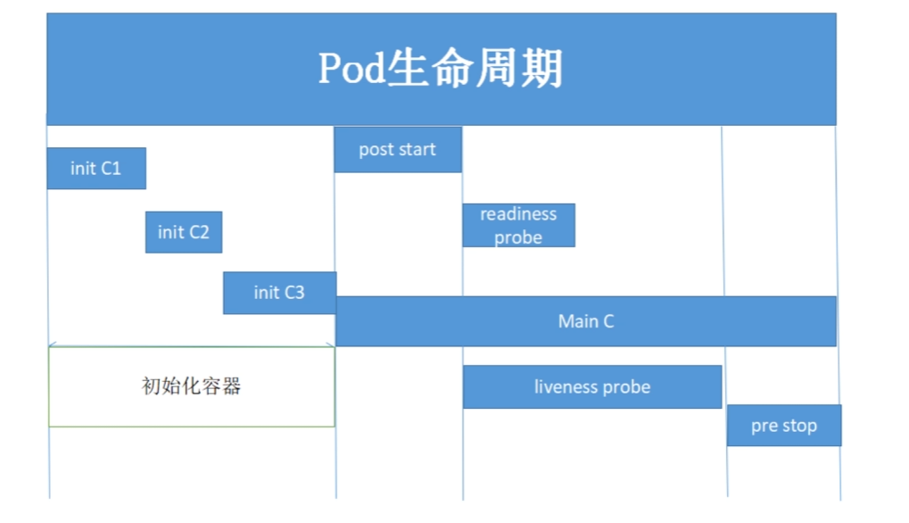
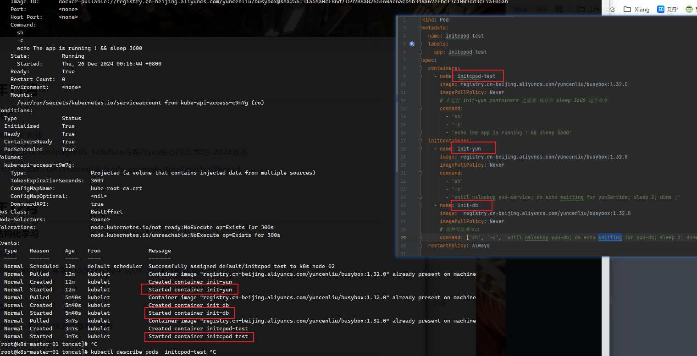
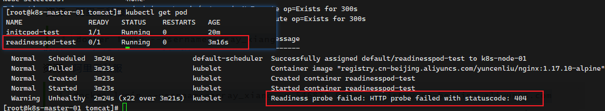
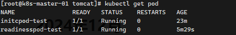

### Pod生命周期




+ init C 初始化卷，数据共享，网络传输，这是有顺序的
+ Main C 全过程
  + start 回调初始化（钩子程序）
  + stop 回调结束
  + readiness 就绪探测，k8s 判断容器是否准备-
  + liveness 生产探测


#### initc 过程

参考 YAML 文件



总结：实现 初始化过程的顺序执行，序列且阻塞的


#### readiness  过程

参考 [Github: YAML](https://github.com/YuncenLiu/code-example/blob/master/docker-module/src/main/resources/k8s/readinessprobe.yaml) 文件，启动之前检测是否存在 index1.html ，那肯定是不存在的，所以一直卡在启动状态

```yaml
readinessProbe:
    httpGet:
    port: 80
    path: /index1.html
    initialDelaySeconds: 2
    # 重新检测 3秒
    periodSeconds: 3
```

```sh
kubectl describe pod readinesspod-test
```



此时我们创建一个 index1.html 文件，为探测开路

```sh
kubectl exec -it readinesspod-test sh
```

进入容器之后，创建 index1.html 文件立刻 Running 状态

