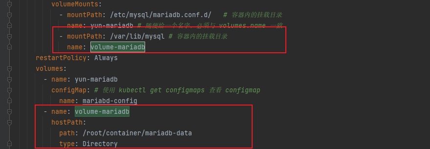

# Volume 存储

[toc]


###  准备镜像

```sh
docker pull mariadb:10.5.2
docker pull registry.cn-beijing.aliyuncs.com/yuncenliu/mariadb:10.5.2
```


因为随着容器、pod 的重启，会导致数据的丢失


## secret

```yaml
env:
  - name: MYSQL_ROOT_PASSWORD
    value: "123456"           # Mariadb root 密码
```

secret 解决了密码、tokne、密钥等敏感数据等配置问题，而不需要把这些敏感数据暴露给镜像或者 Pod 中，Secret 可以用 Volume 或者环境变量的方式使用


#### Service Account

简称 sa，用来访问 K8s API、由 K8s 自动创建，并且自动挂载到 pod 到 /run/secrets/kunbernetts.io/serviceaccount 目录中


#### Opaque

base64编码格式的 secret，用来存储密码，密钥等

```sh
[root@k8s-master-01 k8s-mariadb]# echo -n "12345678" | base64
MTIzNDU2Nzg=
[root@k8s-master-01 k8s-mariadb]# echo -n "MTIzNDU2Nzg=" | base64 -d
12345678
```

编写 secrets.yml

```yaml
apiVersion: v1
kind: Secret
metadata:
  name: mariadb-secret
type: Opaque
data:
  password: MTIzNDU2Nzg=
```

编写 mariadb.yml 使用密码部分

```yaml
env:
  - name: MYSQL_ROOT_PASSWORD
    # 这是 root 用户密码
    valueFrom:
      secretKeyRef:
        key: password
        name: mariadb-secret
```


#### Kubernetes.io/dockerconfigjson

用来存储是有 docker registry 认证信息


用于保存配置数据的键值对，也可以保存单个属性和配置文件


## hostPath

将工作节点某文件系统的目录或文件挂载于 Pod 中的一种存储卷

只做入门操作，不做实际使用


提前了解如何给 node 打 label 标签

准备好存储数据的目录

```sh
mkdir -p /root/mariadb-data
```



为什么不实际使用，因为只能支持单节点，而且只支持 ReadWriteOnce 就是 1对1 模式


#### enptyDir

pod 生命周期中的 临时目录，在 pod 对象被移除时会被一并删除，用的很少，例如同一个 pod 内多个容器之间文件共享，或者作为容器数据临时存储目录用于数据缓存系统。