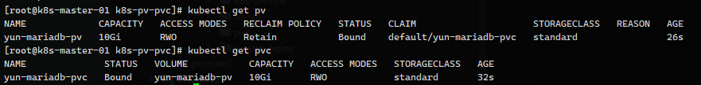
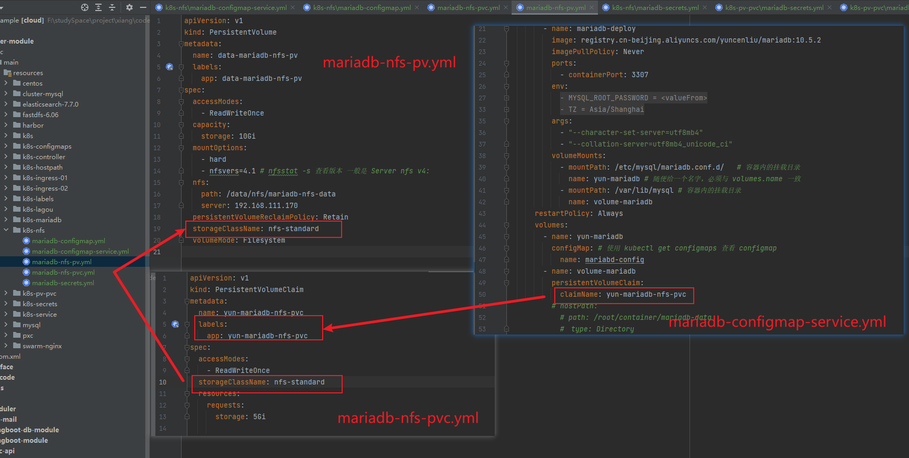

# PV & PVC

[toc]

### PV概念

persistentVolume，由管理员设置的存储，是集群的一部分，就像节点时集群中资源，PV 也是集群中的资源，PV 是 volumes 之类的卷插件，但具有独立于使用 PV 的pod生命周期，此API对象包含存储实现的细节，即NFS，iSCSI或特定于 云供应商的存储系统。


### PVC概念

persistentVolumeClaim 用户存储请求，与 pod 相似，pod 消耗节点资源PVC，PVC消耗PV资源，pod 可用请求特定级别的资源 CPU和内存


PV 就好比一个仓库，我们需要先购买一个仓库，即定义一个 PV存储服务，例如 NFS、HostPath等

PVC就好比租户，pv和pvc是一对一绑定，挂载到 pod 中，一个 pvc 可用被多个 pod 挂载


依旧使用 案例

mariadb-secrets.yml，用于存储 mariadb root 密码的 secrets
mariadb-configmap-service.yml，创建 deployment、service 的资源清单
mariadb-configmap.yml 用于初始化 mariadb 容器内挂载配置文件 my.ini 的 configmap


每个节点创建目录 `/root/container/mariadb-pv`

创建 mariadb-pv.yml

```yaml
apiVersion: v1
kind: PersistentVolume
metadata:
  name: yun-mariadb-pv
  labels:
    app: yun-mariadb-pv
spec:
  # 存储方式
  accessModes:
    - ReadWriteOnce # hostpath 模式只支持读写 1对1  ReadWriteOnce
  capacity:
    # 磁盘大小挂载 10G
    storage: 10Gi
  hostPath:
    path: /root/container/mariadb-pv
    # 如果目录不存在，我就创建一个这个目录
    type: DirectoryOrCreate
  # 回收策略
  persistentVolumeReclaimPolicy: Retain
  storageClassName: standard
  volumeMode: Filesystem
```


创建 mariadb-pvc.yml

```yaml
apiVersion: v1
kind: PersistentVolumeClaim
metadata:
  name: yun-mariadb-pvc
  labels:
    app: yun-mariadb-pvc
spec:
  accessModes:
    - ReadWriteOnce
  storageClassName: standard
  resources:
    requests:
      storage: 5Gi
```


修改 mariadb-configmap-service.yml

```yaml
volumes:
  - name: volume-mariadb
    persistentVolumeClaim:
      claimName: yun-mariadb-pvc
```


上传所有文件并检查 pv

```sh
kubectl get pv

kubectl get pvc
```



+ Status Bound 已经被绑定状态

连接 mariadb 数据库，创建数据库 yun，可用发现固定绑定的节点 `/root/container/mariadb-pv` 目录下已经有 yun 文件夹了


## 理论补充

### 存储机制介绍

在 Kubernetes 中，存储资源和 计算资源同样重要，kubernetes 为了让管理员方便管理集群中的存储资源，同时也为了让使用者使用资源更加方便，所以屏蔽了底层存储的实现细节，将存储抽象成了 API 资源，PersistenVolume 和 PersistentVolumeCliam 对象进行存储管理

+ PersistentVolume 持久化卷，简称 pv，是对底层共享存储的一种抽象，将共享存储定义为一种资源，它属于集群级别资源，不属于任何 namespace，用户使用 pv 需要通过 pvc申请，pv是由管理员进行创建
+ PersistentVolumeVliam 持久化卷声明，简称 pvc，使用户存储的一种声明，类似于对资源的申请，属于一个 namespace 资源，可用用于向 pv 申请资源，pvc 和 pod 类似，pod 消耗的是 node 节点资源，而 pvc消耗的是 pv存储资源。

上面两种资源的存在可以很好的解决存储管理问题，不过每次存储都需要管理员手动创建管理，如果一个集群中有很多应用，并且每个应用都需要挂载很多存储，就需要创建很多 pv和pvc，为此 kubernetes 在 1.4版本引入 storageClass 对象


PV 的四个生命周期

+ Available 可用， 可用状态，尚未被 PVC 绑定
+ Bound 绑定，已经与某个 PVC 绑定
+ Released 已释放，与之前绑定的 PVC被删除，但资源尚未被集群回收
+ Failed 失败，当删除 PVC 清理资源，自动回收卷失败时，所以处于故障阶段

查看 pv 状态

```sh
kubectl get pv
```


#### pv 常用参数配置

##### 存储能力 capacity

对 PV 挂载多大存储空间进行配置，


##### 存储卷模式 volumeMode

+ Filesystem，文件系统，默认

+ Block 块设备

  目前 Block 模式只有 AWSElasticBlockStore、AzureDisk、FC、GCEPersistenDisk、iSCSl、LocalVolume 等


##### 访问模式 accessModes

+ ReadWriteOnce，该卷可以被单个节点读/写模式挂载 RWO（hostpath 只支持这个）
+ ReadOnlyMany，该卷可用被多个节点只读模式挂载 ROX
+ ReadWriteMany，该卷可以被多个节点读/写模式挂载 RWX


pv 可用以资源提供者支持的任何方式挂载到主机上，供应商具有不同功能，每个 PV 的访问模式都将被设置为改卷支持的特定模式，例如 NFS，可用支持多个读/写客户端，但特定的 NFS PV 可能以只读方式导出到服务器上，每个 PV都有一套自己的用来描述特定功能的访问模式


##### 挂载参数 mountOptions

PV 可用根据不同的存类型，设置不同挂载参数，每种类型存储可配置参数都不相同

```yaml
mountOptions:
  - hard
  - nfsver=4
```


##### 存储类 storageClassName

通过配置此参数，使 pv 与 pvc进行绑定


##### 回收策略 persistentVolumeReclaimPolicy

+ Retain 保留，需要管理员手动删除
+ Recyle，删除数据，比如执行 rm -rf /thevolume/ ，目前只有 NFS 和 HostPath 支持
+ Delete，删除，仅部分云存储系统支持


#### pvc常用参数


##### 赛选器 selector

pvc 可用通过在 selecter 中设置 Label 标签，选择指定 labal 的 pv 进行绑定，

```yaml
selector:
  matchLabels:
    release: "stable"
  matchExpressions:
    - key: environment
      operator: In
      values: dev
```


##### 资源请求 resources

```yaml
resources:
  requests:
    storage: 5Gi
```


##### 存储类 storageClassName

pvc 与 pv 进行绑定


##### 访问模式 accessModes

与 pv 的 accessModes 策略一样


### 使用 NFS 进行挂载

创建 NFS 参考文档 GitHub：[NFS挂载共享目录](https://github.com/YuncenLiu/Knowledge/blob/master/14_Linux%20%E6%9C%8D%E5%8A%A1/%E6%93%8D%E4%BD%9C/NFS%E6%8C%82%E8%BD%BD%E5%85%B1%E4%BA%AB%E7%9B%AE%E5%BD%95.md)





NFS 编写

```yaml
nfs:
  path: /data/nfs/mariadb-nfs-data
  server: 192.168.111.170
```


# 动态 PV

安装镜像  [docker hub](https://hub.docker.com/r/vbouchaud/nfs-client-provisioner/tags) 官网

```sh
docker pull vbouchaud/nfs-client-provisioner:v3.2.2
```


创建文件 nfs-pv.yml、nfs-rbac.yml、nfs-storage.yml，参考 Github：[src/main/resources/k8s-nfs-dynamic](src/main/resources/k8s-nfs-dynamic)


成功的将文件挂在到 NFS 共享磁盘中

即使使用 `kubectl delete -f ./` 删除所有 pod 资源， 在本地 NFS 共享目录 /data 下依旧存在此目录


等待回收 Released，但是目录还在

将其进行删除

```sh
kubectl edit pv pvc-c7d60abb-d497-4ff5-9c8e-3c3354cc823b
```

将这段内容删掉


此时 `STATUS` 状态由 `Released` 转为 `Available` 就可以手动删除 目录了，这是运维工程师做的，对于咱们开发人员来说，在测试环境，直接 delete pv xxx ，再删除 目录


## volumeClaimTemplate 属性

#### statefulset 组成

+ Headless Service，名 nginx，用来定义Pod 网络标识
+ Statefulset，有三个 pod 副本，并为每个pod定义域名
+ volumeClaimTemplates，存储卷申请模版，创建 PVC，指定pvc名称大小，将自动创建 pvc，且 pvc 必须由存储类供应


##### 为什么需要 headless service 无头服务

deployment 中，每个 pod 事无序的，是随机字符串，但是 statefulset 中要求必须是有序的，每个 pod 不能被随意替换，因此需要无头服务，保证每个 pod 唯一名称


##### 为什么需要 volumeClaimTemplate

对于又状态副本集都会用到持久存储，对于分布式来讲，最大特点是数据不一致，所以各节点不能使用同一存储卷，每个节点都有自己 专用存储，但是 deployment 中的 pod template 定义的存储卷所用副本公用一个存储卷，数据是相同的，而 statefulset 中每一个 pod 都要有专有存储卷


## Nginx 实现动态PVC 挂在 NFS案例


### nfs 服务

[完整案例： GitHub](https://github.com/YuncenLiu/code-example/tree/master/docker-module/src/main/resources/k8s-statefuleset)

[nfs-rbac.yml](https://github.com/YuncenLiu/code-example/blob/master/docker-module/src/main/resources/k8s-nfs-dynamic/nfs-rbac.yml) 和前文保持一致


分别动态绑定


