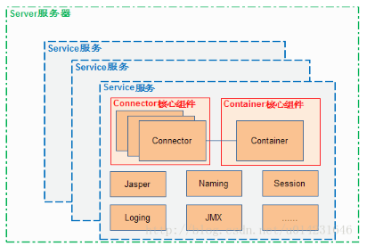
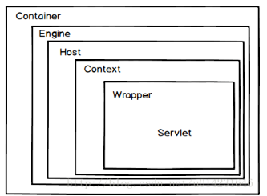
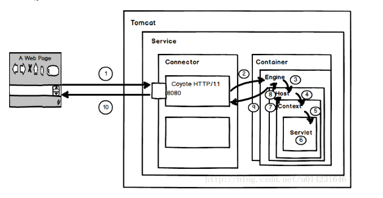

## 一、概念

​	Tomcat 服务器是一个开源的轻量级 Web 应用服务器，在中小型系统和并发量小的场合下普遍被使用，是开发和调试Servlet JSP程序的首选

## 二、原理

​	Tomcat 结构图：

​		Tomcat 主要组件：服务器 Server，服务 Service，连接器 Connector ，容器 Container。连接器 Connector 额 容器Container 是Tomcat 的核心

一个Container 容器和一个或多个 Connector 组合在一起，加上其他一些支持的主键共同组成一个 Service 服务，有了Service服务便可以对外提供能力了，但是Service服务的生产需要一个环境，个环境便是Server，Server组件为Service服务的正常使用提供了生成环境，Server组件可以同时管理一个或多个Service服务。

## 三、两大组件

### 1、Connector（连接器）

​		一个Connector将在某个指定的端口上侦听客户请求，接收服务器的发过来的tcp连接请求，创建一个Request和Response对象分别用于和请求交换数据，然后ui产生一个线程来处理这个请求并把产生的Request 和 Response对象传给出合理 Engine（Container中的一部分），从Engine出获取响应并返回客户

​		Tomcat 中有两个经典的Connector ，一个直接侦听来自 Brower的HTTP请求，另外一个来自其他的 WebServer 请求。HTTP/1.1 Connector在端口8080侦听处来自客户 Brower的HTTP请求，AJP/1.3 Connector在端口8009处侦听其他 Web Server（其他的HTTP服务）的Servelt/JSP请求

​		Connecotr 最重要的功能就是接收连接请求然后分配线程让 Container 来处理请求，所以这必然是多线程的，多线程的处理是 Connector 设计的核心。

### 2、Conatiner（容器）

​		Container 是容器的父接口，该容器的设计是典型的负责链的设计模式，它由四个自容器组件构成，分别是Engine、Host、Context、Wrapper。这四个组件是负责关系，存在包含关系。通常一个 Servlet class 对应一个 Wrapper，如果有多个 Servlet 定义多个 Wrapper，，如果多个 Wrapper 就要定义一个更高的 Container，如 Context。

​		Context 还可以定义在父容器中 Host 中国，Host不是必须的，但是要运行war程序，就必须要用到 Host，因为 War汇总必有 web.xml 文件，这个文件的解析就需要Host 了，如果要有多个Host就要定义了一个 top 容器Engine 了，而Engine没有了父容器了，一个 Engine 代表一个完整的 Servlet 引擎。

+ Engine 容器：

     Engine 容器比较加单，他只定义了一些基本的关联关系

+ Host 容器

     Host 是Engine 子容器，一个 Host  在 Engine 中代表一个虚拟主机，这个虚拟主机的作用就是运行多个运用，他负责安装和展开这些引用，并且标识这个应用以便能够区分它们。它的子容器通常是 Context，他除了关联子容器外，还有就是保存了一个主机应该有的信息。

+ Context 容器

     Context 代表 Servelt 中的 Context，它具备了 Servlet 运行的基本环节，理论上只要有 Context 就能运行 Servlet了，简单的Tomcat 可以没有 Engine 和 Host。Context 最重要的功能就是管理它里面的 Servelt 实例，Servlet实例在 Context中是以 Wrapper出现的，还有一点就是 Context如何才能找到正确的 Servelt来执行呢？Tomcat 5以前是通过一个 Mapper类来管理的，Tomcat5 以后这个功能被移到了 request 中，在前面的时序图就可以发现获取子容器是通过 request 来分配的

+ Wrapper容器

     wrapper 代表一个 Servlet，它负责管理一个 Servlet，包含的 Servelt 装载、初始化、执行以及资源回收，Wrapper 是最底层的容器，它没有子容器了，所以调用它的 addChild就会报错。

     wrapper的实现类是 StandardWrapper，StandarWrapper 还实现了拥又一个 Servlet初始化信息的 ServletConfig，由此看出 StandardWrappper 将直接和 Servlet 的各种信息打交道。

### 3、其他组件

​		Tomcat 还有其他重要组件，比如安全组件 securty、logger 日志组件，session、mbeans、naming 等其他组件，这些组件共同为 Connector 和 Container提供必要服务。

1.用户点击网页内容，请求被发送到本地端口8080，被在那里坚挺的 Coyote HTTP /1.1 Connector 获得。

2、Connector 把请求交给他所在的 Service 的Engine来处理，并等待 Engine处理

3、Engine获得请求 localhsot/text/index.jsp，匹配所有的虚拟机Host

4、Engine 匹配到名 LocalHost 的 Host（即使匹配不到，也把请求交给 Host处理，因为该Host被定义为该 Engine 的默认主键，名为 localhost 的Host请求获得请求 /text/inde.jsp ，匹配它所有拥有的 Contxt，Host匹配到路径为 /text的Context（如果匹配不到，就把请求交给路径为“ ” 的Contxt处理

5、Path = "/test" 的Context获得请求 /index.jsp 在它的 mapping table 中寻找对应的 Servlet。Context 匹配到 URL PATTERN为 *.jsp 的 Servlet，对应的 JspServlet类。

6、构造 HttpServeltRequest对象和 HttpServletReqest对象，作为参数调用 作为参数调用 JspServlet 的 doGet() 或  doPost() 执行逻辑、数据存储等程序。

7、Context把回想完之后的  HttpServletRequest 对象返回给Host

8、Host 把 HttpServletResponse对象返回给 Engine.

9、Engine把 HttpServlet 传到 MDL

10、Contector把ttoServketReqest 对象返回客户 Brower

