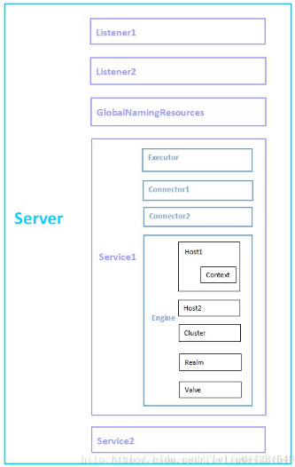

## Tomcat(二) Server.xml 配置

### 1、Tomcat 组件关系图



### 2、组件

#### 1、Server

​		Server.xml 的最外层元素

> 常用属性：
>
> ​	port：Tomcat 监听 shutdown 命令的端口
>
> ​	shutdown：通过指定的端口（prot）关闭 tomcat 所需要的字符串，修改 shutdown 的值，对 shutdown.bat 无影响

#### 2、Listener

​		Listener 即监听器，负责监听特定的事务，当特定事务触发时，Listener 会捕捉到该事件，并做出相应处理。Listener 通常会在 Tomcat 的启动和关闭过程。Listener 可嵌在 Server、Engine、Host、Context内

> 常用属性：
>
> ​	className：指定实现 org.apache.catalina.LifecycleListener 接口的类

#### 3、GlobalNamingResources

​		GlobalNamingResources 用于配置 JNDI

#### 4、Service

​		Service 包装 Executor、Connector、Engine、以组成一个完整的服务

#### 5、Executor

​		Executor 即 Service 提供的线程池，供 Service 内各组件的使用

> 常用属性：
>
> ​	className：指定实现 org.apache.catalina.Executor 接口的类，默认值为 org.apache.catalina.core.StandardThreadExecutor
>
> ​	name：线程池名字
>
> ​	daemon：是否为守护线程，默认为ture
>
> ​	maxldleTime：总线程数高于 minSpareThreads 时，空闲线程的存活时间（单位 ms）默认值为 60000，即一分钟
>
> ​	maxQueueSize：人物队列上限，默认为 Integer.MAX_VALUE(2147483647)，超过此值，将拒绝
>
> ​	==maxThreads==：线程池内线程数上限，默认为200
>
> ​	==minSpaceThreads==：线程池内线程数下线，默认为25
>
> ​	namePrefix：线程名的前缀。线程名字通常为 namePrefix+threadNumber
>
> ​	prstartminSpaceThreads：是否在Executor开启前，就生成 minSpareThreads 个线程。默认为 false
>
> ​	threadProitry：Executor 内线程的优先级，默认为5（Thread.NORM_PRIORTY)
>
> ​	threadRenewalDelay：重建线程的时间间隔，重建线程池内的线程时，为了避免线程同时重建，每隔threadRenewalDealy（单位ms）重建一个线程。默认为1000，设置为负则不重建

#### 6、Connector

​		Connector 是Tomcat 接收请求的入口，每个Connector有自己专属的监听端口

​		Connector也有两张：HTTP Connector 和 AJP Connecotr

> 常用属性：
>
> ​	prot：Connector 接收请求端口
>
> ​	protocol：Connector 使用的协议（HTTP/1.1 或 AJP/1.3）
>
> ​	connectionTimeout：每个请求的最长连接时间（单位 ms）
>
> ​	redirectPort：处理http请求时，收到一个SSL传输请求，该SSL传输请求将转移到此端口处理
>
> ​	executor：指定线程池，如果没设置 executor 可在 Connector标签内设置 maxThreads（默认200）、minSpareThreads（默认10）
>
> ​	acceptCount：Connecotr请求队列的上线，默认为100。当该Connector的请求队列超过 acceptCount时，将拒接接收请求

#### 7、Engine

​		Engine负责处理Service内所有的请求。它接收来自Connector请求，并决定传给哪个Host来处理，Host处理完请求后，将结果返回个 Engine，Engine再将结果返回给 Connector

> 常用属性：
>
> ​	name：Engine 的名字
>
> ​	defaultHost：指定默认Host。Engine接收来自Connector的请求，然后将请求传递给defaultHost，defaultHost 负责处理请求
>
> ​    className：指定实现org.apache.catalina. Engine接口的类，默认值为org.apache.catalina.core. StandardEngine
>
> ​    backgroundProcessorDelay：Engine及其部分子组件（Host、Context）调用backgroundProcessor方法的时间间隔。backgroundProcessorDelay为负，将不调用backgroundProcessor。backgroundProcessorDelay的默认值为10
>
>   注：Tomcat启动后，Engine、Host、Context会启动一个后台线程，定期调用backgroundProcessor方法。backgroundProcessor方法主要用于重新加载Web应用程序的类文件和资源、扫描Session过期
>
> ​    jvmRoute：Tomcat集群节点的id。部署Tomcat集群时会用到该属性，
>
> ​	Service内必须包含一个Engine组件
>
> ​	Service包含一个或多个Connector组件，Service内的Connector共享一个Engine

#### 8、Host

​		Host负责管理一个或多个 Web 项目

> 常用属性：
>
> ​	name：Host的名字
>
> ​    appBase：存放Web项目的目录（绝对路径、相对路径均可）
>
> ​    unpackWARs：当appBase下有WAR格式的项目时，是否将其解压（解成目录结构的Web项目）。设成false，则直接从WAR文件运行Web项目
>
> ​    autoDeploy：是否开启自动部署。设为true，Tomcat检测到appBase有新添加的Web项目时，会自动将其部署
>
> ​    startStopThreads：线程池内的线程数量。Tomcat启动时，Host提供一个线程池，用于部署Web项目，startStopThreads为0，并行线程数=系统CPU核数；startStopThreads为负数，并行线程数=系统CPU核数+startStopThreads，如果（系统CPU核数+startStopThreads）小于1，并行线程数设为1；startStopThreads为正数，并行线程数= startStopThreads，startStopThreads默认值为1
>
> ​    startStopThreads为默认值时，Host只提供一个线程，用于部署Host下的所有Web项目。如果Host下的Web项目较多，由于只有一个线程负责部署这些项目，因此这些项目将依次部署，最终导致Tomcat的启动时间较长。此时，修改startStopThreads值，增加Host部署Web项目的并行线程数，可降低Tomcat的启动时间
>
>  	Tomcat配置多Host可参考此文：[http://grass51.blog.51cto.com/4356355/1123400](http://grass51.blog.51cto.com/4356355/1123400)

#### 9、Context

​		Context 代表一个运行的 Host 上的 Web 项目，一个Host上可以有多个 Context。将一个 Web项目（D:\MyApp）添加到 Tomcat，在Host标签内，添加 Context标签

<Context path="" docBase="D:\MyApp" reloadable="true" crossContext="true">

</Context>

> 常用属性：
>
> ​	==path==：该Web项目的URL入口。path设置为””，输入http://localhost:8080即可访问MyApp；path设置为”/test/MyApp”，输入http://localhost:8080/test/MyApp才能访问MyApp
>
> ​    ==docBase==：Web项目的路径，绝对路径、相对路径均可（相对路径是相对于CATALINA_HOME\webapps）
>
> ​    ==reloadable==：设置为true，Tomcat会自动监控Web项目的/WEB-INF/classes/和/WEB-INF/lib变化，当检测到变化时，会重新部署Web项目。reloadable默认值为false。通常项目开发过程中设为true，项目发布的则设为false
>
> ​    crossContext：设置为true，该Web项目的Session信息可以共享给同一host下的其他Web项目。默认为false

#### 10、Cluster

​		Tomcat集群配置。(见[Tomcat 8（三）Apache2.2.25+Tomcat8.0.3集群配置](http://blog.csdn.net/flyliuweisky547/article/details/21293071)和[Tomcat 8（四）server.xml的Cluster标签详解](http://blog.csdn.net/flyliuweisky547/article/details/21980825))	

#### 11、Realm

​		Realm 可以理解为包含用户、密码、角色的“数据库”。Tomcat 定义了多种 Relam 实现：JDBC Database Realm、DataSource Database Realm、JNDI Directory Realm、UserDatabase Realm 等

#### 12、Value

​		Value 可理解为 Tomcat 的拦截器，而我们常用的 filter为项目内的拦截器。Value可用于 Tomcat 日志、权限等，Value可嵌在 Engine、Host、Context内


### 3、实例

#### conf/server.xml 

```xml
规划： 
网站网页目录：/web/www      域名：www.test1.com 
论坛网页目录：/web/bbs     URL：bbs.test1.com/bbs 
网站管理程序：$CATALINA_HOME/wabapps   URL：manager.test.com    允许访问地址：172.23.136.* 
 

<Server port="8005" shutdown="SHUTDOWN"> 
  <Listener className="org.apache.catalina.core.AprLifecycleListener" SSLEngine="on" /> 
  <Listener className="org.apache.catalina.core.JasperListener" /> 
  <Listener className="org.apache.catalina.core.JreMemoryLeakPreventionListener" /> 
  <Listener className="org.apache.catalina.mbeans.GlobalResourcesLifecycleListener" /> 
  <Listener className="org.apache.catalina.core.ThreadLocalLeakPreventionListener" /> 
  <GlobalNamingResources> 
  <!-- 全局命名资源，来定义一些外部访问资源，其作用是为所有引擎应用程序所引用的外部资源的定义 --!> 
    <Resource name="UserDatabase" auth="Container" 
              type="org.apache.catalina.UserDatabase" 
              description="User database that can be updated and saved" 
              factory="org.apache.catalina.users.MemoryUserDatabaseFactory" 
              pathname="conf/tomcat-users.xml" /> 
  </GlobalNamingResources> 
  <!-- 定义的一个名叫“UserDatabase”的认证资源，将conf/tomcat-users.xml加载至内存中，在需要认证的时候到内存中进行认证 --> 
  <Service name="Catalina"> 
  <!--  定义Service组件，同来关联Connector和Engine，一个Engine可以对应多个Connector，每个Service中只能一个Engine --> 
    <Connector port="80" protocol="HTTP/1.1" connectionTimeout="20000" redirectPort="8443" /> 
    <!-- 修改HTTP/1.1的Connector监听端口为80.客户端通过浏览器访问的请求，只能通过HTTP传递给tomcat。  --> 
    <Connector port="8009" protocol="AJP/1.3" redirectPort="8443" /> 
    <Engine name="Catalina" defaultHost="test.com"> 
    <!-- 修改当前Engine，默认主机是，www.test.com  --> 
    <Realm className="org.apache.catalina.realm.LockOutRealm"> 
        <Realm className="org.apache.catalina.realm.UserDatabaseRealm" 
               resourceName="UserDatabase"/> 
    </Realm> 
    <!--# Realm组件，定义对当前容器内的应用程序访问的认证，通过外部资源UserDatabase进行认证 --> 
      <Host name="test.com"  appBase="/web" unpackWARs="true" autoDeploy="true"> 
      <!--  定义一个主机，域名为：test.com，应用程序的目录是/web，设置自动部署，自动解压    --> 
        <Alias>www.test.com</Alias> 
        <!--    定义一个别名www.test.com，类似apache的ServerAlias --> 
        <Context path="" docBase="www/" reloadable="true" /> 
        <!--    定义该应用程序，访问路径""，即访问www.test.com即可访问，网页目录为：相对于appBase下的www/，即/web/www，并且当该应用程序下web.xml或者类等有相关变化时，自动重载当前配置，即不用重启tomcat使部署的新应用程序生效  --> 
        <Context path="/bbs" docBase="/web/bbs" reloadable="true" /> 
        <!--  定义另外一个独立的应用程序，访问路径为：www.test.com/bbs，该应用程序网页目录为/web/bbs   --> 
        <Valve className="org.apache.catalina.valves.AccessLogValve" directory="/web/www/logs" 
               prefix="www_access." suffix=".log" 
               pattern="%h %l %u %t "%r" %s %b" /> 
        <!--   定义一个Valve组件，用来记录tomcat的访问日志，日志存放目录为：/web/www/logs如果定义为相对路径则是相当于$CATALINA_HOME，并非相对于appBase，这个要注意。定义日志文件前缀为www_access.并以.log结尾，pattern定义日志内容格式，具体字段表示可以查看tomcat官方文档   --> 
      </Host> 
      <Host name="manager.test.com" appBase="webapps" unpackWARs="true" autoDeploy="true"> 
      <!--   定义一个主机名为man.test.com，应用程序目录是$CATALINA_HOME/webapps,自动解压，自动部署   --> 
        <Valve className="org.apache.catalina.valves.RemoteAddrValve" allow="172.23.136.*" /> 
        <!--   定义远程地址访问策略，仅允许172.23.136.*网段访问该主机，其他的将被拒绝访问  --> 
        <Valve className="org.apache.catalina.valves.AccessLogValve" directory="/web/bbs/logs" 
               prefix="bbs_access." suffix=".log" 
               pattern="%h %l %u %t "%r" %s %b" /> 
        <!--   定义该主机的访问日志      --> 
      </Host> 
    </Engine> 
  </Service> 
</Server> 
 


```

#### conf/tomcat-users.xml 

```xml
<?xml version='1.0' encoding='utf-8'?> 
<tomcat-users> 
  <role rolename="manager-gui" /> 
  <!--  定义一种角色名为：manager-gui    --> 
  <user username="cz" password="manager$!!110" roles="manager-gui" /> 
  <!--  定义一个用户的用户名以及密码，并赋予manager-gui的角色    --> 
</tomcat-users> 
```

