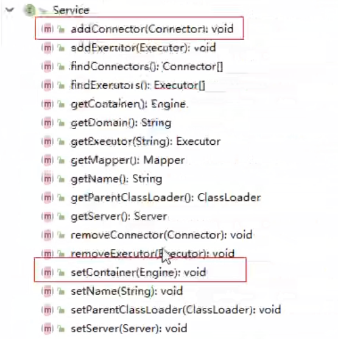
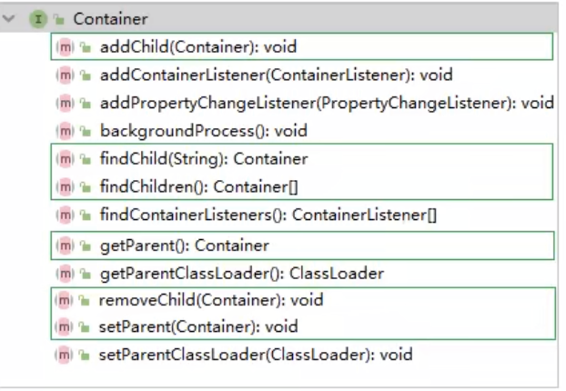

# 	一、Tomcat

## 1、Tomcat 基础

### 1.1、Web概念

1）软件架构

1. C/S：客户端/服务端

    		2. B/S：浏览器/服务器

2）资源分类

1. 静态资源：所有用户访问后，得到的结果都是一样的，称为静态资源，静态资源可以直接被浏览器解析。

     如：html、css、JavaScript、jpg

2. 动态资源：每个用户访问相同的资源后，得到的结果可能不同，称为动态资源。动态资源被访问后，需要先转换为静态资源，再返回个浏览器，通过浏览器进行解析

     如：servlet、jsp、php

3）网络通信三要素

1. IP：电子设备（计算器）在网络中的知识点
2. 端口：应用程序在计算机中的唯一标识 0-65536
3. 传输协议：规定了数据传输的规则
     1. 基本协议：
          1. tcp：安全协议、三次挥手、速度稍慢
          2. udp：不安全，速度快


### 1.2、常见的Web服务器

#### 1.2.1、概念

1） 服务器：安装了服务器软件的计算机

2） 服务器软件：接收用户请求，处理请求，做出相应

3） web服务器软件：接收用户请求，处理请求，做出相应

​	在Web服务器软件中，可以部署web项目，让用户通过浏览器来访问这些项目

#### 1.2.2、常见 web 服务器软件

+ webLogic：oracle公司，大型的JavaEE服务器，支持所有JavaEE规范，收费的
+ webSphere：IBM公司，大型的JavaEE服务器，支持所有JavaEE规范，收费的
+ JBOSS：JBOSS公司，大型的JavaEE服务器，支持所有JavaEE规范，收费的
+ Tomcat：Apache基金组织，中小型JavaEE服务器，仅仅支持少量的JavaEE规范servlet/jsp。开源免费


### 1.3、Tomcat历史

1） Tomcat最初是由 SUN公司的软件架构师 James Duncan Davidson开发，名为 “JavaWebSever”

2）1999年，在Davidson的帮助下，该项目于1999年apache软件基金会旗下 JServ 项目合并，并发布了第一个版本（3.x)，就是现在的Tomcat，该版本实现了 Servlet2.2 和 JSP1.1规范

3）2001年，Tomcat发布了4.0版本，作为里程碑的版本，Tomcat完全重新设计了其架构，并实现了 Servlet2.3和 JSP1.2规范


目前Tocmat已经更新了10.x 版本，但目前企业中主要的Tomcat服务器，还是7.x 和8.x，所以本课程基于8.5版本进行讲解


### 1.4、Tomcat安装

#### 1.4.1、下载

[https://mirrors.tuna.tsinghua.edu.cn/apache/tomcat/tomcat-8/v8.5.60/bin/apache-tomcat-8.5.60.zip](https://mirrors.tuna.tsinghua.edu.cn/apache/tomcat/tomcat-8/v8.5.60/bin/apache-tomcat-8.5.60.zip)


#### 1.4.2、安装

将下载的 .zip文件，解压到系统的目录，建议目录中不要出现空格和中文


### 1.5、Tomcat目录结构

Tomcat目录结构文件如下：

| 目录    | 目下文件                     | 说明                                                         |
| ------- | ---------------------------- | ------------------------------------------------------------ |
| bin     | /                            | 存放Tomcat的启动、停止等批处理脚本文件                       |
|         | startup.bat<br/>startup.sh   | 用于在 windows和 Linux下的启动脚本                           |
|         | shutdown.bat<br/>shutdown.sh | 用于在 windows和 Linux下的停止脚本                           |
| conf    | /                            | 用于存放Tomcat相关配置文件                                   |
|         | Catalina                     | 用于存储针对每个虚拟机的Context的配置                        |
|         | context.xml                  | 用于定义所有web引用均需要的 Context配置，如果Web指定了<br />Context.xml，该文件会被覆盖 |
|         | catalina.properties          | Tomcat的环境变量                                             |
|         | catalina.policy              | Tomcat运行的安全策略配置                                     |
|         | logging.properties           | Tomcat的日志配置文件，可以通过该文件修改Tomcat的日志级别和路径 |
|         | server.xml                   | Tomcat服务器核心配置文件                                     |
|         | tomcat-user.xml              | 定义Tomcat默认的用户以及角色映射信息配置                     |
|         | web.xml                      | Tomcat中所有应用默认的部署描述文件，主要定义了基础Servlet和MIME映射 |
| lib     | /                            | Tomcat服务器的依赖包                                         |
| logs    | /                            | Tomcat默认存放路径目录                                       |
| webapps | /                            | Tomcat默认的Web应用目录                                      |
| work    | /                            | Web应用JSP代码生成和编译的临时目录                           |


### 1.6、Tomcat启动停止

启动

```sh
双击 bin/startup.bat 文件
```

停止

```sh
双击 bin/shutdown.bat 文件
```

访问

```http
http://localhost:8080
```


### 1.7、Tomcat源码

#### 1.7.1、下载源码

源码下载路径：

[https://mirrors.tuna.tsinghua.edu.cn/apache/tomcat/tomcat-8/v8.5.60/src/apache-tomcat-8.5.60-src.zip](https://mirrors.tuna.tsinghua.edu.cn/apache/tomcat/tomcat-8/v8.5.60/src/apache-tomcat-8.5.60-src.zip)


#### 1.7.2、运行

1）解压zip文件

2）进入解压文件，并创建一个目录，名为home，并将 conf、webapps、目录移入home、目录中

3）在当前目录下创建pom.xml 文件，引入Tomcat的依赖包

```xml
<?xml version="1.0" encoding="UTF-8"?>
<project xmlns="http://maven.apache.org/POM/4.0.0"
         xmlns:xsi="http://www.w3.org/2001/XMLSchema-instance"
         xsi:schemaLocation="http://maven.apache.org/POM/4.0.0 http://maven.apache.org/xsd/maven-4.0.0.xsd">
 
    <modelVersion>4.0.0</modelVersion>
    <groupId>org.apache.tomcat</groupId>
    <artifactId>Tomcat8.5</artifactId>
    <name>Tomcat8.5</name>
    <version>8.5</version>
 
    <build>
        <finalName>Tomcat8.5</finalName>
        <sourceDirectory>java</sourceDirectory>
        <resources>
            <resource>
                <directory>java</directory>
            </resource>
        </resources>
        <testResources>
           <testResource>
                <directory>test</directory>
           </testResource>
        </testResources>
        <plugins>
            <plugin>
                <groupId>org.apache.maven.plugins</groupId>
                <artifactId>maven-compiler-plugin</artifactId>
                <version>2.3</version>
                <configuration>
                    <encoding>UTF-8</encoding>
                    <source>1.8</source>
                    <target>1.8</target>
                </configuration>
            </plugin>
        </plugins>
    </build>
 
    <dependencies>
        <dependency>
            <groupId>junit</groupId>
            <artifactId>junit</artifactId>
            <version>4.12</version>
            <scope>test</scope>
        </dependency>
        <dependency>
            <groupId>org.easymock</groupId>
            <artifactId>easymock</artifactId>
            <version>3.4</version>
        </dependency>
        <dependency>
            <groupId>ant</groupId>
            <artifactId>ant</artifactId>
            <version>1.7.0</version>
        </dependency>
        <dependency>
            <groupId>wsdl4j</groupId>
            <artifactId>wsdl4j</artifactId>
            <version>1.6.2</version>
        </dependency>
        <dependency>
            <groupId>javax.xml</groupId>
            <artifactId>jaxrpc</artifactId>
            <version>1.1</version>
        </dependency>
        <dependency>
            <groupId>org.eclipse.jdt.core.compiler</groupId>
            <artifactId>ecj</artifactId>
            <version>4.5.1</version>
        </dependency>
       
    </dependencies>
</project>
```

4) 在IDEA中添加maven工程


5）配置idea的启动类，配置 MainClass，并配置VM参数

```properties
-Dcatalina.home=F:/study/IDEA/tomcat/itcast_project_tomcat/apache-tomcat-8.5.60-src/home
-Dcatalina.base=F:/study/IDEA/tomcat/itcast_project_tomcat/apache-tomcat-8.5.60-src/home
-Djava.util.logging.manager=org.apache.juli.ClassLoaderLogManager
-Djava.util.logging.config.file=F:/study/IDEA/tomcat/itcast_project_tomcat/apache-tomcat-8.5.60-src/home/conf/logging.properties
-Duser.language=en
-Duser.region=US
```


6)启动项目后


7)出现上述异常的原因，是在我们直接启动 org.apache.catalina.startup.Bootstrap的时候没有加载 JasperInitializer,从而无法编译 jsp。解决办法是在tomcat的源码 ContextConfig中configureStart函数中时候手动将JSP解析器初始化

```java
context.addServletContainerInitializer(new JasperInitializer(),null);
```


8)再次启动项目


## 2、Tomcat 架构

### 2.1、Http工作原理

HTTP协议是浏览器与服务器之间的数据传输协议。作为应用层协议，HTTP是基于TCP/IP协议来传递数据的（HTML文件、图片、查询结果等），HTTP协议不涉及数据包（Packet）传输，主要规定了客户端和服务器会见的通讯格式


从图上你可以看到，这个过程是：

1）用户通过浏览器进行一个操作，比如输入网址进行回车，或者是点击一个链接，接着浏览器获取到了这个事件

2）浏览器向服务端发出TCP连接请求

3）服务程序接受浏览器的连接请求，并经过TCP三次握手建立连接

4）浏览器将请求数据打包成一个HTTP协议格式的数据包

5）浏览器将该数据包推入网络，数据包经过网络，最终达到程序服务器端

6）服务器端拿到这个数据包后，同样以HTTP协议格式解包，获取到客户端的意图

7）得知客户端意图后进行处理，比如提供静态文件或者调用服务端程序获得动态结果

8）服务器将响应结果（可能是HTML网页或图片)按照HTTP协议形式打包

9）服务器将响应的数据包推入网络，数据包经过网络传输最终到浏览器

10）浏览器拿到数据包后，以HTTP协议形式解包，然后解析数据，假设这里是HTML

11）浏览器将HTML文件展示在页面上

那我们想要探究Tomcat和Jetty作为一个HTTP服务器，在这个过程中我们都做了些什么事情呢？主要是接收连接、解析请求数据，处理请求和发送响应这几个步骤


### 2.2、Tomcat整体架构

#### 2.2.1、Http服务器请求处理

浏览器发给服务器的是一个HTTP格式的请求，HTTP服务器收到这个请求后，需要调用服务端程序来处理，所谓的服务端程序就是你写的JAVA类，一般来说不同的请求需要不同的Java类处理


1）图1，表示HTTP服务器直接调用具体的业务类，他们是紧耦合的

2）图2，HTTP服务器不直接调用业务类，而是吧请求交给容器来处理，容器通过Servlet接口调用业务类，因此Servlet接口和Servlet容器也就出现了，达到了HTTP服务器与业务解耦的目的，而Servlet接口和Servlet容器这一套规范叫做Serlvet规范，Tomcat安装Servlet规范要求实现了Servlet容器，同事他们也具有HTTP服务器的功能。作为Java程序员，如果我们要实现新的业务功能，只需要实现一个Servlet，并把它注册到Tomcat（Servlet容器中)中，剩下的事情就由Tomcat帮我们处理了


#### 2.2.2、Serlvet容器工作流程

为了解耦，HTTP服务器不直接调用Servlet，而是把请求交给了Servlet容器来处理，那Servlet容器又是如何工作的呢？当客户请求某个资源时，HTTP服务会用 一个ServletRequest对象把客户的请求信息封装起来，然后调用Servlet容器的service方法，Servlet容器拿到请求后，根据请求的URL和Servlet的映射关系，找到响应的Servlet，如果Servlet还没有被加载，就有反射机制创建这个Servlet，并调用Servlet的init方法完成初始化，接着调用Servlet的service方法来处理请求，把ServletRequest对象返回给Http服务器，Http服务器会把响应发送给客户端


#### 2.2.3、Tomcat整体架构

我们知道如果要设计一个系统，首先是要了解需求，我们已经了解了Tomcat要实现两个核心功能

1）处理Socket连接，负责网络字节流与Request和Response对象的转换

2）加载和管理Servlet，以及具体处理Request请求

因此Tomcat设计了两个核心组件连接器（Connector）和容器（Container）来分别做这两件事，连接器负责对外交流，容器负责内部处理


### 2.3、连接器 Coyote

#### 2.3.1、架构介绍

Coyote是Tomcat的练级框架的名称，是Tomcat服务器提供给客户访问的外部接口。客户通过Coyote与服务器建立连接，发送请求并接受响应。

Coyote封装了底层的网络通讯（Socket请求及响应处理）为Catalina容器提供了统一的接口，使Catalina容器与具体的请求协议及IO操作完全解耦。Coyote将Socket输入转换封装为Request对象交由Catalina容器进行处理，处理请求完后，Catalina通过Coyote提供的Request对象将其结果写入输入流。

Coyote作为独立模块，只负责具体的协议和IO的相关操作，与Servlet规范实现没有直接关系，因此即使是Request和Response对象也未实现Servlet规范对的接口，而是在Catalina中将进一步封装为ServletRequest和ServletResponse


#### 2.3.2、IO模型与协议

在Coyote中，Tomcat支持多种I/O模型和应用层协议，具体包含哪些IO模式和应用层协议：

Tomcat支持IO模型（自8.5/9.0）版本起，Tomcat移除了对BIO的支持）

| IO模型 | 描述                                                         |
| ------ | ------------------------------------------------------------ |
| NIO    | 非阻塞I/O，采用JAVA NIO类库实现                              |
| NIO2   | 异步I/O，采用JDK 7最新的NIO2类库实现                         |
| APR    | 采用Apache可移植运行库实现，是C/C++编写的本地库。如果选用这个方式，需要单独安装APR库 |

Tomcat支持的底层协议

| 应用层协议 | 描述                                                         |
| ---------- | ------------------------------------------------------------ |
| HTTP/1.1   | 这是大部分Web用于采用的访问协议                              |
| AJP        | 用于和Web服务器集成（Apache），以实现对静态资源的优化以及集群部署，当前支持AJP/1.3 |
| HTTP/2     | HTTP 2.0 大幅度的提升了Web性能，下一代HTTP协议，自8.5以及9.0版本之后支持 |

协议分层：

在8.0之前，Tomcat默认采用的I/O方式为BIO，之后改为NIO。无论用NIO、NIO2还是APR，在性能方面均优于以往的BIO，如果采用APR，甚至可以叨叨Apache HTTP Server的影响性能

Tomcat为了实现支持多种I/O模型和应用层协议，一个容器可能对接多个连接器，就好比一个房间有多个门，但是独立的连接器或者容器都不能对外提供服务，需要把他们组装起来才能工作，组装后这个整体叫作Service组件，这里请你注意，Service本身没有做过什么重要的事情，只是在连接器和容器外面包了一层，把他们组装在一起、Tomcat内可能有多个Service，这样的设计也是处于灵活性考虑，通过在Tomcat中配置多个Service，可以实现通过不同的端口号来访问一台机器上部署的不同应用


#### 2.3.3、连接器组件

连接器中的各个组件的作用如下：

==EndPoint==

1）EndPoint：Coyote通信端口，即通信监听的端口，是具体Socket接收和发送处理器，是对传输层的抽象，因此EndPoint用来实现TCP/IP协议的

2）Tomcat并没有EndPoint接口，而是提供了一个抽象类AbstractEndpoint，里面定义了两个内部类:Accepte和SocketProccessor。Acceptor用于监听Socket连接请求。SocketProcessor用于处理接收的Socket请求，它实现Runabe接口，在Run方法里调用协议处理组件Processor进行处理，为了提高处理能力，SocketProcessor被提交到线程池来执行。而这个线程池叫做执行器（Executor）

==Processor==

Processor：Coyote协议处理接口，如果说EndPoint是用来实现TCP/IP协议的，那么Processor用来实现HTTP协议，Processor接收来自EndPoint的Socket，读取字节流解析成Tomcat Request和Response对象，并通过Adapter将其提交到容器处，Processor是对应用层协议的抽象

==ProtocolHandler==

ProtocolHandler：Coyote协议处理借口，通过Endpoint和Processor，实现针对具体协议的处理能力，Tomcat按照协议和I/O提供了66个实现类：AjpNioProtocol、AjpAprProtocol、AjpNioProtocol、Http11NioProtocol、Http11Nio2Protocaol,Htto11AprProtocol，我们在配置tomcat/conf/server.xml时，至少要指定具体的ProtocolHandler，当然也可以指定协议名称，如：HTTP/1.1，如果按照了APR，那么讲使用Http11AprProtocol，否则使用HttpNioProtocol

==Adapter==

由于协议不同，客户端发送来的消息也不尽相同，Tomcat定义了自己的Request类来存放这些请求消息，ProtocolHandler接口复制解析请求并生成Tmcat Request类，但是这个Request对象不是标准的ServletRequest，也就意味着，不能用Tomcat Reuqests作为参数来调用容器。Tomcat设计者的解决方案是引入CoyoteAdpter，这是适配器模式的经典运行，连接器调用CoyoteAdapter的Servlet方法，传入的是Tomcat Request对象，CoyoteAdapter负责将Tomcat Request转成ServletRequest，再调用容器的Service方法


### 2.4、容器 - Catalina

Tomcat是由一些列可配置的组件构成的Web容器，而Catalina是Tomcat的Servlet容器

Catalina是Servlet容器实现，包含了之前讲到的所有容器组件，

#### 2.4.1、Catalina 地位

Tomcat的模块分层结构图，如下：


Tomcat 本质上就是一款Servlet容器，因此Catalina才是Tomcat的核心，其他模块都是为Catalina提供支撑的，比如：通过Coyote模块提供链接通讯，Jasper模块提供JSP引擎，Naming提供JDNI服务，Juli提供日志服务


#### 2.4.2、Catalina 结构

Catalina 的主要组成结构如下


如上图所示，Catalina复制管理Server，而Server表示整个服务器，Server下面有多个Service，每个服务都包着多个链接组价Connector（Coyote实现）和一个容器组件Container，在Tomcat启动的时候，会初始化一个Catalina的实例

Catalina各个组件的职责

  

| 组件      | 复制                                                         |
| --------- | ------------------------------------------------------------ |
| Catalina  | 复制解析`Tomcat` 的配置文件，以此来创建服务器Server组件，并根据命令来对其进行管理 |
| Server    | 服务器标识整个Catalina Servlet容器以及其他组件，负责组装并启动Servlet引擎，Tomcat连接器。Server通过实现Lifecycle接口，提供了一种优雅的启动和关闭整个系统的方式 |
| Service   | 服务是Server内部的组件，一个Server包含多个Service，它将若干个Connector组件绑定到一个Container（Engine）上 |
| Connector | 连接器，处理与客户端的通信，它负责接收客户请求，然后负责接收客户请求，然后转给相关的容器处理，最后向客户返回响应结果 |
| Container | 容器，负责处理用户的servlet请求，并返回对象给web用户的模块   |




#### 2.4.3、Container架构

Tomcat 设计了4种容器，分别是 Engine、Host、Context和Wrapper。这四种容器不是平级关系，而是父子关系，Tomcat通过一种分层的架构，使得Servlet容器有很好的灵活性


各种组件的含义

| 容器    | 描述                                                         |
| ------- | ------------------------------------------------------------ |
| Engine  | 表示整个Catalina的Servlet引擎，用来管理多个虚拟站点，一个Service最多只能有一个Engine，但是一个引擎下可包喊多个Host |
| Host    | 代表一个虚拟主机，或者说一个站点，可以给Tomcat配置多个虚拟主机地址，而一个虚拟主机下包含多个Context |
| Context | 表示一个Web应用程序，一个Web应用可包含多个Wrapper            |
| Wrapper | 表示一个Servlet，Wrapper可作为容器中的底层，不能包含子容器   |


我们也可以通过Tomcat的Servlet.xml 配置文件来加深对Tomcat容器的理解。Tomcat采用了组件化设计，它的构成组件都是可配置的，其中最外层的是Server，其他组件安装一定格式要求配置在这个顶层容器中

```xml
<Server>
	<Service>
    	<Connector/>
        <Connector/>
        <Engine>
        	<Host>
            	<Context></Context>
            </Host>
        </Engine>
    </Service>
</Server>
```

那么，Tomcat是怎么管理这些容器的呢？你会发现这些容器具有父子关系，形成一个树形结构，你可能马上就想到了设计模式总的组合模式，没错，Tomcat就是用组合模式来管理这些容器的，具体实现方法是，所有容器组件都实现了Container接口，因此组合模式可以使得用户对象和容器对象的使用具有一致性，这里单容器对象指的是最底层的Wrapper，组合容器对象指的是上面的Context、Host和Engine

> java.org.apache.catalina.Containe


Container 接口中提供了以下方法




### 2.5、Tomcat 启动流程

#### 2.5.1、流程


步骤：

1）启动tomcat，需要调用  bin/startup.bat（在linux目录中，需要调用bin/startup.sh）在startup.bat脚本中，调用了catalina.bat

2）在catalina.bat 脚本中，调用了Bootstarp中的main方法

3）在BootStrap的main方法调用了init方法，来创建Catalina及初始化类加载器

4）在BootStrap的mian方法调用了load方法，在其中又调用了Catalina的load方法

5）在Catalina的load方法中，需要进行一些初始化的工作，并需要构造Digester对象，用于解析XML

6）然后调用后续组件进行初始化操作...


==加载Tomcat的配置文件，初始哈容器组件，监听对应端口号，准备接受客户端请求==


#### 2.5.2、源码解析

##### 2.5.2.1、Lifecycle

由于所有组件均存在初始化、启动、停止等生命周期方法，拥有生命周期管理的特性，所以Tomcat在设计的时候，基于生命周期管理抽象成了一个接口Lifecycle，而组件Server、Service、Container、Executor、Connector组件，都实现了一个生命周期的接口，从而具有了以下生命周期中的核心方法

1） init（）：初始化组件

2）start（）：启动组件

3）stop（）：停止组件

4）destory（）：销毁组件


##### 2.5.1.2、各组件的默认实现

上面我们提到的 Server、Service、Engine、Host、Context都是接口，下图中罗列了这些接口的默认实现类，当前对于 Endpoint 组件来说，在Tomcat中没有对应的EndPoint接口，但是有一个抽象类 AbstarctEndpoint，其下有三个实现类：NioEndpoint、Nio2Endpoint、AprEndpoint，这三个实现类，分别对应于链接器Coyote时，提到的链接器支持的三种IO模式，NIO、NIO2、APR，Tomcat8.5版本中，默认采用的是NioEndPoint


ProtocolHandler：Coyote协议接口，通过封装EndPoint和Processor，实现针对协议的处理能力，Tomcat按照协议和IO提供了6个实现类

AJP协议：

1）AjpNioProtocol：采用NIO的IO模式

2）AjpNio2Protocol：采用NIO2的IO模式

3）AjpAprProtocol：采用APR的IO模式，需要依赖于APR库

HTTP协议：

1）Http1NioProtocol：采用NIO的IO模型，默认使用的协议（如果服务器没有安装APR）

2）Http1Nio2Protocol：采用NIO2的IO模型

3）Http1NioAprProtocol：采用APR的IO模型，需要依赖于APR库


##### 2.5.2.3、源码入口

```java
### org.apache.catalina.startup.Bootstrap
>>    main()
```


#### 2.5.3、总结

​		从启动流程图中以及源码中，我们可以看出Tomcat的启动流程非常标准化，统一按照生命周期管理接口Lifecycle的定义进行启动。首先调用init（）方法进行组件的逐级初始化操作，然后再调用start（）方法进行启动

​		每一级的组件除了完成自身的处理外，还要负责调用子组件响应的生命周期管理方法，组件与组件之间是松耦合的，因为我们可以很容易的通过配置文件进行修改和替换


### 2.6、Tomcat请求处理流程

#### 2.6.1、请求流程

设计了这么多层次的容器，Tomcat是怎么确定每一个请求应该由哪个Wrapper容器里的Servlet来处理呢？答案是Tomcat是用Mapper组件来完成这个任务的

​	Mapper组件的功能就是将用户请求的URL定位到一个Servlet，它的工作原理是：Mapper组件用来保存了Web应用的配置信息，其实就是容器组件来访问路径的映射关系，比如Host容器里配置的域名、Context容器里的Web应用路径，以及Wrapper容器里的Servelt映射的路径，你可以想象这些配置信息就是一个多层次的Map

​	当一个请求到来时，Mapper组件通过解析请求URL里的域名和路径，再到组件保存的Map里去查找，就能定位到一个Servlet。请你注意，一个请求URL最后只会定位到一个Wrapper容器，也就是一个Servlet。

​	下面的示意图，就描述了请求链接 `http://www.xiang.press/hello/findAll'  之后，最终是如何找到处理业务逻辑的servlet


那上面的这幅画只是描述了根据请求的URL如何查出到需要执行的Servlet，那么下面我们再来解析一下，从Tomcat的设计架构层面来分析Tomcat的请求处理


步骤如下：

1）Connector组件Endpoint中的Acceptor监听客户端套接字连接并接受Socket

2）连接交给线程池Executor处理，开始执行请求响应任务

3）Processor组件读取报文信息，解析请求行、请求体、请求头、封装成Request对象

4）Mapper组件根据请求行URL值的请求头和Host值匹配由哪个Host容器、Context容器、Wrapper容器处理请求

5）CopyteAdaptor组件负责将Connector组件和Engine容器关联起来，把生成的Request对象和响应对象Response传递到Engine容器中，调用Pipeline

6）Engine容器的管道开始处理，管道中包含若干个Value，每个Value负责部分处理逻辑。执行完Value后会执行基础的 Value--StandarEngineValue，负责调用Host容器的Pipeline

7）Host容器的管道开始处理，流程类似，最后执行Context容器的Pipeline。

8）Context容器的管道开始处理，流程类似，最后执行Wrapper容器的Pipeline

9）Wrapper容器的管道开始处理，流程类似，最后执行Wrapper容器对应的Servlet对象的处理方式


#### 2.6.2、请求流程源码解析


在前面所讲解到Tomcat的整体架构中，我们发现Tomcat中的各个组件各司其职，组件之间松耦合，确保了整体架构的可伸缩性和可拓展性，那么在组件内部，如何增强组件的灵活性和拓展性呢？Tomcat中，每个Container组件Container组件采用责任链模式来完成具体的请求处理

​		在Tomcat中定义了Piepeline和Value两个接口，Pipeline用于构建责任链，后者代表责任链上的每个处理器。Pipeline中维护了一个基础的Value，它始终位于Pipeline的末端（最后执行），封装了具体的请求处理和输出响应过程。当然，我们也可以调用addValue（）方法，为Pipeline添加其他Vlaue，后添加的Value位于继承的Value之前，并按照添加顺序执行，Pipeline通过获得首个Value来启动整合链条的执行。


## 3、Jasper 组件

### 3.1、Jasper简介

对于基于JSP的Web应用来说，我们可以直接在JSP页面中编写Java代码，添加第三方的标签库，以及使用EL表达式。但是无论经过何种形式的处理，最终输出到客户端的都是标准HTML页面（包含js、css），并不包含任何 的java相关语句，也就是说，我们可以把jsp看成一种运行最终服务器端的脚本，那么服务器是如何将JSP页面转换为HTML页面的呢？

​		Jasper模块是Tomcat的JSP核心引擎，我们知道JSP本质上是一个Servelt。Tomcat使用Jasper对JSP语法进行解析，生成Servelt并生成Class字节码，用户在访问jsp时，会访问Servlet，最终将访问的结果直接响应在浏览器，另外，在运行的时候，Jasper还会检测JSP文件是否修改，如果修改，会重新编译JSP文件


### 3.2、JSP编译方法

#### 3.2.1、运行时编译

​		Tomcat并不会在启动Web应用的时候自动编译JSP文件，而是在客户端第一次请求时，才编译需要访问的JSP文件


##### 3.2.1.1、编译过程

Tomcat在默认的web.xml中配置一个 org.apache.jasper.servlet.JspServlet，用于处理所有.jsp或.jspx结尾的请求


##### 3.2.1.2、编译结果


1）如果 tomcat/conf/web.xml  中配置了参数 scratchdir，则jsp编译后的结果会存储在这个目录下

```xml
<init-param>
	<param-name>scratchdir</param-name>
    <param-value>D:/tmp/jsp/</param-value>
</init-param>
```

2）如果没有配置该选项，则会编译后的结果，存储在Tomcat安装路径下，work-Catalina,(Engine名称)/localhost(Host名称)/Context名称。假设项目名称为 jsp_demo_01  默认的目录为 :"work/Catalina/localhhost/jsp_demo_01

3）如果使用IDEA开发集成工具集成Tomcat，访问Web工程中的jsp，编译后的结果，存放

```xml
c:\Users\Administator\.IntelliJIdea2019.1\system\tomcat\_project_tomcat\work|Ctalina|localhost\get_demo_01_war_exploded\prg\apache\jsp
```


#### 3.2.2、预编译

​		除了运行时编译，我们还可以直接在Web应用启动时，一次性将Web应用的所有JSP页面一次性编译完成，在这种情况下，Web应用运行过程中，便可以不必再时时编译，二十直接调用JSP页面对应的Servlet，完成请求处理，从而提升系统性能

​		Tomcat提供了一个Shell程序JspC，用于支持JSP预编译，而且在Tomcat的安装目录下提供了一个catalina-tasks.xml 文件声明了Tomcat支持的Ant任务，因此，我们很容易使用Ant来执行JSP预编译。（要想使用这种方式，必须得确保在此之前已经下载并安装了Apache Ant）


### 3.3、JSP编译原理

#### 3.3.1、代码分析

编译后.class字节码文件以及源码：

```class

```

#### 3.3.2、编译流程

JSP编译过程如下：


Compiler 编译工作主要包含代码生成 和 编译两部分

代码生成

1）Compiler 通过一个 PageInfo 对象保存JSP页面编译对象过程中的各种配置，这些配置来源于Web应用初始化参数，也可能来源于JSP页面的指令配置（如Page，include）

2）调用ParserController 解除指令节点，验证其是否合法，同时将配置信息保存到PageInfo中，用于工作代码生成。

3）调用ParserController解析整个页面，由于JSP 是逐行解析，所以对于每一行会创建一个具体的  Node  对象。如静态文本（TemplateText）、Java代码（Scriptlet）、定制标签（CustomTag）、Include指令（IncludeDrivective）

4）验证除指令外所有节点的合法性，如 脚本、定制标签、EL表达式等

5）收集除指令以外的其他节点的页面配置信息。

6）编译并加载当前   JSP  页面依赖的标签

7）对于 JSP 页面的EL表达式，生成对应的映射函数。


## 4、Tomcat 服务器配置

​		Tomcat 服务器的配置主要集中于  tomcat/conf 下的 catalina.policy、catalina.properties、context.xml、server.xml、tomcat-user.xml、web.xml 文件

### 4.1、Server.xml

Server.xml  是tomcat服务器的核心配置文件，包含了 Tomat 的Servet 容器（Catalina）的所有配置。由于配置的属性特别多，我们在这里主要讲解其中的一部分重要配置。

#### 4.1.1、Server

Server 是Server.xml 的根元素，用于创建一个 Server 实例，默认使用的实现类是  org.apache.catalina.core.StandardServer

```xml
<server port="8005" shutdown="SHUTDOWN">
	...    
</server>
```

port ：Tomcat 监听的关闭服务器端口

shutdown：关闭服务器的指令字符串


Server 内嵌套的子元素为 Listener、GlobalNamingResources、Service。

默认配置的5个Listener含义

```xml
<!-- 用于以日志形式输出服务器、操作系统、JVM的版本信息 -->
<Listener className="org.apache.catalina.startup.VersionLoggerListener" />

<!-- 用于加载（服务器启动）和 销毁(服务器停止)APR。如果找不到APR库，则会输出日志，并不影响Tomcat启动 -->
<Listener className="org.apache.catalina.core.AprLifecycleListener" SSLEngine="on" />

<!-- 用于避免JRE内存泄露问题  -->
<Listener className="org.apache.catalina.core.JreMemoryLeakPreventionListener" />

<!-- 用户加载（服务器启动）和销毁（服务器停止）全局命名服务 -->
<Listener className="org.apache.catalina.mbeans.GlobalResourcesLifecycleListener" />

<!-- 用于Context停止时重建Executor池中的线程，以避免ThreadLocal相关的内存泄露 -->
<Listener className="org.apache.catalina.core.ThreadLocalLeakPreventionListener" />
```

GlobalNamingResources 全局命名服务

```xml
  <!-- Global JNDI resources
       Documentation at /docs/jndi-resources-howto.html
  -->
  <GlobalNamingResources>
    <!-- Editable user database that can also be used by
         UserDatabaseRealm to authenticate users
    -->
    <Resource name="UserDatabase" auth="Container"
              type="org.apache.catalina.UserDatabase"
              description="User database that can be updated and saved"
              factory="org.apache.catalina.users.MemoryUserDatabaseFactory"
              pathname="conf/tomcat-users.xml" />
  </GlobalNamingResources>
```


#### 4.1.2、Service

​		该元素用于创建 Service实例，默认使用 org.apache.catalina.core.StandardService。默认情况下，Tomcat仅指定了 Service的名称，值为 “catalina”。Service可以内嵌的元素为：Listener、Executor、Connector、Engine，其中：Listener用于为Service添加生命周期监听器，Executor用于配置Service共享线程池，Connector用于配置Service包含的链接器，Engine用于配置Service中链接器对应的Servlet容器引擎

```xml
<Service name="Catalina">
	...
</Service>
```

一个Server服务器，可以包含多个Service服务


#### 4.1.3、Executor

​	默认情况下，Service 并未添加共享线程池配置，如果我们想要添加一个线程池，可以在 < Service > 下添加如下配置

```xml
<Executor name="tomcatThreadPool"
          namePrefix="catalina-exec-"
          maxThreads="200"
          minSpaceThreads="100"
          maxIdleTime="60000"
          maxQueueSize="Integer.MAX_VALUE"
          prestartminSpareThreads="false"
          threadPriority="5"
          className="org.apache.catalina.core.StandardThreadExecutor"/>
```

属性说明：

| 属性                    | 定义                                                         |
| ----------------------- | ------------------------------------------------------------ |
| name                    | 线程池名称，用于 Connetor 中指定                             |
| namePrefix              | 所创建的每个线程的名称前缀，一个单独的线程名称为 namePrefix+threadNumber |
| maxThreads              | 线程池中最大线程数                                           |
| minSpaceThreads         | 活跃线程数，也就是核心线程池线程数，这些线程不会被销毁，会一直存在 |
| maxIdleTime             | 线程空闲时间，超过该时间后，空闲线程会被销毁，默认6000（1分钟）单位毫秒 |
| maxQueueSize            | 在被执行最大线程排队数目，默认为Int的最大值，也就是广义的无限，除非特殊情况，这个值不需要更改，否则会有请求不会被处理的情况发生 |
| prestartminSpareThreads | 启动线程池时是否启动minSpareThreads部分线程。默认值为 false，即不启动 |
| threadPriority          | 线程池中线程优先级，默认值为5，值从1到10                     |
| className               | 线程池实现类，未指定情况下，默认实现类为<br />org.apache.catalina.core.StandardThreadExecutor 。如果想使用自定义线程池首先需要实现 <br />org.apache.catalina.Executor接口 |


#### 4.1.4、Connector

Connector 用于创建链接器实例，默认情况下，server.xml  配置了两个链接器，一个支持HTTP协议，一个支持 AJP协议，因此大多数情况下，我们并不需要新增链接器配置，只是根据需要对已有链接器进行优化

```xml
<Connector port="8080" protocol="HTTP/1.1" connectionTimeout="20000" redirectPort="8443" />

<Connector port="8009" protocol="AJP/1.3"  redirectPort="8443" />
```

一个链接器下面，可以有多个  Connector

1）port：端口号，Connector用于创建服务器端 Socket 并进行监听，以等待客户端请求链接。如果该属性设置为0，Tomcat将会随机选一个可用的端口号给当前Connector使用。

2）protocol：当前Connector支持的访问协议。默认为 HTTP/1.1，并采用自动切换机制选择一个基于 JAVA NIO 的链接器或者基于本地 APR的链接器（根据本地是否有Tomcat 的本地库判定）

如果不希望采用上述自动切换的机制，而是明确指定协议，可以使用以下值

Http协议：

```txt
org.apache.coyote.http11.http11NioProtocol      非阻塞式  Java NIO 链接器
org.apache.coyote.http11.Http11Nio2Protpcol     非阻塞 JAVA NIO2 链接器
org.apache.coyote.http11.Http11AprProtocol      APR 链接器
```

AJP协议：

```txt
org.apache.coyote.ajp.AjpNioProtocol      非阻塞式  Java NIO 链接器
org.apache.coyote.ajp.AjpNio2Protpcol     非阻塞 JAVA NIO2 链接器
org.apache.coyote.ajp.AjpAprProtocol      APR 链接器
```

3）connectionTimeout：Connector接收链接后的等待超时时间，单位：毫秒。-1 表示不超时。

4）redirectProt：当前Connector 不支持 SSL 请求，接收到一个请求，并且符合 security-constraint 结束，需要SSL传输，Catalina自动将请求重定向到指定的端口。

5）executor：指定共享线程池的名称，也可以通过maxThreads、minSpareThreads等属性配置内部线程池。

6）URIEncoding：用于指定编码 URI 的字符编码，Tomcat8.x版本默认编码为 UTF-8

完整的配置如下：

```xml
<Connector port="8080"
           protocol="HTTP/1.1"
           executor="tomcatThreadPool"
           maxThreads="1000"
           minSpareThreads="100"
           acceptCount="1000"
           maxConnections="1000"
           connectionTimeout="20000"
           compression="on"
           compressionMinSize="2048"
           disableUploadTimeout="true"
           redirectPort="8443"
           URIEncoding="UTF-8"/>
```

#### 4.1.5、Engine

Engine 作为 Servlet 引擎的顶级元素，内部可以嵌入 Cluster、Listener、Realm、Value和Host

```xml
<Engine name="Catalina" defaultHost="localhost">
	...
</Engine>
```

属性说明：

1）name：用于指定Engine的名称，默认为Catalina。该名称会影响一部分Tomcat的存储路径（如临时文件）

2）defaultHost：默认使用的虚拟主机名称，当客户请求指定的主机无效时，将交由默认的虚拟主机处理，默认为localhost


#### 4.1.6、Host

Host元素用于配置一个虚拟主机，它支持以下嵌入元素，Alias、Cluster、Listener、Value、Realm，Conext。如果在Engine下配置Realm，那么此配置将在当前Engine下的所有Host中共享。同样，如果Host中配置了Realm，则在当前Host下的所有Context中共享

> Context 中的 Realm优先级 >  Host 的Realm优先级 > Engine 中的 Realm优先级

```xml
<Host name="localhost"  appBase="webapps" unpackWARs="true" autoDeploy="true">
    ...
</Host>
```

属性说明：

1）name：当前Host通用的网络名称，必须与DNS服务器上的注册信息一致。Engine中包含的Host必须存在一个名称与Engine的defaultHost设置一致

2）appBase：当前Host的应用基础目录，当前Host上部署的Web应用均在改目录下（可以是绝对目录，相对路径）。默认为webapps。

3）unpackWARs：设置为true，Host在启动时会将appBase目录下war包解压为目录。设置为false，Host将直接从war文件启动。

4）autoDeploy：控制tomcat是否在运行时定期检测并自动部署新增或变更的web应用


通过给Host添加别名，我们可以实现同一个Host拥有多个网络名词，配置如下

```xml
<Host name="www.baidu.com"  appBase="webapps" unpackWARs="true" autoDeploy="true">
	<Alias>www.baidu.com</Alias>
</Host>
```

属性说明：

1）name：当前Host通用的网络名词，必须与DNS服务器上的注册信息一致，Engine中包含的Host必须存在一个名称与Engine的defaultHost设置一致

2）appBase：当前Host的应用基础目录，当前Host上部署的Web应用均在该目录下（可以是绝对路径，相对路径）。默认为webapps。

3）unpackWARs：设置为true，Host在启动时会将appBase目录下war包解压为目录，Host将直接从war文件启动

4）autoDeploy：控制tomcat是运行时定期检测并自动部署新增或变更的web应用


这个 ，我们可以通过两个域名访问当前Host下的应用（需要确保DNS或hosts中添加了域名的映射配置

#### 4.1.7、Context

Context用于配置一个Web应用，默认的配置如下：

```xml
<Context docBase="east" path="/east">
	...
</Context>
```

属性描述：

1）docBase：Web应用目录或者War包的部署路径，可以是绝对路径，也可以是相对路径，也可以是相对于 Host appBase的相对路径

2）path：Web应用的Context路径，如果我们Host名为localhost，则该web应用访问的根路径为 http://localhost:8080/east

它支持内嵌的元素为：CookieProcessor、Loader、Manager、Realm、Resources、WatchedResource、JarScanner、Valve

```xml
<Host name="www.tomcat.com" appBase="webapps" unpackWARs="true" autoDeploy="true">
	<Context docBase="D:\cbicc" path="/east"></Context>
    <!-- docBase war包的绝对路径  path 是http访问路径 -->
    <Valve className="org.apache.catalina.valves.AccessLogValve" directory="logs"
           prefix="localhost_access_log" suffix=".txt"
           pattern="%h %l %u %t &quot;%r&quot; %s %b"/>
</Host>
```

### 4.2、tomcat-users.xml

​	该配置文件中，主要配置的是Tomcat的用户，角色等信息，用来控制Tomcat中manager，host-manager的访问权限


## 5、Web 应用配置

web.xml   是web应用的描述文件，它支持元素以及属性来自 Servlet规范定义。在Tomcat中，web应用的描述信息包括 tomcat/conf/web.xml  中默认配置以及 Web应用 WEB-INF/web.xml 下的定制配置

### 5.1、ServletContext初始化参数

我们可以通过 < context-param > 添加 ServletContext 初始化参数，它配置了一个键值对，这样我们可以在应用程序中使用 javax.servlet.ServletContext.getInitParameter()方法获取参数。

```xml
<context-param>
	<param-name>contextConfigLocation</param-name>
    <param-value>classpath:applicationContext-*.xml</param-value>
    <description>Spring Config File Location</description>
</context-param>
```

> 通过配置了 context-param 我们可以直接在 Servlet 中取出
>
> ```java
> String value = req.getServletContext().getInitParameter("param-name");
> ```
>
> value 就是 param-value 里的值

### 5.2、会话配置

< session-config > 用于配置web应用会话，包括超时时间，Cookie配置以及会话追踪模式。它将覆盖server.xml 和 context.xml中的配置

```xml
<session-config>
	<session-timeout>30</session-timeout>
    <cookie-config>
        <name>JESSIONID</name>
        <domain>localhost</domain>
        <path>/</path>
        <comment>Session Cookie</comment>
        <http-only>true</http-only>
        <secure>false</secure>
        <max-age>3600</max-age>
    </cookie-config>
    <tracking-mode>COOKIE</tracking-mode>
</session-config>
```

解析配置

1）session-timeout：会话超时时间 单位（分钟）

2）cookie-config：用于配置会话追踪 Cookie

+ name：Cookie名称
+ domain：Cookie的域名
+ path：Cookie路径
+ comment：注释
+ http-only：cookie只能通过Http方式进行访问，JS无法读取或修改，此项可以增加网站访问的安全性
+ secure：此cookie只能通过HTTPS链接传递到服务器，而HTTP连接则不会传递该信息，注意是从浏览器传递到服务器，服务器端的Cookie对象不受此影响
+ max-age:此==秒为单位==表示cookie的生存期，默认为-1表示是会话Cookie，浏览器关闭时就会消失

3）tracking-mode：用于配置会话追踪模式，Servlet3.0版本中支持追踪模式：COOKIE、URL、SSL

1. COOKIE：通过HTTP Cookie追踪会话是最常用的追踪机制，而且Servlet规范也要求所有的Servlet规范都需要支持Cookie追踪

2. URL：URL重写是最基本的会话最终机制，当客户端不支持Cookie时，可以采用URL重写的方式。当采用URL追踪模式时，请求路径需要包含会话标识信息，Servlet容器会根据路径会话标识请求的会话信息 如：

     http://www.baidu.com/user/index.html;jessionid=1234567890

3. SSL：对于SSL请求，通过SSL会话标识确定请求会话标识


### 5.3、Servlet配置

Servlet的配置主要分为两部分  servlet 和 servle-maping：

```xml
<servlet>
	<servlet-name>myServlet</servlet-name>
    <servlet-class>press.xiang.web.MyServlet</servlet-class>
    <init-param>
    	<param-name>fileName</param-name>
        <param-value>init.conf</param-value>
    </init-param>
    <load-on-startup>1</load-on-startup>
    <enabled>true</enabled>
</servlet>

<servlet-mapping>
	<servlet-name>myServlet</servlet-name>
    <url-pattern>*.do</url-pattern>
    <url-pattern>/myservlet/*</url-pattern>
</servlet-mapping>
```

配置说明：

1）servlet-name：指定servlet名称，该属性在web.xml 中唯一

2）servlet-class：用于指定servlet类名

3）init-param：用于指定servlet的初始化参数，在应用可以通过 HttpServlet.getInitParameter获取

4）load-on-startup：用于控制在web应用启动时候，Servlet的加载顺序，值小于0，web应用在启动时，不加载该servlet，第一次访问时加载

5）enable：true、false、若为false，表示servlet不处理任何请求


### 5.4、Listener配置

Listener用于监听Servlet中的事件，例如context、request、session对象的创建、修改、删除、并触发响应事件。Listener是观察者模式的实现，在servlet中主要用于context、request、session对象的声明周期进行控制。在servlet2.5规范中共定义了8个Listener。在启动时，ServletContextListener的执行顺序一致。停止时执行顺序相反

```xml
<listener>
	<listener-class>org.springframwork.web.contextt.ContextLoaderListener</listener-class>
</listener>
```


### 5.5、Filter配置

filter 用于配置 web 应用过滤器，用来过滤资源请求及响应，经常用于认证、日志、加密、数据转换等操作，配置如下

```xml
<filter>
	<filter-name>myFilter</filter-name>
    <filter-class>press.xiang.web.MyFilter</filter-class>
    <async-supported>true</async-supported>
    <init-param>
    	<param-name>language</param-name>
        <param-value>CN</param-value>
    </init-param>
</filter>

<filter-mapping>
    <filter-name>myFilter</filter-name>
    <url-pattern>/*url-pattern>
</filter-mapping>
```

配置说明：

1）filter-name:用于指定过滤名称、在web.xml中，过滤器名称必须唯一

2）filter-class：过滤器的全限定类名，该类必须实现Filter接口

3）async-supported：该过滤器是否支持异步

4）init-param：用于配置Filter的初始化参数，可以配置多个，可以通过FilterConfig.getInitParameter获取

5）url-pattern：指定过滤器需要拦截的URL


### 5.6、欢迎页面的配置：

welcome-file-list 用于指定web应用的欢迎文件列表

```xml
<welcome-file-list>
    <welcome-file>index.html</welcome-file>
    <welcome-file>index.htm</welcome-file>
    <welcome-file>index.jsp</welcome-file>
</welcome-file-list>
```

尝试请求的顺序，从上到下


### 5.7、错误页面配置

error-page 用于配置web应用访问异常时定向到的页面，支持HTTP响应码和异常两种形式

```xml
<error-page>
	<error-code>404</error-code>
    <localhost>/404.html</localhost>
</error-page>
<error-page>
	<error-code>500</error-code>
    <localhost>/500.html</localhost>
</error-page>
<error-page>
	<exception-type>java.lang.Exception</exception-type>
    <localhost>/error.jsp</localhost>
</error-page>
```


## 6、Tomcat 管理配置

从早期 Tomcat 版本开始，就提供了 Web版的管理控制台，他们是两个独立的Web应用，位于Webapps目录下，Tomcat提供的管理应用有用于管理Host和host-manager和用于管理web应用下的manager

### 6.1、host-manager

Tomcat 启动之后，可以通过 http://localhost:8080/host-manager/html 访问web应用。host-manager 默认添加了访问权限控制，当打开网页时，需要输入用户名和密码 （conf/tomcat-user.xml中配置）。所以要想访问该页面，需要在 conf/tomcat-user.xml 中配置，并分配对应角色

1）admin-gui：用于控制页面的访问权限

2）admin-script：用于控制简单文本的形式进行访问

配置如下：

```xml
<role rolename="admin-gui"/>
<role rolename="admin-script"/>
<user username="xiang" password="xiang" roles="admin-script,admin-gui"/>
```

> 如果是访问远程服务器，需要吧 META-INF下面的 context.xml  找到以下内容，然后替换掉
>
> ```xml
> <Valve className="org.apache.catalina.valves.RemoteAddrValve"
> allow="127\.\d+\.\d+\.\d+|::1|0:0:0:0:0:0:0:1|\d+\.\d+\.\d+\.\d+" />
> ```
>
> 修改此内容，需要重启Tomcat    host-manager 和 manager 下均有此文件

### 6.2、manager

manager的访问地址为 http://localhost:8080/manager ，同样，manager也添加了页面访问控制，因此我们需要为登录用户分配角色

```xml
<role rolename="admin-gui"/>
<role rolename="admin-script"/>
<role rolename="manager-gui"/>
<role rolename="manager-scirpt"/>
<user username="admin" password="admin123456" roles="admin-script,admin-gui,manager-gui,manager-script"/>
```


> + Type 类型
>
>      + Heap memory  堆内存
>      + Non-heap memory 非堆内存
>
> + Memory Pool
>
>      + PS Eden Space 伊甸园区
>
>      + PS Old Gen 老年代
>
>      + PS Survivor Space 幸存区     
>
>           新生代 = 伊甸园区 + 2×幸存区
>
>      + Code Cache 代码缓存
>
>      + Compressed Class Space 字节码空间
>
>      + Metaspace  （1.8以后才有的）


## 7、JVM 配置

最常见的 JVM配置当属内存分配，因为绝对多数情况下，JVM默认分配的内存可能不能够满足我们的需求，特别是在生产环境，因此需要手动修改Tomcat启动时内存参数分配

### 7.1、JVM运行时结构


### 7.2、JVM配置选项

windows平台（catalina.bat）

```properties
set JAVA_OPTS=-server -Xms2048m -Xmx2048m -XX:MetaspaceSize=256m -XX:MaxMetaspaceSize=256m -XX:SurvivorRatio=8
```

linux 平台（catalina.sh)

```properties
Java_OPTS="-server -Xms1024m -Xmx1024m -XX:MetaspaceSize=256m -XX:MaxMetaspaceSize=512m -XX:SurvivorRatio=8"
```


参数说明：

| 序号 | 参数                                                         | 含义                                                         |
| ---- | ------------------------------------------------------------ | ------------------------------------------------------------ |
| 1    | -Xms                                                         | 堆内存的初始大小                                             |
| 2    | -Xms                                                         | 堆内存的最大大小                                             |
| 3    | -Xmn                                                         | 新生代的内存大小，官方建议是整个堆的3/8                      |
| 4    | -XX:MetaspaceSize                                            | 元空间内存初始化大小，在JDK1.8版本前配置为 -XX：PermSize（永久代） |
| 5    | -XX:MaxMetspaceSize                                          | 元空间内存最大大小，在JDK1.8版本之前配置为：-XX:MaxPermSize（永久代） |
| 6    | -XX:InitialCodeCacheSize<br /><br />-XX:ReservedCodeCacheSize | 代码缓冲区大小                                               |
| 7    | -XX:NewRatio                                                 | 设置新生代和老年代的相对大小比例，这种方式的优点是新生代大小会随着整个堆大小动态扩展。如 -XX:NewRatio = 3 指定老年代 / 新生代  为  3/1  老年占堆大小的 3/4  ，新生代占 1/4 |
| 8    | -XX:SurvivorRatio                                            | 指定伊甸园区（Eden）与幸存区大小比例。如-XX:SurvivorRatio = 10 表示伊甸园区（Eden）是幸存区  To 大小的10倍（也是From的10倍）。所以，伊甸园区（Eden）占新生代大小的10/12，幸存区 From 和幸存区 To 每个占新生代的 1/12 。注意，两个幸存区永远是一样大的 |


## 8、Tomcat 集群

​		由于单台Tomcat的承载能力有限，当我们的业务系统用户量较大，请求压力比较大时，单台Tomcat是扛不住的，这个时候，就需要搭建Tomcat的集群，而且目前比较流行的做法就是通过 Nginx来实现 Tomcat集群的负载均衡


### 8.1、环境准备：

#### 8.1.1、准备Tomcat

在服务器上，安装两台Tomcat，然后分别更改Tomcat服务器端号：

```
8005 ---->  8015 ---->  8025

8080 ---->  8888 ---->  9999

8009 ---->  8019 ---->  8029
```

#### 8.1.2、安装配置Nginx

 当前服务器上，安装Nginx，然后配置Nginx，配置nginx.conf

```conf
upstream serverpool{
	server localhost:8888;
	server localhost:9999;
}

server {
	listen       99;
	server_name  localhost;
	
	#后端搜素服务
	localhost / {
		proxy_pass http://serverpool/;
	}
}
```

### 8.2、负载均衡策略

#### 8.2.1、轮询

最基本的配置方法，它是 upstream 模块默认的负载均衡默认策略，每次请求会按时间逐一分配到不同的后端服务器

```txt
upstream serverpool{
	server localhost:8888;
	server localhost:9999;
}
```

参数说明：

| 参数         | 描述                                                         |
| ------------ | ------------------------------------------------------------ |
| fail_timeout | 与 max_fails 结合使用                                        |
| max_fails    | 设置 fail_timeout 参数设置的时间内最大失败次数，如果在这个时间内，每次在这个时间内了，所有针对该服务器的请求都失败了，那么认为该服务器会被认为停机了 |
| fail_time    | 服务器会认为停机的时间长度，默认为10s                        |
| backup       | 标记该服务器为备用服务器，当主服务器停止时，请求会被发送到这里 |
| down         | 标记服务器永久停机了                                         |


#### 8.2.2、weight权重

```xml
upstream serverpool{
	server localhost:8888 weight=3;
	server localhost:9999 weight=1;
}
```

weight参数用于指定轮询几率，weigth的默认值为1；weight的数值与访问比率成正比

此策略比较适合服务器的硬件配置差别较大的情况


#### 8.2.3、ip_hash

指定负载均衡安装基于客户端IP的分配方式，这个方法确保了相同客户端的请求一直发送到相同服务器，以保证session会话，这样每个访客都固定访问一个后端服务器，可以解决session不能跨越服务器的问题

```txt
upstream serverpool{
	ip_hash;
	server localhost:8888 weight=3;
	server localhost:9999 weight=1;
}
```


### 8.4、Session 共享方案

在Tomcat集群中，如果应用需要用户进行登录，那么这个时候，用于tomcat做了负载均衡，则用户登录并访问应用系统时，就会出现问题。


解决上述问题，有以下几种方案：


#### 8.4.1、ip_hash 策略

一个用户发起一次请求，只会请求到 tomcat1 上进行操作，另一个用户发起的请求只会在 tomcat2 上进行操作。那么这个时候，同一个用户发起的请求，都会通过nginx 的 ip_hash 策略，将请求转发到同一台tomcat上


#### 8.4.2、Session复制

 在 servlet_demo1 工程中，制作 session.jsp 页面，分别将工程存放在 两台 Tomcat 的webapps/ 目录下

```jsp
<%
Object longinUser = session.getAttribute("loginUser");
if(loginUser!=null && loginUser.toString().length()>0){
    out.print("session 有值")
}else{
    session.setAttribute("loginUser","xiang");
    out.print("session 没有值")
}
%>
```

如果没有任何配置，直接集群的话，session是无法共享的

<font style="background-color:yellow">Session 同步的配置如下：</font>

1）在Tomcat的conf/server.xml 配置如下：

```xml
<Cluster className="org.apache.catalina.ha.tcp.SimpleTcpCluster"/>
```

2）在Tomcat部署的应用程序的 web.xml 中添加如下配置

```xml
<!-- 只需要在最后一个元素的上一行添加就行 -->
<distributable/>
```

3）配置完毕之后，再次重启两个 Tomcat 服务

即可达到 Session 共享目的，上述方案，适用于较小的集群环境（节点数不超过4个），如果集群节点数比较多的话，通过这种广播的形式来完成 session 的复制，会消耗大量的网络带宽，影响服务的性能。


### 8.4.3、SSO-单点登录

单点登录（Single Sign On），简称 SSO，是目前比较流行的企业业务整合的解决方案之一，SSO 的定义是在多个应用系统张红，用户只需要登录一次就可以访问所有相互信任的应用系统，也是用来解决集群环境Session共享的方案之一


## 9、Tomcat 安全

### 9.1、配置安全

1）删除 webapps 目录下所有文件，禁用 tomcat 管理界面

2）注释或删除 tomcat-users.xml 文件内所有用户权限

3）更改关闭 tomcat 指令或禁用

​		tomcat 的 server.xml 中定义了可以直接关闭 Tomcat 实例的管理端口 （默认 8005）。可以通过 telent 连接上的该端口之后，输入 SHUTDOWN （此为默认关闭指令）即可关闭 Tomcat 实例（注意：此虽然关闭了实例，但是进程还是存在的）。由于默认关闭 Tomcat 的端口和指令都很简单，默认端口为 8005，指令为 SHUTDOWN

方案一

```xml
更改端口号的指令
<Server port="8456" shutdown="itcast_shut"/>
```

方案二

```xml
禁用8005端口
<Server port="-1" shutdown="SHUTDOWN"/>
```

4）定义错误页面

在 webapps/ROOT 目录下定义错误页面 404.html,500.html

```xml
<error-page>
	<error-code>404</error-code>
    <localhost>/404.html</localhost>
</error-page>
<error-page>
	<error-code>500</error-code>
    <localhost>/500.html</localhost>
</error-page>
<error-page>
	<exception-type>java.lang.Exception</exception-type>
    <localhost>/error.jsp</localhost>
</error-page>
```

这样配置之后，用户在访问资源时404、500这样的异常，就能看到我们自定义的错误页面，而不会看到异常的堆栈信息，提高了用户体验也保障了服务安全性


### 9.2、应用安全

在大部分的Web应用中，特别是后台的一些系统，都会实现自己的安全模块（权限模块），用于控制应用系统的安全访问，基本包含两个部分：认证（登录/单点登录）和授权（功能权限、数据权限）两个部分，对于当前的业务系统，可以自己做一套适用于自己业务系统的权限模块，也有很多的应用系统直接使用一些功能完善的安全框架，将其集成到我们的web应用中，如：SpringSecurity、Apache Shiro等


### 9.3、传输安全

#### 9.3.1、HTTPS介绍

HTTPS 的全称是超文本传输安全性协议（Httpertext Transfer Protocol Secure),s是一种网络安全传输协议。在HTTP的基础加上 SSL/TLS来进行数据加密，包含交换数据不被泄露

SLL和TLS 是用于网络通信安全的加密协议，它允许客户端和服务器之间通过安全链接通信。SSL 协议的3个特性：

1）保密：通过SSL链接传输的数据是加密的

2）鉴别：通信双方的身份鉴别，通常是可选的，单至少有一方需要验证。

3）完整性：传输数据的完整性检查

从性能角度考虑，加解密是一项计算昂贵的处理，因为尽量不要将整个Web应用采用SSL链接，实际部署中，选择有必要的进行安全加密页面（存在敏感信息的传输页面）采用SSL传输


HTTPS和HTTP的区别主要分为四点：

1）HTTPS 协议需要到证书颁发机构CA申请SSL证书，然后与域名进行绑定，HTTP不用申请证书；

2）HTTPS是超文本传输协议，属于应用层信息传输，HTTPS 则是具有SSL加密传输安全性传输协议，对数据的传输进行加密，相当于HTTP的升级版

3）HTTP和HTTPS使用的是完全不同的链接方式，用的端口也不一样，前者是8080，后者是8443.

4）HTTP的连接很简单，是无状态的，HTTPS协议是由 SSL + HTTP 协议构建的可进行加密传输、身份认真的网络协议，比HTTP协议安全


HTTPS的优势：

1）提高网络排名，有利于SEO、谷歌已经公开声明两个网站的搜索结果方面相同，如果一个网站启用了SSL，它可能获得略高于没有SSL网站等级，而且百度也声明对安装了SSL的网站表示友好，因此，网站上的内容启动SSL都有明显SEO优势

2）隐私信息加密，防止流量劫持。特别是涉及到隐私信息的网站，互联网大型的数据泄露的事件频发发生，网站进行信息加密势在必行

3）浏览器受信任，自从各大主流浏览器大力支持HTTPS协议之后，访问HTTP的网站都会提示“不安全”的警告信息


#### 9.3.2、Tomcat 支持 HTTPS

1）生成密匙库文件

```shell
keytool -genkey -alias tomcat -keyalg RSA -keystore tomcatkey.keystore
```


2）将密钥文件 tomcatkey.keystore 复制到 tomcat bin目录下

3）配置 tomcat/conf/server.xml

```xml
<Connector port="28444" protocol="org.apache.coyote.http11.Http11NioProtocol"
           maxThreads="150" schema="https" secure="true" SSLEnable="true">
	<SSLHostConfig certificateVerification="false">
    	<Certificate ceritficateKeystoreFile="/home/xiang/app/tomcat/conf/tomcatkey.keystore" certificateKeystorePassword="xiang" type="RSA"/>
    </SSLHostConfig>
</Connector>
```


## 10、Tomcat 性能调优

### 10.1、Tomcat 性能测试

对于系统性能，用户最直观的感受就是系统的加载和操作时间，即用户执行某项操作的耗时，从更为专业的角度来讲，性能测试可以从以下两个指标量化

1）响应时间：如上述是，为执行某个操作的耗时，大多数情况下，我们需要针对一个操作测试多次，从获取操作的平均响应时间。

2）吞吐量：即给定的时间内，系统支持的事务数量，计数单位TPS

通常情况下，我们需要借助一些自动化工具来进行性能测试，因为手动模拟大量用户并发访问几乎是不可能的，而且我们市面上也有很多测试工具：ApacheBench、ApacheJMeter、WCAT、WebPolygraph、LoadRunner


#### 10.1.1、ApacheBench

ApacheBench(ab) 是一款 ApacheServer 基准的测试工具，用户测试 Apache Server的服务能力（每秒处理请求数），它不仅可以用于Apache的测试，还可以用Tomcat、Nginx、lighthttp、IIS 等服务器

1）安装

```shell
yum install httpd-tools
```

2）查看版本号


3）部署war包


