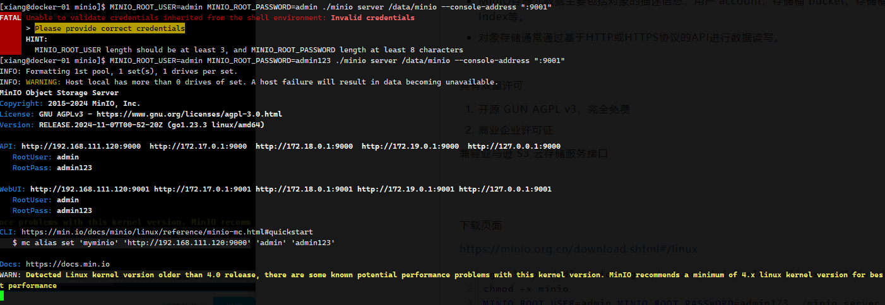

# MinIO

英文官网：https://min.io/

中文官文：https://minio.org.cn/


+ 对象存储，一种数据存储架构，以对象位单位来处理，存储和检索数据，每个对象都包含了数据本身及元数据。
+ MinIO存储元数据主要包括对象的描述信息，用户 account、存储桶 bucket、存储桶索引bucket Index等。
+ 对象存储通常通过基于HTTP或HTTPS协议的API进行数据读写。


具有双重许可

1. 开源 GUN AGPL v3，完全免费
2. 商业企业许可证

兼容亚马逊 S3 云存储服务接口


下载页面

https://minio.org.cn/download.shtml#/linux

```sh
wget https://dl.minio.org.cn/server/minio/release/linux-amd64/minio
chmod +x minio
MINIO_ROOT_USER=admin MINIO_ROOT_PASSWORD=admin123 ./minio server /data/minio --console-address ":9001"
```

+ MINIO_ROOT_USER 访问用户名
+ MINIO_ROOT_PASSWORD 访问密码
+ ./minio server 启动服务器
+ /data/minio 用于存储目录
+ --console-address ":9001" 管理后台的端口

> 这是前台启动



```
INFO: Formatting 1st pool, 1 set(s), 1 drives per set.
INFO: WARNING: Host local has more than 0 drives of set. A host failure will result in data becoming unavailable.
MinIO Object Storage Server
Copyright: 2015-2024 MinIO, Inc.
License: GNU AGPLv3 - https://www.gnu.org/licenses/agpl-3.0.html
Version: RELEASE.2024-11-07T00-52-20Z (go1.23.3 linux/amd64)

API: http://192.168.111.120:9000  http://172.17.0.1:9000  http://172.18.0.1:9000  http://172.19.0.1:9000  http://127.0.0.1:9000 
   RootUser: admin 
   RootPass: admin123 

WebUI: http://192.168.111.120:9001 http://172.17.0.1:9001 http://172.18.0.1:9001 http://172.19.0.1:9001 http://127.0.0.1:9001   
   RootUser: admin 
   RootPass: admin123 

CLI: https://min.io/docs/minio/linux/reference/minio-mc.html#quickstart
   $ mc alias set 'myminio' 'http://192.168.111.120:9000' 'admin' 'admin123'

```


### 后台启动

```sh
MINIO_ROOT_USER=admin MINIO_ROOT_PASSWORD=admin123 ./minio server /data/minio --console-address ":9001" &
```


### 关闭，直接 kill

