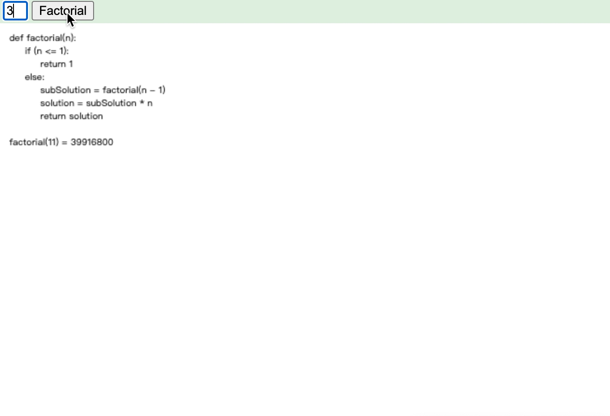

[TOC]

## 阶乘

阶乘（factoial）是基斯顿·卡曼(Christian Kramp, 1760 – 1826)于1808年发明的运算符号。

在表达阶乘时，就使用“！”来表示。如h阶乘，就表示为h!

但是，有时候我们会将Gamma函数定义为非整数的阶乘，因为当x是正整数n的时候，Gamma函数的值是n-1的阶乘。
伽玛函数（Gamma Function）
Γ（x)=∫e^(-t)*t^(x-1)dt (积分下限是零上限是＋∞）(x<>0,-1,-2,-3,……)
运用积分的知识，我们可以证明Γ（x)＝(x-1) * Γ（x-1)
所以，当x是整数n时，Γ（n) = (n-1)(n-2)……＝(n-1)!
这样Gamma 函数实际上就把阶乘的延拓。

```javascript
def factoial(n):
	if (n<=1)
    	return 1
	else
    	subSolution = factoial(n)
			solution = subSoluton * n
	return solution
```

图解：



