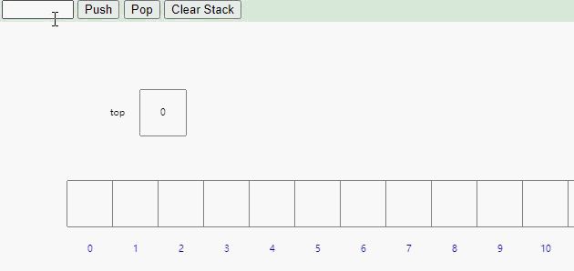

---
可视化 https://www.cs.usfca.edu/~galles/visualization/StackArray.html
---

[TOC]


## Stack (堆栈)

​		栈：一种特殊的线性表，其只允许在固定的一端进行插入和删除元素操作。进行数据插入和删除操作的一端称为栈顶，另一端称为栈底。栈中的数据遵循先进先出 `LIFO`  （Last In First Out）原则

​		压栈：栈的插入操作叫做 进栈/压栈/入栈，入数据在栈顶

​		出栈：栈的删除操作叫做出栈。出数据在栈顶

```
java.lang.Object
  java.util.AbstractCollection<E>
      java.util.AbstractList<E>
          java.util.Vector<E>
              java.util.Stack<E>
```

### 方法：

+ boolean		enpty()

     + 测试堆栈是否为空，当且仅当堆栈中不含任何项时，返回 true，否则返回 false

+ E                 peek()

     + 查看堆栈顶部对象，但不从堆栈中移除它，返回 堆栈顶部的对象 （Vector 对象的最后一项）

+ E                 pop()

     + 移除堆栈顶部的对象，并作为此函数的值返回该对象，返回 堆栈顶部的对象 （Vector 对象的最后一项）

+ E                 push(E item)

     + 把项压入堆栈顶部。参数：item - 压入栈顶。 返回 item 参数

     

     数组实现：

     

     链表实现：

     

     

+ int              seach(Object o)

     + 返回对象在堆栈中的位置，以 1 为基数，此方法返回距栈顶部最近的出现位置到栈顶的距离，栈堆中最顶部的距离为1，其内部使用 equal 比较 o 与栈堆中的值，如果存在，则返回 -1


### 模拟实现栈：

```java
public class StackDemo {
    private int[] elem;
    private int top;//既可以代表下标：这个位置就是当前可以存放数据的下标
    // 也可以代表当前有多少个元素

    public StackDemo() {
        this.elem = new int[10];//默认栈的大小为10
    }
    
    public boolean isFull() {//判断栈是否满了
        return this.top == this.elem.length;
    }

    /**
     * 压栈
     */
    public int push(int item) {
        if(isFull()) {
            throw new RuntimeException("栈为满");
        }
        this.elem[this.top] = item;
        this.top++;
        return this.elem[this.top-1];
    }

    /**
     * 弹出栈顶元素 并且删除
     */
    public int pop() {
        if(empty()) {
            //return -1;
            throw new RuntimeException("栈为空");
        }
        this.top--;
        return this.elem[this.top];
    }

    /**
     * 拿到栈顶元素不删除
     * @return
     */
    public int peek() {
        if(empty()) {
            //return -1;
            throw new RuntimeException("栈为空");
        }
        return this.elem[this.top-1];
    }

    public boolean empty() {
        return this.top == 0;
    }

    public int size() {
        return this.top;
    }
}
```


