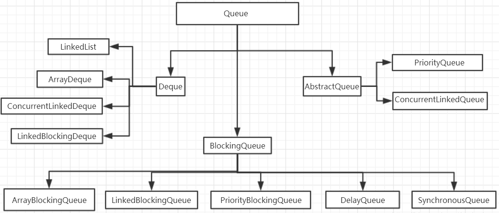
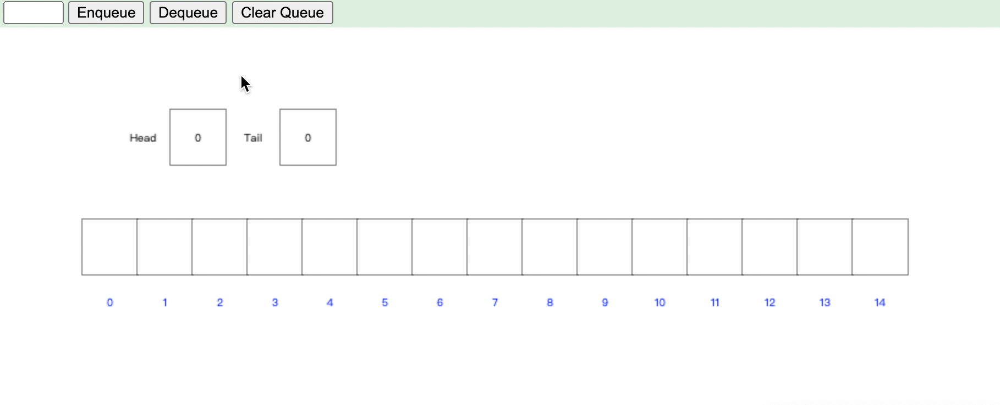
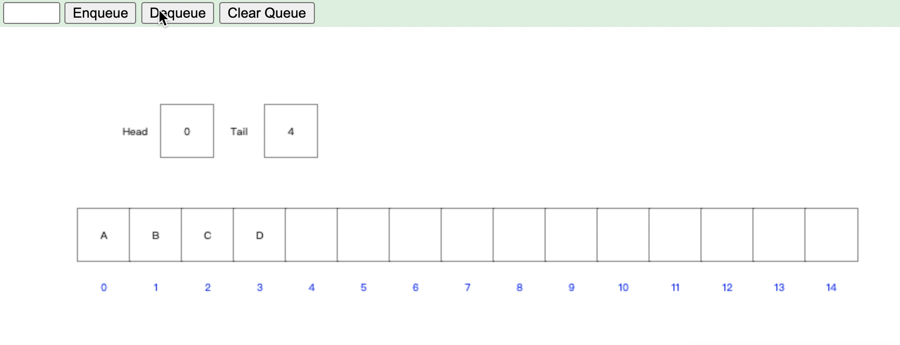
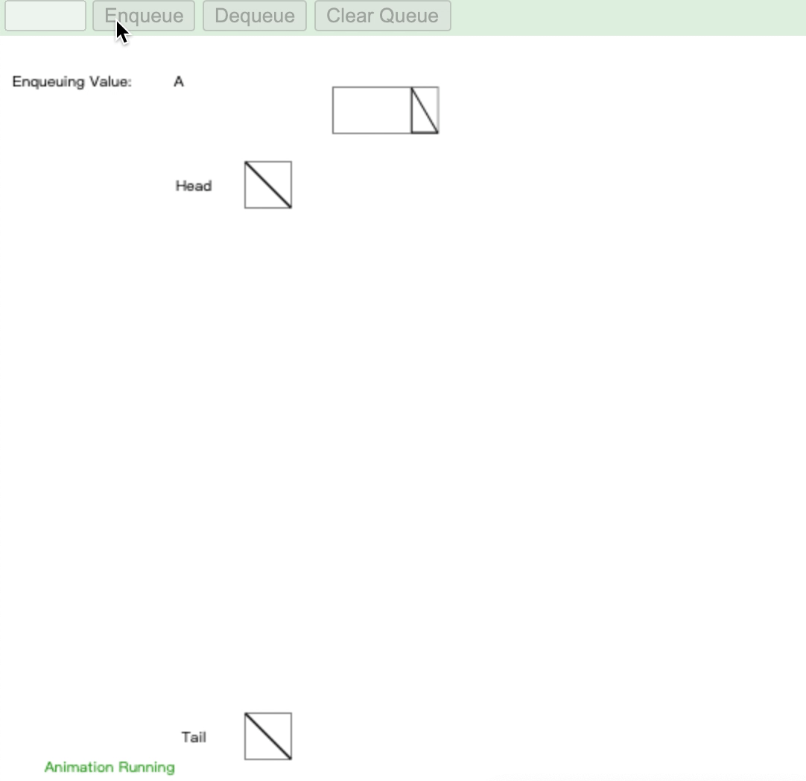
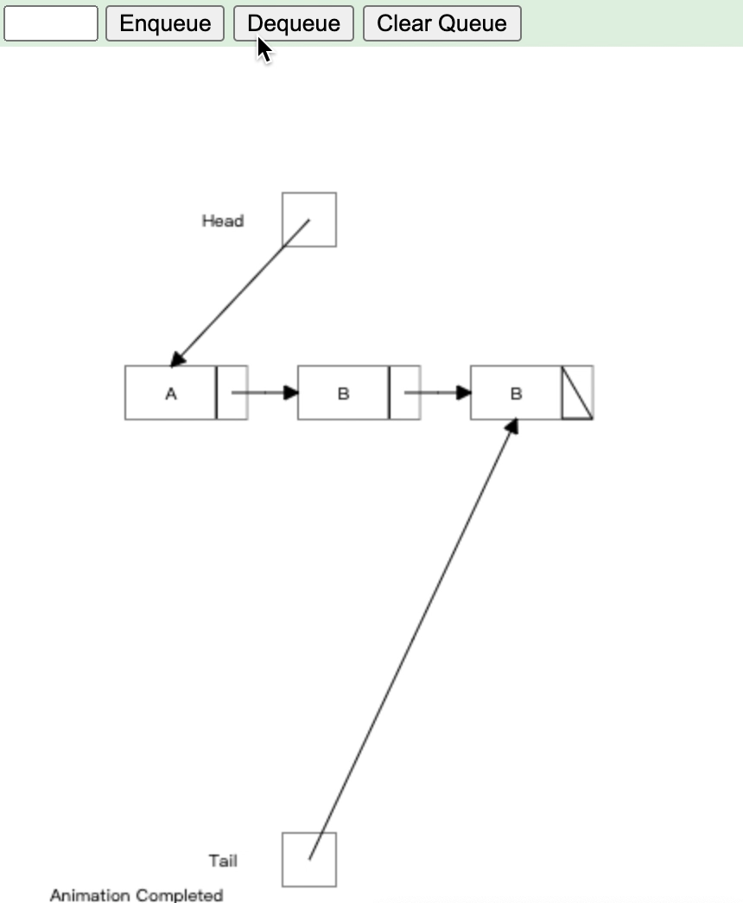

---
https://www.cs.usfca.edu/~galles/visualization/QueueArray.html
---

[TOC]

## Queue (队列)

​		Queue：队列，遵循 FIFO （先进先出) 原则的数据结构， 接口与 List、Set 同一级，都是继承了 Collection 接口。LinkedList 实现了 Deque 接口

常用的类关系图：

### AbstractQueue 非阻塞队列

实现了java.util.Queue接口和java.util.AbstractQueue接口

+ PriorityQueue 类实质上维护了一个有序列表。加入到 Queue 中的元素根据它们的天然排序（通过其 java.util.Comparable 实现）或者根据传递给构造函数的 java.util.Comparator 实现来定位。
+ ConcurrentLinkedQueue 是基于链接节点的、线程安全的队列。并发访问不需要同步。因为它在队列的尾部添加元素并从头部删除它们，所以只要不需要知道队列的大小，ConcurrentLinkedQueue 对公共集合的共享访问就可以工作得很好。收集关于队列大小的信息会很慢，需要遍历队列。

### BlockingQuere 阻塞队列

java.util.concurrent 中加入了 BlockingQueue 接口和五个阻塞队列类。它实质上就是一种带有一点扭曲的 FIFO 数据结构。不是立即从队列中添加或者删除元素，线程执行操作阻塞，直到有空间或者元素可用。

+ ArrayBlockingQueue ：一个由数组支持的有界队列。
+ LinkedBlockingQueue ：一个由链接节点支持的可选有界队列。
+ PriorityBlockingQueue ：一个由优先级堆支持的无界优先级队列。
+ DelayQueue ：一个由优先级堆支持的、基于时间的调度队列。
+ SynchronousQueue ：一个利用 BlockingQueue 接口的简单聚集（rendezvous）机制。

### Deque 双端队列

Deque的含义是 “double ended queue”即双端队列，Deque 是一种具有队列和栈的性质的数据结构。双端队列中的元素可以从两端弹出，起限定插入和删除操作中表的两端进行。

Deque的容量有两张模式，一种是固定长度，另一种是容量有限。同Queue一样，Deque也定义了两套操作访问元素的方法，比如在头部和尾部插入、删除、检索元素，同样的，一种是在满队列或者空队列的操作元素时，会报异常，而一种则会 return null 或者 return false

+ LinkedList 大小可变的链表双端队列，允许元素为null
+ ArrayDeque 大小可变的数组双端队列，不允许 null

> LinkedList 和 ArrayDeque 是现场不安全的容器

在并发场景下，推荐使用 LinkedBlockingDeque

+ LinkedBlockingDeque 阻塞的双向列表，在队列为空时，获取操作将会被阻塞，直到有元素添加

### ==JDK1.5中的阻塞队列操作==

| 方法    | 描述                     | 极限                                                 |
| ------- | ------------------------ | ---------------------------------------------------- |
| add     | 添加一个元素             | 如果队列满了，则抛出一个 IllegalSlabEepeplian 异常   |
| remove  | 移除并返回队列头部元素   | 如果队列为空，则抛出一个 NoSuchElementException 异常 |
| element | 返回队列头部元素         | 如果队列为空，则抛出一个 NoSuchElementException 异常 |
| offer   | 添加一个元素并返回 true  | 如果队列已满，则返回 false                           |
| poll    | 移除并返回队列头部的元素 | 如果队列已空，则返回 null                            |
| peek    | 返回队列头部元素         | 如果队列为空，则返回 null                            |
| put     | 移除一个元素             | 如果队列满，则阻塞                                   |
| take    | 移除并返回列头部元素     | 如果队列为空，则阻塞                                 |

remove、elemet、offer、poll、peek 是属于 Queue 接口

### 数组实现：

#### 添加元素

#### 删除元素

###  链表实现

#### 添加元素

#### 删除元素

