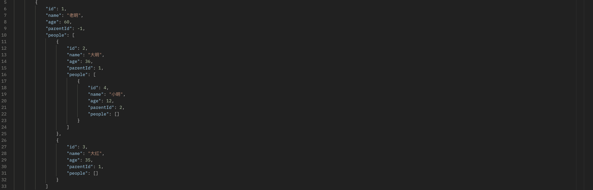
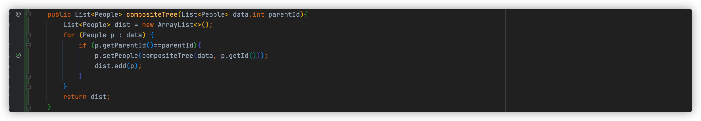
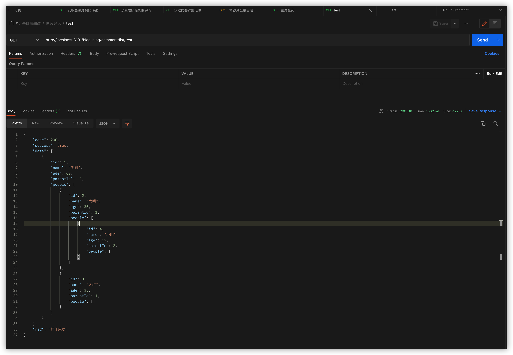

> 创建于2021年12月15日
> 	   作者：想想

[toc]

### 前言

平常开发中，经常会碰到一些包含数据层级结构的数据在表中。我们需要将这样的数据组装成带有层级的 json 格式。我个人认为简单的数据，如果不涉及数据加工的话，递归算法完全可以处理，现在我们从搭建数据到加工最后返回效果来展示递归算法。

提示：阅读次篇文章，涉及到接口请求，复线代码需要 Spring 相关基础。


# 递归算法简单实现

## 1、准备数据

| id(主键) | name(姓名) | age(年纪) | parentId(父级ID) |
| -------- | ---------- | --------- | ---------------- |
| 1        | 老明       | 60        | -1               |
| 2        | 大明       | 36        | 1                |
| 3        | 大红       | 35        | 1                |
| 4        | 小明       | 12        | 2                |

我们自己模拟了一张这样的表，最终的数据结构应该是这样的：



但是我们在程序里应该如何操作呢？请跟着我的脚步一步一步来

## 2、创建实体类

为了减少代码量，我这里使用了 lombok ，如果没有这个环境的同学，去掉`@Data`注解，手动生成 Geting、Setting

```java
@Data
public class People {

    private int id;
    private String name;
    private int age;
    private int parentId;
    private List<People> people;
}
```

## 3、获取数据

这里我们就简单写个方法`set`进对象里

```java
public List<People> getData(){
		List<People> data = new ArrayList<>();
		People people = new People();
		people.setId(1);
		people.setName("老明");
		people.setAge(60);
		people.setParentId(-1);
		data.add(people);
//  ....(此处胜率)
}
```

通过调用 `getData()`方法获取到上面的数据

## 4、递归算法组装数据

兄弟们～ 重头戏来了，创建递归方法

```java
	public List<People> compositeTree(List<People> data,int parentId){
		List<People> dist = new ArrayList<>();
		for (People p : data) {
			if (p.getParentId()==parentId){
        // 要用父级去setPeople，这样子父都会在对象中存在
				p.setPeople(compositeTree(data, p.getId()));
				dist.add(p);
			}
		}
		return dist;
	}
```



主方法调用

```java
	public R<List<People>> test(){
    // 获取数据
		List<People> data = getData();
    // 递归组装数据
		List<People> people = compositeTree(data, -1);
		return R.data(people);
	}
```

最后得到数据



> <center><b><font color=blue >好了到这我们的分享也结束了😉</font></b></center>
> 
> <center><b><font color=blue >希望以上方法可以帮到您，祝您工作愉快！💖</font></b></center>
> 
> <center>👇</center>
> <center><b><font color=pink >对您有帮助的话记点赞得收藏哦！👍</font></b></center>
> <center><font color=blue>我是</font>       <font color=red>想想</font>     <font color=blue>从小白一步一步地变成工具人 😛</font></center>

