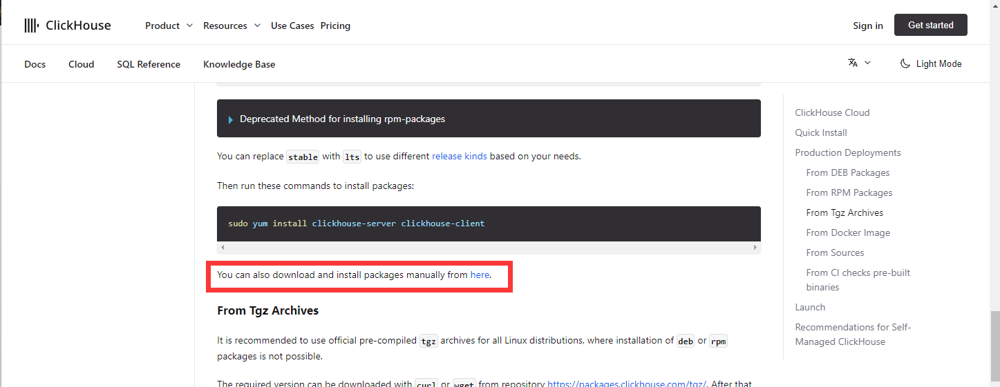
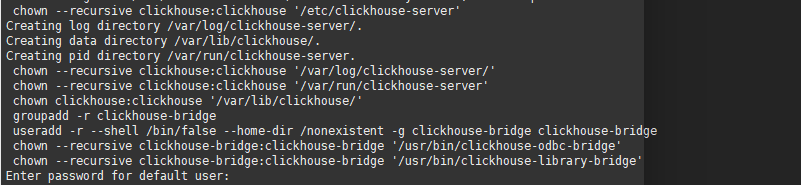
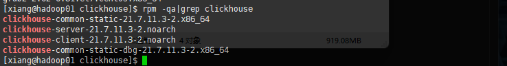
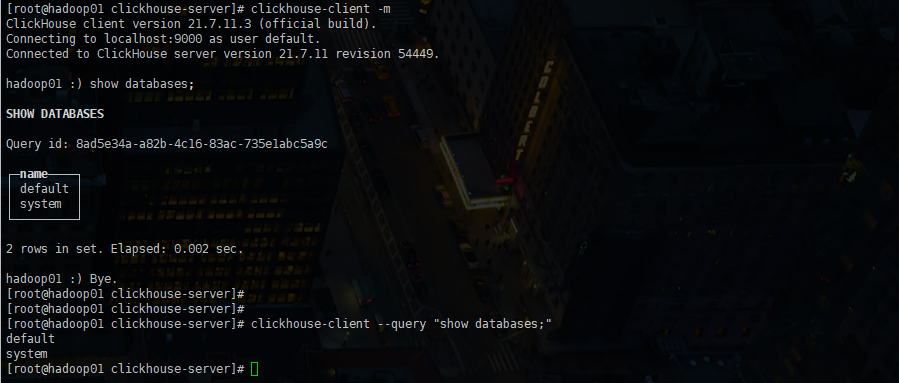

安装官网：https://clickhouse.com/docs/en/install



点击：https://packages.clickhouse.com/rpm/stable/


```
 inhttps://packages.clickhouse.com/rpm/stable/clickhouse-server-21.7.11.3-2.noarch.rpm
https://packages.clickhouse.com/rpm/stable/clickhouse-common-static-dbg-21.7.11.3-2.x86_64.rpm
https://packages.clickhouse.com/rpm/stable/clickhouse-common-static-21.7.11.3-2.x86_64.rpm
https://packages.clickhouse.com/rpm/stable/clickhouse-client-21.7.11.3-2.noarch.rpm
```


下载放到任意一个文件夹下

```shell
sudo rpm -ivh *.rpm
```



较新的版本，到这里会提示给 default 设置密码，如果不设密码直接回车就好了


检查安装是否成功

```shell
rpm -qa|grep clickhouse
```



bin/ 	  ==> 	  /usr/bin

conf/	 ==>		/etc/clickhouse-server/

lib/		==>		/var/lib/clickhouse

log/		==>		/var/log/clickhouse


### 修改配置文件

```shell
sudo vim /etc/clickhouse-server/config.xml
```

修改这个

```
<listen_host>::</listen_host>
```

这样就可以除本机之外的所有服务器访问


在这个文件里还能看到日志文件的位置：

```
/var/log/clickhouse-server/clickhouse-server.log
```


### 启停

```shell
# 查看状态
systemctl status clickhouse-server

clickhouse status


# 同理
clickhouse start|stop|restart
```


### 连接

```shell
# -m 回车可以继续输入，否则回车就直接执行了
clickhouse-client -m

# 远程执行
clickhouse-client -h hadoop02 -m

clickhouse-client --query "show databases;"
```




Clickhouse 默认运行端口 9000


默认开机直启

```shell
sudo systemctl disable clickhouse-server
```

