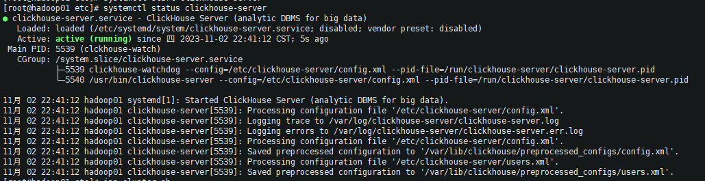
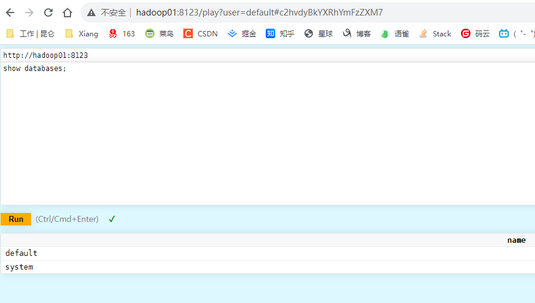
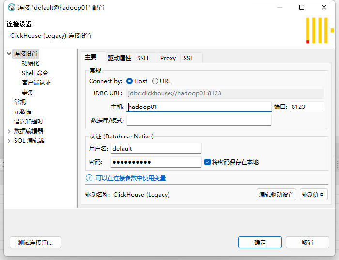

### 启动

切换 root 用户

```shell
# 查看状态
systemctl status clickhouse-server

# 启动
systemctl status clickhouse-server
```




#### Web 端访问

http://hadoop01:8123/play




#### 本地明文密码访问

密码存储在 `/etc/clickhouse-server/users.xml` 的 `password `标签中

密文生成的方式有：https://blog.csdn.net/kongliand/article/details/109219516


```shell
clickhouse-client -h hadoop01 -d default -m -u default --password xiaocencen
```


#### DBeaver连接



