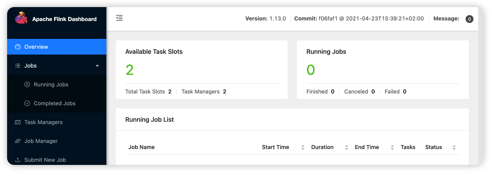
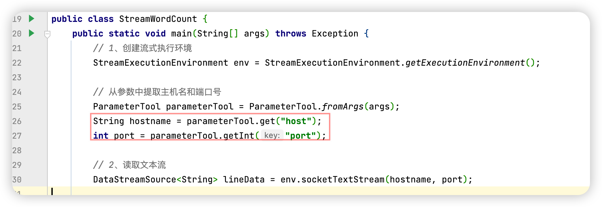
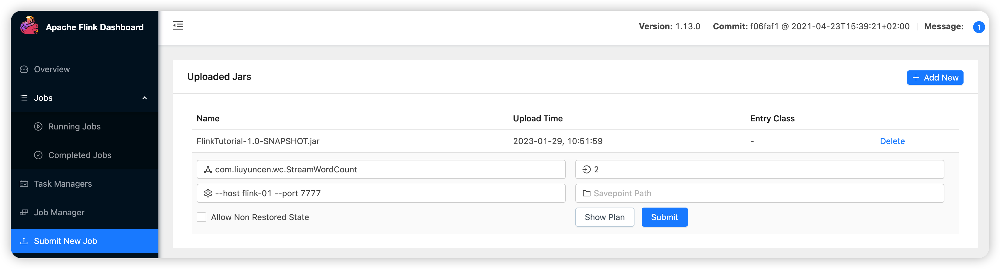
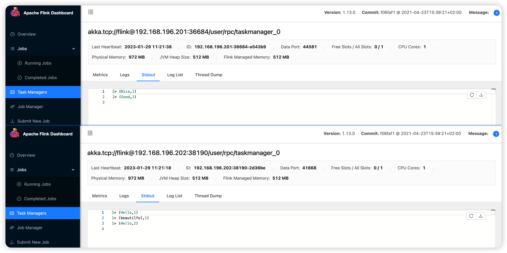
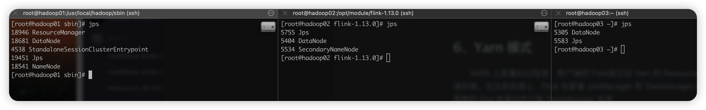

# Flink 部署

Flink 提交作业和执行任务，需要几个关键组件：客户端（Client）、作业管理器（JobManager）和任务管理器（TaskManager）。我们的代码右客户端获取并转换，之后提交到 JobManager。所以 JobManager 就是 Flink 集群里的管事人，对作业进行中央调度管理，而它获取到要执行的作业时，会进一步处理转换，然后分发给众多的 TaskManager，这里的 TaskManager，就是真正的干活人，数据的处理都是由他们处理

## 1、快速搭建部署

Flink 是一个分布式的流处理框架，所以实际应用一般需要搭建集群环境

| 系统     | CentOS 7                                                 |
| -------- | -------------------------------------------------------- |
| 已有配置 | Java 8、Hadoop 集群 2.10版本、免密、时间同步、关闭防火墙 |
| hadoop01 | 192.168.196.200                                          |
| hadoop02 | 192.168.196.201                                          |
| hadoop03 | 192.168.196.202                                          |

Flink 下载地址：

```
https://archive.apache.org/dist/flink/flink-1.13.0/flink-1.13.0-bin-scala_2.12.tgz
```

解压

```sh
[root@hadoop01 ~]# tar -zxvf flink-1.13.0-bin-scala_2.12.tgz -C /opt/module/
```

修改配置文件

清晰三台节点服务器的角色分配

| 节点服务器 | Hadoop01   | Hadoop02    | Hadoop3     |
| ---------- | ---------- | ----------- | ----------- |
| 角色       | JobManager | TaskManager | TaskManager |


#### flink-conf.yaml

```sh
[root@hadoop01 conf]# vim /opt/module/flink-1.13.0/conf/flink-conf.yaml
...
# 本地启动不用改
jobmanager.rpc.address: hadoop01
# RPC 通信端口（默认）
jobmanager.rpc.port: 6123
# jobmanager 分配内存大小（默认）
jobmanager.memory.process.size: 1600m
# taskManager 干活的人内存大小（默认）
taskmanager.memory.process.size: 1728m
# 任务槽 并行数（默认）
taskmanager.numberOfTaskSlots: 1
# 并行度
parallelism.default: 1
# Flink 外部访问页面（默认）解开注释进行修改
#rest.port: 8081
```

#### masters

```sh
[root@hadoop01 conf]# vim /opt/module/flink-1.13.0/conf/masters
hadoop01:8081
```

#### workers

```sh
[root@hadoop01 conf]# vim /opt/module/flink-1.13.0/conf/workers
hadoop02
hadoop03
```

#### 启动

```sh
[root@hadoop01 bin]# cd /opt/module/flink-1.13.0/bin
[root@hadoop01 bin]# ./start-cluster.sh
Starting cluster.
[INFO] 1 instance(s) of standalonesession are already running on hadoop01.
Starting standalonesession daemon on host hadoop01.
Starting taskexecutor daemon on host hadoop02.
Starting taskexecutor daemon on host hadoop03.

[root@hadoop02 conf]# jps
2391 TaskManagerRunner

[root@hadoop03 ~]# jps
2777 TaskManagerRunner
```

#### 关闭

```sh
[root@hadoop01 bin]# ./stop-cluster.sh
Stopping taskexecutor daemon (pid: 2391) on host hadoop02.
Stopping taskexecutor daemon (pid: 2777) on host hadoop03.
No standalonesession daemon (pid: 6016) is running anymore on hadoop01.
```


访问  hadoop01:8081


+ Available Task Slots 可用的资源
	+ Total Task Slots 总资源
	+ Task Managers 


## 2、Web界面提交

在我们编写 Flink 入门程序的 pom.xml 添加如下打包插件

```xml
<build>
  <plugins>
    <plugin>
      <groupId>org.apache.maven.plugins</groupId>
      <artifactId>maven-assembly-plugin</artifactId>
      <version>3.0.0</version>
      <configuration>
        <descriptorRefs>
          <descriptorRef>jar-with-dependencies</descriptorRef>
        </descriptorRefs>
      </configuration>
      <executions>
        <execution>
          <id>make-assembly</id>
          <phase>package</phase>
          <goals>
            <goal>single</goal>
          </goals>
        </execution>
      </executions>
    </plugin>
  </plugins>
</build>
```

编译、打包、上传



上述添加参数，所以这里要写入参数，否则无法点击 Show Plan



```
com.liuyuncen.wc.StreamWordCount
--host flink-01 --port 7777
```

配置hosts

```
192.168.196.129 flink-01
```

启动 flink-01 对应服务器，启动之后，重新 submit 提交，发现不会立刻失败，则进入等待状态，在 flink 服务器输入

```sh
[root@flink ~]# nc -lk 7777
Hello Nice
beautilful Hello Good
```



关闭的话，只要爱 Running Jobs 里点击 **CANCEL**  即可

## 3、命令行提交

上传 FlinkTutorial-1.0-SNAPSHOT.jar 文件至 Hadoop02，在 Hadoop02 执行，注意 flink-01 nc 服务启动状态

```sh
[root@hadoop02 flink-1.13.0]# ./bin/flink run -m hadoop01:8081 -c com.liuyuncen.wc.StreamStaticWordCount  -p 2 ~/FlinkTutorial-1.0-SNAPSHOT.jar
Job has been submitted with JobID 000e6acf732fea68a9e09ef05b9d872a
# 执行完后，线程已经守护了，ctrl+c 不会退出任务，需要到页面进行 cancle job

# 也可以命令行 cancle
[root@hadoop02 flink-1.13.0]# ./bin/flink cancel 000e6acf732fea68a9e09ef05b9d872a
Cancelling job 000e6acf732fea68a9e09ef05b9d872a.
Cancelled job 000e6acf732fea68a9e09ef05b9d872a.
```

说明，**我们可以在任意一个节点提交任务**

**如果我们的 Available Task Slots 为0 时候，再进行提交，会报错的。因为已经没有资源了**


## 4、部署模式

在一些场景中，对于集群资源分配和占用的方式，可能会有特定的需求。Flink 为各种场景提供了不同的部署模式，主要以下三种

+ 会话模式（Session Mode）
+ 单作业模式（Per-Job Mode）
+ 应用模式（Application Mode）

它们的区别主要在于：集群的生命周期以及资源的分配方式：以及应用的 main 方法到底在哪里执行 是客户端、还是 JobManager

### 4.1、会话模式

会话模式是最符合常规思维。我们需要启动一个集群，保持一个会话，在这个会话中通过客户端提交作业，集群启动时所有资源就已经确定，所以所有提交的作业会竞争集群的资源

会话模式比较适合于单个规模小、执行时间段的作业

### 4.2、单作业模式

 严格的一对一，集群只是为了这个作业而生，同样由客户端运行程序，然后启动集群，作业被提交给 JobManager，进而分发给 TaskManager 执行。作业完成后，集群就会关闭，所有资源也会释放

这些特性使得单作业模式在生产环境运行更加稳定，所以是实际应用的首选模式。

需要注意的是，Flink 本身无法直接这样运行，所以单作业需要借助一些资源管理框架来启动集群，比如 YARN、Kubernetes

### 4.3、应用模式

前面提到的两种模式，应用代码都是在客户端上执行的，然后由客户端提交给JobManager的，但是这种方式客户端占用大量网络带宽，去下载依赖把二进制数据发送给 JobManager：加上很多情况下我们需要提交作业的是同一个客户端，就会加重客户端所在节点的资源消耗。

所以解决办法就是，我们不要客户端了，直接把应用提交到 JobManager 上运行，而这也就代表着我们需要为每个提交应用启动一个 JobManager，也就是创建一个集群，这个JobManager 只是执行这个应用而存在，执行结束后，JobManager 也就关闭了，这就是所谓的应用模式

应用模式与单作业模式，都是提交作业后才创建集群：单作业模式是通过客户端来提交的，客户端解析出点每个作业对应一个集群，而应用模式下，是直接由 JobManager 执行应用程序的，并且即使应用包含了多个作业，也只创建一个集群。

这里我们所讲到的部署模式，相对于抽象的概念，实际应用时，一般需要和资源管理平台结合起来，现在特定的模式来分配资源、部署应用。

## 5、独立模式

独立模式是Flink最简单部署模式，只需要JVM即可，不依赖任何资源管理平台，如果出现故障只能手动处理，一般用于开发和测试

+ 会话模式  hadoop01、hadoop02、hadoop03 已经模拟过了

+ 单作业模式  独立无法使用这个模式

+ 应用模式

	​	应用模式下不会提前创建集群，所以不能调用 start-cluster.sh 脚本，我们可以使用同样在 bin 目录下的 standalone-job.sh 来创建一个 JobManager

	具体步骤如下

	1. 进入 Flink 安装路径，将应用程序 jar 放到 lib/ 目录下

		```sh
		cp ./xxx.jar  lib/
		```

	2. 执行以下命令，启动 JobManager

		~~~sh
		./bin/standalone-job.sh start --job-classname com.liuyuncen.wc.StreamWordCount
		~~~

	3. 这里我们直接指定作业入口类，脚本会到 lib/ 目录下扫描所有的 jar

	4. 同样的使用 bin/ 目录下的脚本，启动 TaskManager

		~~~sh
		./bin/taskmanager.sh start
		~~~

	5. 如果希望停掉集群，同样可以使用脚本

		~~~sh
		./bin/standalone-job.sh stop
		./bin/taskmanager.sh stop
		~~~

		

## 6、Yarn 模式

YARN 上部署的过程是：客户端把 Flink提交给 Yarn 的 ResourceManager，Yarn 的resourceManager 会向 Yarn 的NodeManager 申请容器。在这些容器上，Flink 会部署 JobManager 和 TaskManager 的实例，从而启动集群，Flink 会根据运行在 JobManager 上的作业需要的 Slot 数量动态分配 TaskManager 资源

### 6.1、准备工作

集群确保有 Hadoop 版本在 2.2 以上，且集群中安装有 HDFS 服务

> 简单说一下，在 Flink 1.8 之间，如果要hadoop支持，就需要选择不同版本的 Flink，Flink的版本会非常多，需要适配不同版本的 hadoop
>
> 在Flink 1.10 -1.8 之间，我们在官网搜索 Additional Components 
>
> 在 1.10 以后，就无所谓了

配置环境变量

```sh
[root@hadoop01 flink-1.13.0]# vim /etc/profile.d/my_env.sh
HADOOP_HOME=/usr/local/hadoop
export PATH=$PATH:$HADOOP_HOME/bin:$HADOOP_HOME/sbin
export HADOOP_CONF_DIR=${HADOOP_HOME}/etc/hadoop
export HADOOP_CLASSPATH=`hadoop classpath`
[root@hadoop01 flink-1.13.0]# source /etc/profile.d/my_env.sh
```

先启动 Hadoop 集群



```sh
# 启动 Hadoop 相关服务
[root@hadoop01 sbin]# ./start-dfs.sh
Starting namenodes on [hadoop01]
hadoop01: namenode running as process 18541. Stop it first.
hadoop03: datanode running as process 5305. Stop it first.
hadoop02: datanode running as process 5404. Stop it first.
hadoop01: datanode running as process 18681. Stop it first.
Starting secondary namenodes [hadoop02]
hadoop02: secondarynamenode running as process 5534. Stop it first.
[root@hadoop01 sbin]# ./start-yarn.sh
starting yarn daemons
resourcemanager running as process 18946. Stop it first.
hadoop02: starting nodemanager, logging to /usr/local/hadoop/logs/yarn-root-nodemanager-hadoop02.out
hadoop03: starting nodemanager, logging to /usr/local/hadoop/logs/yarn-root-nodemanager-hadoop03.out
hadoop01: starting nodemanager, logging to /usr/local/hadoop/logs/yarn-root-nodemanager-hadoop01.out
```

启动

```sh
[root@hadoop01 ~]# cd /opt/module/flink-1.13.0/
[root@hadoop01 flink-1.13.0]# ./bin/yarn-session.sh -nm test -jm 900 -tm 900
```

没启动成功.... 不尝试了