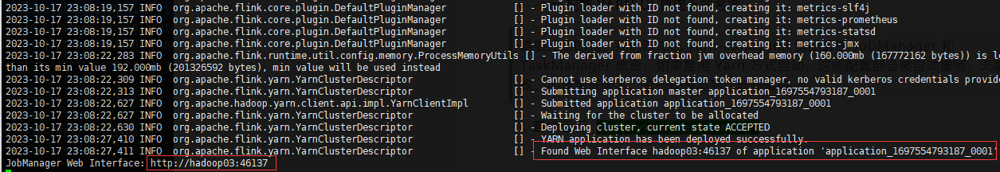
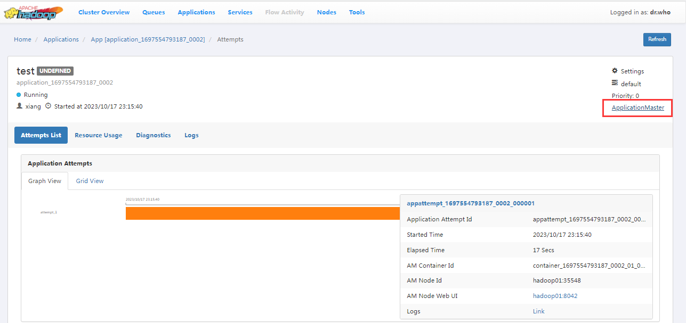
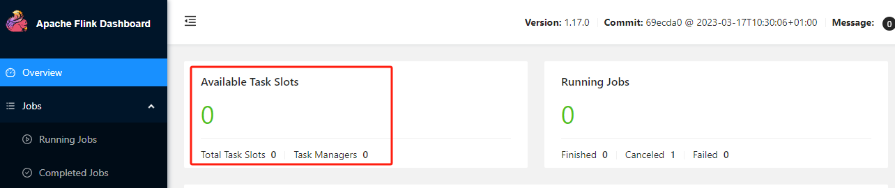
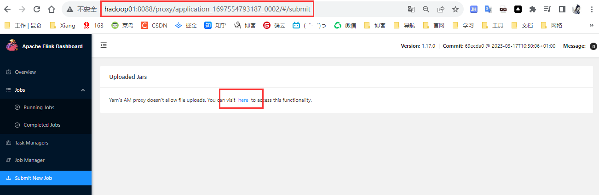
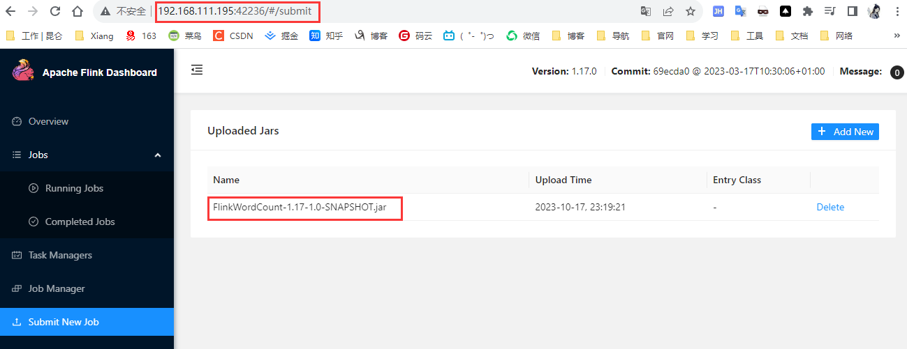
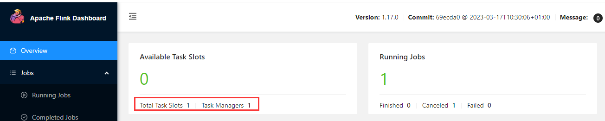

## 运行模式

### Standalone 独立运行

不依赖外部场景，一般在开发测试或者作业非常少场景下，默认 会话模式

Flink 的 Standalone 集群不支持 单作业模式部署，因为单作业模式需要借助一些资源管理平台。

应用模式下不会提前创建集群

##### 应用模式部署

确保环境启动 `nc -lk 17777`

将jar包放到 lib/ 目录下

```sh
cp FlinkWordCount-1.17-1.0-SNAPSHOT.jar  /usr/local/flink/lib/
```

启动 JobManager

```sh
bin/standalone-job.sh start --job-classname com.liuyuncen.wordCount.WordCountStreamUnboundedDemo
```

启动 TaskManager

```sh
bin/taskmanager.sh start
```

访问 http://hadoop01:8081 查看状态

无论我们是Web UI页面关闭任务，还是 执行 `bin/taskmanager.sh stop` 都会将服务关掉，而且 访问 http://hadoop01:8081 已经打不开了


### Yarn 运行模式

##### 配置环境变量

```sh
sudo vim /etc/profile.d/bigdata.sh
```

```properties
# Flink
export HADOOP_CLASSPATH=`hadoop classpath`
export HADOOP_CONF_DIR=$HADOOP_HOME/etc/hadoop
```

##### 启动 HDFS 和 YARN

```sh
start-dfs.sh
start-yarn.sh
```

确保环境启动 `nc -lk 17777`


#### 1、启动会话模式

1. 提前启动集群 bin/start-cluster.sh

2. 执行脚本，向 YARN 申请资源，开启一个 YARN 会话，启动 Flink 集群

   ```sh
   bin/yarn-session.sh -nm test
   ```

   参数解读

   + -d 后台启动
   + -jm 配置 JobManager 所需内存，默认单位 MB
   + -nm 配置 YARN UI 界面上的名字

   > 需要注意的是，我们原先在 yarn-conf.yaml 里配置的 JobManager 和 TaskManager 信息，如果是用 Yarn 方式启动，这些配置都会被自动重写，无需修改，如果是低版本，这些配置写死可能会影响。

   1. 直接运行 `bin/yarn-session.sh`访问 http://hadoop03:46137 可以打开 flink 页面

   2. 运行 bin/yarn-session.sh -d -nm test 

      就不会占用端口。我们依旧可以在 YARN 页面上找到进入 Flink 的链接

      

      这是使用代理的方式访问：http://hadoop01:8088/proxy/application_1697554793187_0002/#/overview

   3.  ==（重点）：==在服务启动后，打开 flink 页面我们可以看到当前可用是 0个

       

       而当我们从 submit 这里提交进去之后

       

       

       这里就变成了 1个，说明 Yarn 在动态分配资源

       

3. 命令方式

   前提是启动 sesion

   ```sh
   bin/yarn-session.sh -nm test
   ```

   然后启动

   ```sh
   bin/flink run -c com.liuyuncen.wordCount.WordCountStreamUnboundedDemo lib/FlinkWordCount-1.17-1.0-SNAPSHOT.jar
   ```

   

   可以看到任务提交到了 Yarn

4. 关闭服务

   ```sh
   cd /usr/local/flink
   ./bin/yarn-session.sh -id application_1697619491036_0002
   ```


#### 2、单作业模式

```sh
bin/flink run -d -t yarn-per-job -c com.liuyuncen.wordCount.WordCountStreamUnboundedDemo  lib/FlinkWordCount-1.17-1.0-SNAPSHOT.jar
```

如果出现问题不用担心，任务已经提交上去了

```sh
# 解决报错问题
vim flink-conf.yaml

classloader.check-leaked-classloader: false
```


查看作业

```sh
bin/flink list -t yarn-per-job -Dyarn.application.id=application_XXXX_YY
```

关闭作业

```sh
bin/flink cancel -t yarn-per-job -Dyarn.application.id=application_XXXX_YY <jobId>
```


#### 3、应用模式部署

直接执行 flink run-application

```sh
bin/flink run-application -t yarn-application -c com.liuyuncen.wordCount.WordCountStreamUnboundedDemo  lib/FlinkWordCount-1.17-1.0-SNAPSHOT.jar
```

##### 3.1、HDFS 提交作业

```sh
# 上传 HDFS
hadoop fs -mkdir /flink-dist
hadoop fs -put plugins/ /flink-dist/
hadoop fs -mkdir -p /flink-dist/jars
hadoop fs -mv /flink-dist/lib/FlinkWordCount-1.17-1.0-SNAPSHOT.jar  /flink-dist/jars/
```

提交作业

```sh
bin/flink run-application -t yarn-application -Dyarn.provided.lib.dirs="hdfs://hadoop01:9820/flink-dist" -c com.liuyuncen.wordCount.WordCountStreamUnboundedDemo hdfs://hadoop01:9820/flink-dist/jars/FlinkWordCount-1.17-1.0-SNAPSHOT.jar
```

