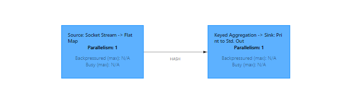

# 系统架构

以 Standalone 会话模式为例


概念

+ JobManager：Flink 任务管理器调度核心，主线程
  + JobMaster：负责单独的 Job ，因为以 Standalone 为例，一个 Job 对应一个 JobMaster
  + ResourceManager：资源管理器，负责资源分配，和Yarn重名，但是这是 Flink 内部组件和Yarn无关
  + Dispatcher：提供一共 REST接口，用来提交应用，负责为每一个Job分配JobMaster
+ TaskManager：任务管理器，理解为专门干活的小弟们
  + TaskSlot：最小单位，slot 数量限制了 TaskManager 能处理的并行数


## 并行度

我们把一个算子操作，“复制”多份到多个节点，这样就实现了并行计算。

并行度设置

1. 代码中设置


这些都是算子，都可以在后面 `.setParallelism(2)`

优先级问题：

+ 代码：算子  >  env  >  提交时指定  > 配置 （flink-conf.yaml)


## 算子链

Operator Chain



### 一对一

One to One，不需要重分区，也不需要调整数据顺序

### 重分区

Redistributing，除了 One to One 都是重分区，一对多


> **==合并算子链==**：如果都是One to One，并且并行度相同，他们可用合并为一个大的Task任务。==是非常有效的优化方案==，可用减少线程之间的切换和基于缓存区的数据交换，减少延迟同时提高吞吐量


```
 1、算子之间关系：
    一对一
    重分区

 2、算子 串在一起的条件
    1） 一对一
    2） 并行度相同

 3、 关于算子链接的api
    1） 全局禁用算子链： env.disableOperatorChaining();
    2） 某个算子不参与链条： 算子A..disableChaining(), 算子A 不会与前面和后面的算子串在一起
    3） 从某个算子开启新链条： 算子A.startNewChain(), 算子A 不与前面串在一起，从A开始正常链条

```


