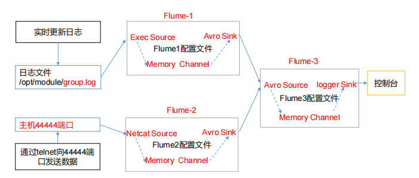

> Hadoop01  Flume-1 监控 /users/home/flume/datas/group.log
>
> Hadoop02  Flume-2 监控某一个端口的数据流
>
> Flume-1、Flume-2 将数据发送到 Hadoop03 上的 Flume-3，最终打印控制台




将 flume 分发给 Hadoop02、Hadoop03

flume1-logger-flume.conf

```properties
# Name the components on this agent
a1.sources = r1
a1.sinks = k1
a1.channels = c1
# Describe/configure the source
a1.sources.r1.type = exec
a1.sources.r1.command = tail -F /home/xiang/flume/group.log
a1.sources.r1.shell = /bin/bash -c
# Describe the sink
a1.sinks.k1.type = avro
a1.sinks.k1.hostname = hadoop01
a1.sinks.k1.port = 4141

# Describe the channel
a1.channels.c1.type = memory
a1.channels.c1.capacity = 1000
a1.channels.c1.transactionCapacity = 100
# Bind the source and sink to the channel
a1.sources.r1.channels = c1
a1.sinks.k1.channel = c1
```

flume2-netcat-flume.conf

```properties
# Name the components on this agent
a1.sources = r1
a1.sinks = k1
a1.channels = c1
# Describe/configure the source
a1.sources.r1.type = exec
a1.sources.r1.command = tail -F /home/xiang/flume/group.log
a1.sources.r1.shell = /bin/bash -c
# Describe the sink
a1.sinks.k1.type = avro
a1.sinks.k1.hostname = hadoop01
a1.sinks.k1.port = 4141

# Describe the channel
a1.channels.c1.type = memory
a1.channels.c1.capacity = 1000
a1.channels.c1.transactionCapacity = 100
# Bind the source and sink to the channel
a1.sources.r1.channels = c1
a1.sinks.k1.channel = c1
```

flume3-flume-logger.conf

```properties
# Name the components on this agent
a3.sources = r1
a3.sinks = k1
a3.channels = c1
# Describe/configure the source
a3.sources.r1.type = avro
a3.sources.r1.bind = hadoop03
a3.sources.r1.port = 4141
# Describe the sink
# Describe the sink
a3.sinks.k1.type = logger
# Describe the channel
a3.channels.c1.type = memory
a3.channels.c1.capacity = 1000
a3.channels.c1.transactionCapacity = 100
# Bind the source and sink to the channel
a3.sources.r1.channels = c1
a3.sinks.k1.channel = c1
```


```sh
[xiang@hadoop01 group3]$ pwd
/usr/local/flume/job/group3
[xiang@hadoop01 group3]$ ll
总用量 12
-rw-rw-r-- 1 xiang xiang 555 10月 20 22:50 flume1-logger-flume.conf
-rw-rw-r-- 1 xiang xiang 542 10月 20 22:50 flume2-netcat-flume.conf
-rw-rw-r-- 1 xiang xiang 481 10月 20 22:50 flume3-flume-logger.conf
[xiang@hadoop01 group3]$ scp flume2-netcat-flume.conf hadoop02:$PWD
[xiang@hadoop01 group3]$ scp flume3-flume-logger.conf hadoop03:$PWD
```


如果出现错误，注意顺序执行

```sh
[xiang@hadoop03 flume]$  bin/flume-ng agent --conf conf/ --name a3 --conf-file job/group3/flume3-flume-logger.conf -Dflume.root.logger=INFO,console

[xiang@hadoop02 flume]$ bin/flume-ng agent --conf conf/ --name a1 --conf-file job/group3/flume1-logger-flume.conf

[xiang@hadoop01 flume]$ bin/flume-ng agent --conf conf/ --name a2 --conf-file job/group3/flume2-netcat-flume.conf
```

