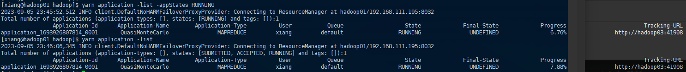
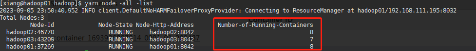
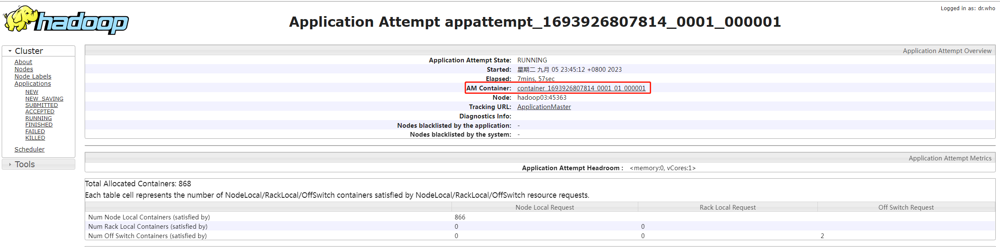

查看 yarn 资源

```sh
yarn top
```


查询任务

> 让服务持久运行
>
> ```sh
> yarn jar /usr/local/hadoop/share/hadoop/mapreduce/hadoop-mapreduce-examples-3.3.1.jar pi 1000 1000
> ```

```sh
yarn application 

	-list -appStates [NEW, NEW_SAVING, SUBMITTED, ACCEPTED, RUNNING, FINISHED, FAILED, KILLED]
	# 列出服务 appStates 筛选状态
	
	-kill
	# 杀掉进程 例如: yarn application -kill  application_12512431...
```




获取 container 详细信息

在 hadoop01:8088 中找到正在运行中的 application的 AttemptID 为 `appattempt_1693926807814_0001_000001` 操作和页面点开一样

```sh
 yarn container -list appattempt_1693926807814_0001_000001
```


获取集群中所有节点，查看 container 的数量

```sh
yarn node -all -list
```




获取 container 状态信息



```sh
yarn container -status container_1693926807814_0001_01_000001
```

