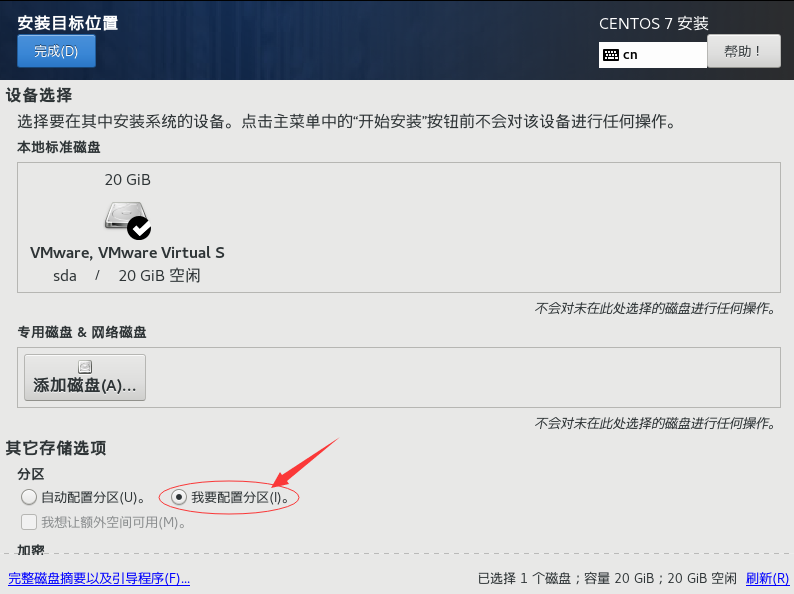
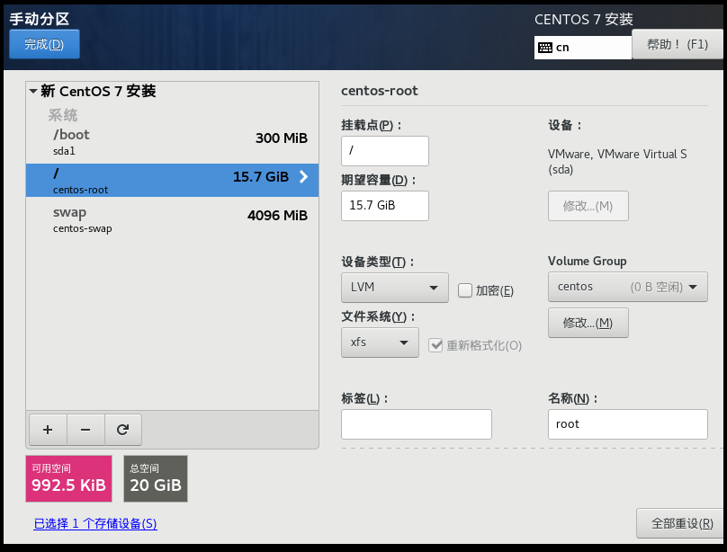
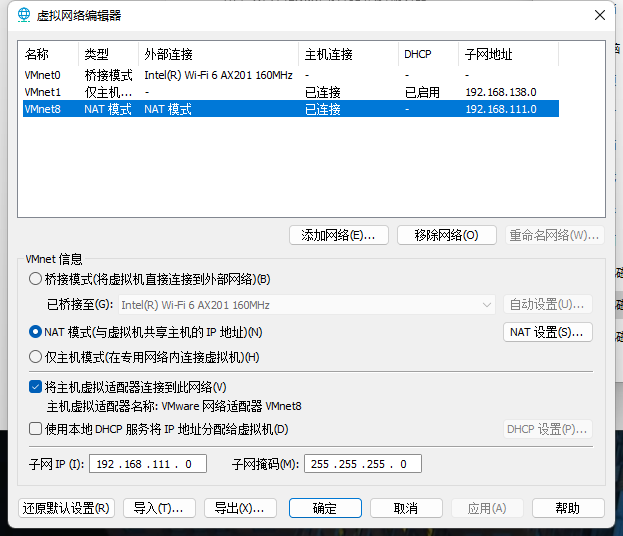
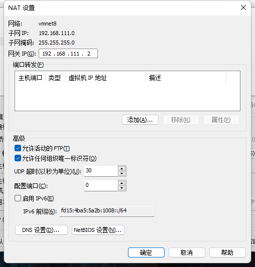
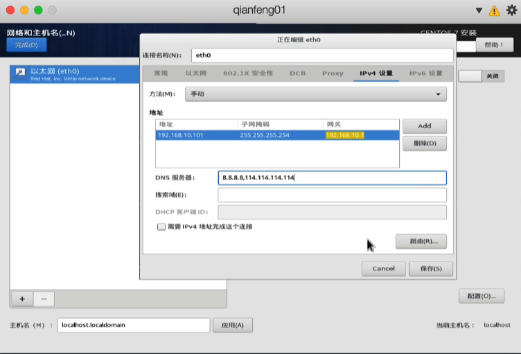
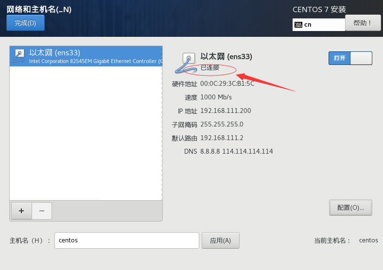

> 参考视频：https://www.bilibili.com/video/BV18y4y1G7JA?p=16&vd_source=929b0281e14d9458ef959e97cc46c19a

修改分区（也可以不修改）





boot 是启动磁盘，这里分了300M

swap 交换空间，一般设置为内存两倍，这里设置了2G

/ 根目录不选择，所以这里是剩下的所有空间


无论是使用 Mac 系统、还是 Windows 系统，首先查到网卡的子网IP 和 网关





Windows 可以通过查看 VMWare 的网络配置查看

```
子网：192.168.111.0
子网掩码：255.255.255.0
网关：192.168.111.2
```


然后在安装 Centos7 的时候，再设置网络

windows 叫 ens33

mac 叫 eth0



这里默认加了 DNS

```
8.8.8.8,114.114.114.114
```

这样就设置好了网络



最后打开，发现已连接，这样就可以了

