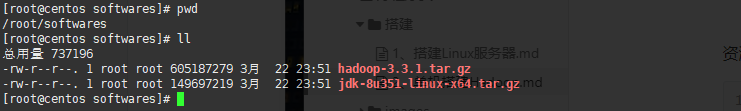
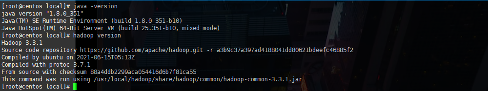
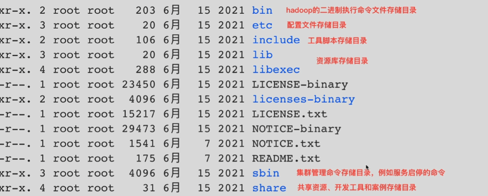

		本地模式，即运行再单台机器上，没有分布式思想，使用本地文件系统，使用本地模式主要是用于对MapReduce 的程序逻辑进行调试，保证程序的正确性，由于本地模式下测试和调试MapReduce程序比较方便，因此这种模式设开发阶段


安装位置：【主力机】

```
E:\VMwareSpace\BigData\Hadoop\qianfeng\hadoop-standalong
192.168.111.190
4c8g
```


资源

```
hadoop-3.3.1.tar.gz 下载地址
https://dlcdn.apache.org/hadoop/common/hadoop-3.3.1/hadoop-3.3.1.tar.gz

jdk-8u351-linux-x64.tar.gz
D:\package\jdk-8u351-linux-x64.tar.gz
```

资源上传到 /root/softwares/



```sh
tar -zxvf jdk-8u351-linux-x64.tar.gz -C /usr/local/
mv /usr/local/jdk1.8.0_351 /usr/local/jdk
```


解压 Hadoop

```
tar -zxvf hadoop-3.3.1.tar.gz -C /usr/local/
mv /usr/local/hadoop-3.3.1 /usr/local/hadoop
```


环境变量

```sh
sed -i '$a \
export JAVA_HOME=/usr/local/jdk \
export HADOOP_HOME=/usr/local/hadoop \
export PATH=$PATH:$JAVA_HOME/bin:$HADOOP_HOME/bin:$HADOOP_HOME/sbin' /etc/profile
```

```sh
source /etc/profile
```


检查java版本和 hadoop版本

```sh
java -version
hadoop version
```




hadoop 目录介绍




